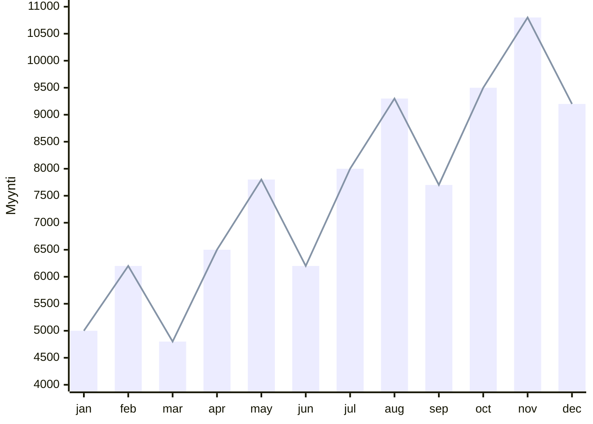

# Aikasarjat

!!! warning

    Perinteisiä koneoppimismenetelmiä ja tilastollisia malleja on käsitelty Johdatus koneoppimiseen -kurssilla. Osa materiaalista on kertausta.

## Määritelmä

Aloitetaan määrittelemällä, mitä aikasarjat ovat. Yksinkertainen, yhden muuttujan aikasarja on helppo kuvata kuvaajalla, kuten alla:



Tässä tapauksessa dataa on yhdeltä vuodelta ja se on kerätty kuukausittain – eli *granulariteetti* on kuukausittainen. Jokainen datapiste kuvaa tietyn ajanhetken (tässä tapauksessa kuukauden aloituspäivän) ja siihen liittyvän arvon (tässä tapauksessa myynti). Myyntidata on intuitiivinen esimerkki, mutta valtava osuus maailman aikasarjadatasta kertyy erilaisilta IoT-laitteilta. Aikasarja voi kuvastaa vaikkapa palvelinkeskuksen kiintolevyjen hajoamista: sarakkeista löytyy SMART-metriikoita ja binäärinen tieto siitä, onko levy hajonnut kyseisenä päivänä.

??? info "Taulukkomuoto"

    Taulukkomuodossa sama data näyttäisi tältä:

    | `month_start` | `sales` |
    | ------------- | ------- |
    | 2026-01-01    | 5000    |
    | 2026-02-01    | 6200    |
    | 2026-03-01    | 4800    |
    | 2026-04-01    | 6500    |
    | ...           | ...     |
    | 2026-11-01    | 10800   |
    | 2026-12-01    | 9200    |


### Komponentit

Kun puhutaan *ennustamisesta*, pyrimme mallintamaan aikasarjan tulevia arvoja. Kuvaajan tapauksessa tämä tarkoittaa, että meitä kiinnostaisi ensi vuoden tammikuu (helmikuu, maaliskuu, ...). Ennustamisen lisäksi on hyvä huomioida, että on olemassa myös aikasarjojen analysointia (engl. time series analysis), joka keskittyy ymmärtämään aikasarjan rakennetta, kuten kausivaihteluita, trendejä ja satunnaisuutta. Aikasarja-analyysiin kuuluu neljä pääkomponenttia [^ml-forecasting-py]:

* :one: **Trendi** eli pitkän ajan liike. Yllä olevassa kuvaajassa on noususuuntainen trendi.
* Lyhyen ajan vaihtelut:
    * :two: **Kausivaihtelut** eli säännölliset vaihtelut, jotka toistuvat tietyn ajan välein. Yllä olevassa kuvassa on 4 kuukauden "hain evä".
    * :three: **Sykliset vaihtelut** ovat nousuja ja laskuja, joiden ei ole kiinteää jaksoa (esim. suhdannevaihtelu).
* :four: **Satunnaisuus** eli täysin ennustamattomat pienet tai suuret vaihtelut. Tämä on kohinaa.

Nämä ovat tekstinä abstrakteja käsitteitä, joten kannattaa etsiä kuva avuksi. Voit löytyää kuvia esimerkiksi `statsmodel`-kirjaston esimerkistä [Seasonal-Trend decomposition using LOESS (STL)](https://www.statsmodels.org/stable/examples/notebooks/generated/stl_decomposition.html)

### Ennustamisen termistö

Datan suhteen muita tärkeitä termejä ovat [^ml-forecasting-py]:

* **(aika)granulariteetti**: Kuinka usein dataa kerätään (esim. päivittäin, kuukausittain, vuosittain).
* **aikahorisontti**: Kuinka pitkälle tulevaisuuteen haluamme ennustaa.
* **exogeeniset muuttujat**: Muut muuttujat (*engl. feature*), jotka vaikuttavat ennustettavaan arvoon, mutta eivät ole osa aikasarjaa. Esimerkiksi `is_holiday` tai `outdoor_temperature` tai `sensor_type`.
* **yksi- tai monimuuttuja**: Onko aikasarja yhden vai useamman muuttujan sarja (*engl. monovariate, multivariate*).
* **ennustehorisontin rakenne**: Ennustetaanko vain seuraava aika-askel (*engl. single-step*) vai useampi askel (*engl. multi-step*). Multi-step -ennusteita voidaan tehdä kolmella eri tavalla (plus yhdellä hybridillä, joka on pudotettu pois listalta):
    * **rekursiivinen ennuste** (*recursive multi-step*): Käytetään yhtä mallia, joka ennustaa seuraavan askeleen. Tulos syötetään takaisin malliin seuraavan askeleen ennustamiseksi.
    * **suora ennuste** (*direct multi-step*): Luodaan erillinen malli jokaiselle ennustettavalle aika-askeleelle (esim. yksi malli tunnille $t+1$ ja toinen tunnille $t+2$).
    * **moniulotteinen tuloste** (*multiple output*): Yksi malli ennustaa koko sekvenssin kerralla vektorina. Tämä on ==neuroverkoille luonnollisin tapa==.

Kannattaa tutustua näihin [skforecast.org: Intro to Forecasting](https://skforecast.org/0.20.1/introduction-forecasting/introduction-forecasting)-sivulla, jossa ne on esitelty visuaalisesti.

## Datan käsittely

!!! warning

    Tässä materiaalissa ei käsitellä puuttuvien arvojen imputointia syvällisesti. Ota kuitenkin huomioon, että aikasarjasta puuttuvat arvot täytyy käsitellä ennen mallinnusta esimerkiksi interpoloimalla, forward fill -menetelmällä tai poistamalla käyttökelvottomat rivit.

### Sekvenssit ja LAG eli viive

Perinteisissä koneoppimisen taulukkomalleissa (kuten lineaarisessa regressiossa) 1-ulotteinen aikasarja täytyy yleensä kääntää moniulotteiseksi rakentamalla sille eksplisiittiset viivepiirteet (*lag features*). Tällöin esimerkiksi edellisen tai sitä edeltävän päivän myynti siirretään omaksi sarakkeekseen.

Neuroverkoissa ajallinen historia syötetään sen sijaan useimmiten **sekvenssinä**, ei erillisinä lag-sarakkeina. Tämä ei tarkoita, että historiaikkuna katoaisi kokonaan – se vain esitetään eri muodossa [^ml-forecasting-py].

Esimerkiksi 48 tunnin historia voidaan antaa mallille yhtenä syötesekvenssinä, jolloin RNN-, LSTM- tai Transformer-malli saa itse oppia, mihin kohtiin historiassa kannattaa kiinnittää huomiota. Käsiteltävä data näyttää neuroverkoille syötettäessä usein tältä:

```
Input shape: (batch_size, sequence_length, features)
Output shape: (batch_size, forecast_horizon[, target_features])
```

Tässä `sequence_length` määrittää sen aikaikkunan, jonka verkko "näkee" kerralla.

### Kalenteri- ja ulkoiset piirteet

Pelkkä viivehistoria ei riitä kaikissa ongelmissa. Monissa liiketoiminta- ja IoT-ongelmissa ennuste tarkentuu merkittävästi, kun mukaan lisätään:

* **kalenteripiirteitä**, kuten viikonpäivä, kuukausi, tunti, lomapäivä tai kampanjapäivä
* **exogeenisiä muuttujia**, kuten lämpötila, hinta, säätila tai sensorin tyyppi

Tärkeä käytännön sääntö on tämä: piirteessä saa käyttää vain sellaista tietoa, joka olisi ollut aidosti saatavilla ennustushetkellä. Jos rakennat esimerkiksi jotakin tunnuslukua laajemmalta aikaväliltä, sitä ei saa laskea tulevien päivien arvoista. Muuten syntyy *data leakage*.

### Skaalaus

Kuten muidenkin syväoppimismallien yhteydessä, neuroverkot hyötyvät lähes aina siitä, että data on skaalattu järkevästi. Käytännössä tämä tarkoittaa standardointia ($z$-score) tai min-max-skaalausta. Skaalaus pitää aina sovittaa vain koulutusdataan ja käyttää sitten samoja parametreja validointi- ja testidataan vuotojen välttämiseksi.

### Train-test-jako

Tavallisessa koneoppimisessa aineisto voidaan usein sekoittaa ja jakaa satunnaisesti opetus- ja testijoukkoihin. Aikasarjojen kanssa näin ei voida tehdä, sillä ajan suuntaa on ehdottomasti kunnioitettava: tarkoituksena on ennustaa tulevaisuutta menneisyyden datan perusteella [^dlwithpython]. Siksi testijoukoksi on aina varattava aikasarjan kronologisesti tuorein osa [^ts-cookbook]. 

Neuroverkojen suhteen yksittäiset opetusnäytteet eivät kuitenkaan ole irrallisia rivejä vaan **ikkunoita**: menneisyysikkuna syötetään sisään ja tulevaisuusikkuna annetaan tavoitteeksi. Ristiinvalidoinnissa (cross-validation) ei myöskään voida käyttää perinteistä k-fold-menetelmää satunnaistuksella, vaan hyödynnetään aikasidonnaisia menetelmiä, kuten liukuvaa ikkunaa, jotta mallin arviointi tapahtuu aina aidosti tulevaa ennustamalla.

### Stationaarisuus

Stationaarinen aikasarja tarkoittaa sitä, että sen tilastolliset perusominaisuudet (kuten keskiarvo ja varianssi) pysyvät ajan suhteen vakaina. Klassisille tilastollisille malleille (kuten ARIMA) stationaarisuus on ehdoton vaatimus, mikä tekee sarjan esikäsittelystä usein työlästä.

Syväoppimisessa tämä taakka kevenee:
> "Neural networks can be useful for time series forecasting problems by eliminating the immediate need for massive feature engineering processes, data scaling procedures, and making the data stationary by differencing."
>
> — Lazzeri [^ml-forecasting-py]

Neuroverkot kykenevät oppimaan monimutkaisia epälineaarisia riippuvuuksia suoraan kohinaisesta datasta. Tämä ei silti tarkoita esikäsittelyn turhuutta; voimakkaasti vinojen jakaumien muuntaminen ja poikkeavien arvojen tunnistaminen auttaa neuroverkkojakin merkittävästi.

### Autokorrelaatio ja piirteiden valinta

Autokorrelaatio kertoo, kuinka vahvasti sarja korreloi oman menneisyytensä kanssa. Jos tämän päivän myynti muistuttaa eilisen myyntiä, yhden päivän viiveellä on positiivinen autokorrelaatio. Vaikka neuroverkkojen yhteydessä klassisia autokorrelaatioviiveitä ei rakenneta käsin erillisiksi ominaisuuksiksi, autokorrelaation ymmärtäminen on edelleen hyödyllistä:

* valitsemaan järkevän `sequence_length`-arvon
* havaitsemaan mahdollisen kausijakson, kuten 24 tuntia tai 7 päivää
* rakentamaan vahvoja baseline-malleja vertailua varten

Jos esimerkiksi datassa on selvät piikit vuorokausi- ja viikkoviiveillä, olisi outoa syöttää mallille vain neljän tunnin historia.

### Globaalit mallit

Perinteinen lähestymistapa on rakentaa **lokaali malli**: jos ennustat 500 tuotteen kysyntää, rakennat 500 erillistä mallia. Syväoppimisessa hyödynnetään tyypillisesti **globaaleja malleja** (*cross-learning*), joissa yksi ja sama malli koulutetaan usean eri aikasarjan yli [^deep-ar] [^smyl] [^modern-ts-forecasting].

Tällöin malli oppii yhteisiä rakenteita sarjojen välillä ja ylläpidettävien mallien määrä on dramaattisesti pienempi. Sarjakohtaiset erot voidaan syöttää mallille esimerkiksi tunnisteilla kuten `tuoteryhmä` tai `myymälä`.

## Mallin koulutus

Neuroverkot loistavat erityisesti silloin, kun dataa on paljon, sarjoja on paljon tai ongelma on monimutkainen [^ml-forecasting-py]. Monimuuttujaisten tai pitkien sekvenssien ennustaminen on neuroverkoille luontevampaa kuin monille perinteisille viiveisiin pohjautuville menetelmille. Tällä kurssilla harjoitellaan aikasarjaennustusta PyTorchilla, mutta käytännön projekteissa saatat haluta hyödyntää niihin erikoistuneita kirjastoja, kuten Nixtlan `NeuralForecast`.

### Aloita baselinesta

Ennen kuin koulutat yhtään monimutkaista neuroverkkomallia, rakenna vähintään yksi yksinkertainen baseline. Aikasarjoissa hyvä baseline ei ole satunnainen arvaus vaan jokin ilmiön rakennetta hyödyntävä nyrkkisääntö. Tyypillisiä baselineja ovat:

* **naive**: huominen arvo = tämän päivän arvo (eli $y_{t+1} = y_t$)
* **seasonal naive**: ensi maanantai = viime maanantai (eli $y_{t+7} = y_t$)
* **moving average**: ennuste = viimeisten havaintojen keskiarvo

Huomaa, että nämä ==eivät siis varsinaisesti ennusta mitään==. Jos ennustehorisonttisi on 7 päivää eteenpäin, *naive baseline* kopioi viimeisimmän näkemänsä askeleen samana arvon kaikkina 7 päivänä horisontissa. Neuroverkkoa ei milloinkaan pidä arvioida tyhjiössä, vaan sen on pystyttävä suoriutumaan baselinea paremmin tuodakseen lisäarvoa.


**Kuva 1:** *Nano Banana 2:n näkemys Naive Baseline -hahmosta, joka ennustaa kalenteria aina samalla kumileimasimella.*

### RNN-perhe

RNN-perhe on luonnollinen valinta, kun ongelmassa on merkittäviä ajallisia riippuvuuksia. Aivan kuten lauseiden kanssa, LSTM ja GRU mallit käsittelevät pitkän ajan riippuvuuksia vahvemmin kuin vanilla RNN.

Näiden mallien koulutuksessa valitaan vähintään:

* historiaikkunan pituus (`sequence_length`)
* ennustehorisontti ja datan muoto
    * **Single-step:** ennustetaan vain seuraava aika-askel (skaalari tai vektori, riippuen muuttujien määrästä)
    * **Multi-step:** ennustetaan useita tulevia aika-askelia yhdelle muuttujalle (vektori)
    * **Multi-step, multi-variate:** ennustetaan useita tulevia aika-askelia useammalle kohdemuuttujalle. Kurssikirjassa [^geronpytorch] neuvotaan yksittäisten `bus` ja `rail` -muuttujien samanaikainen ennustus. Montaa ennustaessa *Encoder-Decoder* -mallit ovat tässä tehokkaita. [^multioutput]
    * **Variable-length horizons:** syötteen tai ennusteen pituus vaihtelee dynaamisesti (ks. *"Encoder-Decoder RNNs for Bus Arrival Time
Prediction"* [^bus-arrival])
* tappiofunktio, kuten MAE, MSE tai Huber

### Transformer-pohjaiset mallit

Transformer-arkkitehtuurit ovat nousseet myös aikasarjaennusteisiin, erityisesti silloin kun sekvenssit ovat pitkiä, exogeenisiä piirteitä on paljon tai aikariippuvuudet ovat monimutkaisia. Aiemmin oppimasi self-attention-mekanismi mahdollistaa sen, että malli voi tarkastella koko historiaa kerralla ja oppia, mitkä osat historiasta ovat relevantteja ennusteen kannalta.

> "Transformers have gained popularity for time series modeling due to their ability to capture long-sequence interactions more effectively than RNN models (...) Many real-world applications, such as weather forecasting, traffic prediction, industrial process controls, and electricity consumption planning, require the prediction of long sequence time series."
>
> — Nicole Koenigstein [^transformers-def-guide]

Jos haluat tutustua yhdenlaiseen tiettyyn toteutukseen, katso esimerkiksi Woo et. al. malli nimeltään Moirai: [ArXiV: Unified Training of Universal Time Series Forecasting Transformers](https://arxiv.org/abs/2402.02592)

### Tappiofunktio ja ennustetapa

Neuroverkkojen koulutuksessa on päätettävä myös, mitä tarkalleen ennustetaan. Kurssin kannalta on hyvä huomata, että juuri **multiple output** sopii neuroverkoille hyvin, koska verkko voi tuottaa koko horisontin yhdellä ulostulokerroksella. Jos teet regressiota, kurssilta jo aiemmin tuttu MSE on oiva valinta tappiofunktioksi. [^dl-for-ts-cookbook]

### Koulutuslooppi käytännössä

Varsinainen koulutus ei poikkea mistään, mitä et olisi jo kurssin aikana nähnyt. Syötetään dataa ikkunamuodossa, lasketaan tappio, backpropagoidaan ja päivitetään painot. Ainoa ero on se, että data on järjestetty sekvensseiksi eikä yksittäisiksi riveiksi. Aivan kuten lauseita kouluttaessa, myös aikasarjojen kanssa on tärkeää pitää huolta siitä, että `y` sisältää `forecast_horizon`-määrän verran tulevaisuuden arvoja, ja `x_sample` sisältää `sequence_length`-määrän verran menneisyyden arvoja. Aivan kuten lauseiden kanssa, aikasarjojen kanssa nämä yksittäiset ikkunat voi syöttää malliin missä tahansa järjestyksessä, mutta train-test-jako ja backtesting on tehtävä siten, että mallin ei koskaan anneta nähdä tulevaisuuden dataa.

## Tehtävät

!!! question "Tehtävä: Metro Interstate Traffic"

    Aja `800_metro_interstate_traffic.py`-notebook sekä sinällään että muokattuna. Muokkaus, mikä sinun tulee tehdä, on vaihtaa skaalausmenetelmä `StandardScaler`ista `MinMaxScaler`iin. Tarkkaile, miten se vaikuttaa suorituskykymittareihin. Tarkalleen ottaen sinun tulee muokata koodia muutamasta paikasta:

    1. Lisää import
    2. Vaihda $y$ skaalaus. $X$:ään ajettava Pipeline saa pysyä ennallaan.
    3. Rajoita mallin output positiivisiin lukuihin. (Vinkki: ReLU)
    4. Muokkaa TensorBoardiin tallentuvan ajon nimeä, jotta tunnistat eri ajot.

    Jos haluat haastaa itseäsi, parametrisoi tämä siten, että voit vaihtaa skaalausmenetelmää yhden hyperparametrin avulla. Kun olet valmis, kokeile rohkeasti muokata myös muita hyperparametreja.


## Lähteet

[^ml-forecasting-py]: Lazzeri, F. *Machine Learning for Time Series Forecasting with Python*. 2020. Wiley.
[^dlwithpython]: Watson, M & Chollet, F. *Deep Learning with Python, Third Edition*. Manning. 2025.
[^ts-cookbook]: Atwan, T. *Time Series Analysis with Python Cookbook - Second Edition*. Packt. 2026.
[^deep-ar]: Salinas, D., Flunkert, V. & Gasthaus, J. "DeepAR: Probabilistic Forecasting with Autoregressive Recurrent Networks". 2017. https://arxiv.org/abs/1704.04110
[^smyl]: Smyl, S. "A hybrid method of exponential smoothing and recurrent neural networks for time series forecasting". 2020. https://www.sciencedirect.com/science/article/abs/pii/S0169207019301153
[^modern-ts-forecasting]: Joseph, M. & Tackes, J. *Modern Time Series Forecasting with Python - Second Edition*. Packt. 2024.
[^geronpytorch]: Géron, A. *Hands-On Machine Learning with Scikit-Learn and PyTorch*. O'Reilly. 2025.
[^multioutput]: Hartomo, K., Lopo, J & Hindriyanto, P. *Enhancing Multi-Output Time Series Forecasting with Encoder-Decoder Networks*. Journal of Information Systems Engineering and Business Intelligence. 2023. https://doi.org/10.20473/jisebi.9.2.195-213
[^bus-arrival]: Bhutani, N., Soumen, P. & Achar, A. *Encoder-Decoder RNNs for Bus Arrival Time Prediction*. 2024. https://arxiv.org/abs/2210.01655v2
[^transformers-def-guide]: Koenigstein, N. *Transformers: The Definitive Guide*. O'Reilly. 2026.
[^dl-for-ts-cookbook]: Cerqueira, V. & Roque, L. *Deep Learning for Time Series Cookbook*. Packt. 2024.
