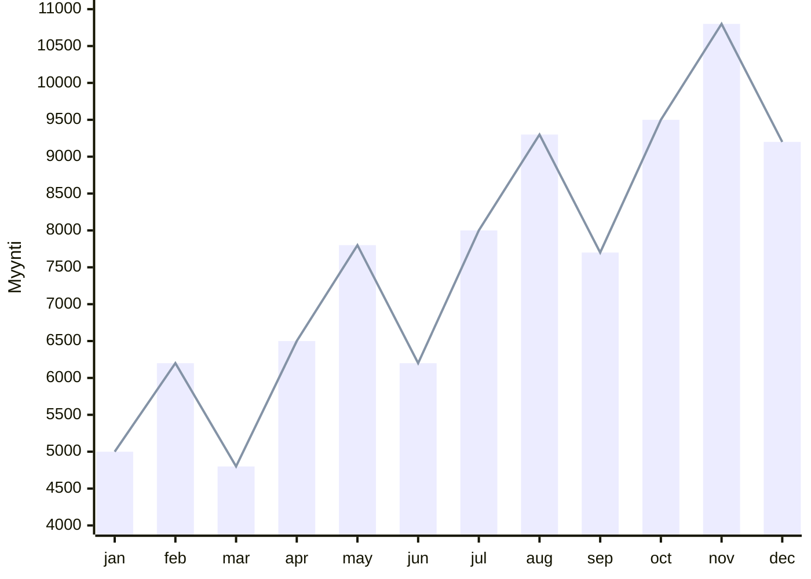

# Aikasarjat

!!! warning

    Perinteisiä koneoppimismenetelmiä ja tilastollisia malleja käsittelevä osa tästä materiaalista tullaan todennäköisesti siirtämään jatkossa Johdatus koneoppimiseen -kurssille. Syy materiaalin tuomiseen aluksi tälle kurssille liittyy kurssien refaktorointijärjestykseen.

## Määritelmä

Aloitetaan määrittelemällä, mitä aikasarjat ovat. Yksinkertainen, yhden muuttujan aikasarja on helppo kuvata kuvaajalla, kuten alla:



Tässä tapauksessa dataa on yhdeltä vuodelta ja se on kerätty kuukausittain – eli *granulariteetti* on kuukausittainen. Jokainen datapiste kuvaa tietyn ajanhetken (tässä tapauksessa kuukauden aloituspvm) ja siihen liittyvän arvon (tässä tapauksessa myynti). Myyntidata on intuitiivinen esimerkki, mutta valtava osuus maailman aikasarjadatasta kertyy erilaisilta IoT-laitteilta. Aikasarja voi kuvastaa vaikkapapalvelinkeskuksen kiintolevyjen hajoamista: sarakkeista löytyy SMART-metriikat ja binäärinen tieto siitä, onko levy hajonnut kyseisenä päivänä.

??? info "Taulukkomuoto"

    Taulukkomuodossa sama data näyttäisi tältä:

    | `month_start` | `sales` |
    | ------------- | ------- |
    | 2026-01-01    | 5000    |
    | 2026-02-01    | 6200    |
    | 2026-03-01    | 4800    |
    | 2026-04-01    | 6500    |
    | ...           | ...     |
    | 2026-11-01    | 10800   |
    | 2026-12-01    | 9200    |


## Termistö pähkinänkuoressa

Kun puhutaan *ennustamisesta*, pyrimme mallintamaan aikasarjan tulevia arvoja. Kuvaajan tapauksessa tämä tarkoittaa, että meitä kiinnostaisi ensi vuoden tammikuu (helmikuu, maaliskuu, ...). Ennustamisen lisäksi on hyvä huomioida, että on olemassa myös aikasarjojen analysointia (engl. time series analysis), joka keskittyy ymmärtämään aikasarjan rakennetta, kuten kausivaihteluita, trendejä ja satunnaisuutta. Aikasarja-analyysiin kuuluu neljä pääkomponenttia [^ml-forecasting-py]:

* **Trendi** eli pitkän ajan liike. Yllä olevassa kuvaajassa on noususuuntainen trendi.
* Lyhyen ajan vaihtelut:
    * **Kausivaihtelut** eli säännölliset vaihtelut, jotka toistuvat tietyn ajan välein. Yllä olevassa kuvassa on 4 kuukauden "hain evä".
    * **Sykliset vaihtelut** ovat nousuja ja laskuja, joiden ei ole kiinteää jaksoa (esim. suhdannevaihtelu).
* **Satunnaisuus** eli täysin ennustamattomat pienet tai suuret vaihtelut. Tämä on kohinaa.

Datan suhteen muita tärkeitä termejä ovat [^ml-forecasting-py]:

* **(aika)granulariteetti**: Kuinka usein dataa kerätään (esim. päivittäin, kuukausittain, vuosittain).
* **aikahorisontti**: Kuinka pitkälle tulevaisuuteen haluamme ennustaa.
* **exogeeniset muuttujat**: Muut muuttujat (*engl. feature*), jotka vaikuttavat ennustettavaan arvoon, mutta eivät ole osa aikasarjaa. Esimerkiksi `is_holiday` tai `outdoor_temperature` tai `sensor_type`.
* **yksi- tai monimuuttuja**: Onko aikasarja yhden vai useamman muuttujan sarja (*engl. monovariate, multivariate*).
* **ennustehorisontin rakenne**: Ennustetaanko vain seuraava aika-askel (*engl. single-step*) vai useampi askel (*engl. multi-step*). Multi-step -ennusteita voidaan tehdä kolmella eri tavalla (plus yhdellä hybridillä, joka on pudotettu pois listalta):
    * **rekursiivinen ennuste** (*recursive multi-step*): Käytetään yhtä mallia, joka ennustaa seuraavan askeleen. Tulos syötetään takaisin malliin seuraavan askeleen ennustamiseksi.
    * **suora ennuste** (*direct multi-step*): Luodaan erillinen malli jokaiselle ennustettavalle aika-askeleelle (esim. yksi malli tunnille $t+1$ ja toinen tunnille $t+2$).
    * **moniulotteinen tuloste** (*multiple output*): Yksi malli ennustaa koko sekvenssin kerralla vektorina. Tämä on ==neuroverkoille luonnollisin tapa==.

Kannattaa tutustua näihin [skforecast.org: Intro to Forecasting](https://skforecast.org/0.20.1/introduction-forecasting/introduction-forecasting)-sivulla, jossa ne on esitelty visuaalisesti.

## Datan käsittely (Perinteinen)

!!! warning

    Tässä materiaalissa ei käsitellä puuttujien arvojen imputointia laisinkaan. Ota huomioon, että aikasarjasta tulee puuttuvat arvojat täyttää esimerkiksi interpoloimalla,

### LAG

Perinteisten aikasarjamallien, kuten ARIMA, Exponential Smoothing tai Xgboost, kanssa on tarpeen kääntää 1-ulotteinen aikasarja N-ulotteiseksi *sliding window*-metodin avulla. Tämän voi luonnollisesti tehdä Pandas-kirjastolla, SQL:llä, Excelillä tai valitsemallaan aikasarja-kirjastolla (esim. `sktime` tai `MLForecast`). Koska SQL on yleismaailmallisesti ymmärrettävä kieli, näytetään esimerkki SQL:llä:

```sql
CREATE TABLE sales_features AS
SELECT
    month_start,                                       -- kuukauden aloituspvm
    LAG(sales, 2) OVER (ORDER BY month_start) AS lag_2 -- toissakuukauden myynti
    LAG(sales, 1) OVER (ORDER BY month_start) AS lag_1 -- viime kuukauden myynti
    sales,                                             -- tämän kuukauden myynti
FROM sales;
```

| `month_start` | `lag_2 (x_0)` | `lag_1 (x_1)` | `sales (y)` |
| :-----------: | :-----------: | :-----------: | :---------: |
|  2026-01-01   | :down_arrow:  | :down_arrow:  |    5000     |
|  2026-02-01   | :down_arrow:  |     5000      |    6200     |
|  2026-03-01   |     5000      |     6200      |    4800     |
|  2026-04-01   |     6200      |     4800      |    6500     |
|      ...      |     4800      |     6500      |     ...     |
|      ...      |     6500      |      ...      |     ...     |

Lopputulos syntyy siten, että jokaiselle kuukaudelle luodaan uusi sarake (*engl. column*), jossa on kyseisen kuukauden myynti ja sitä edeltävien kuukausien myynnit. Näin saadaan luotua uusia ominaisuuksia (features), jotka kuvaavat aikasarjan rakennetta. Perinteinen tilastollinen malli käsittelee näitä samalla tavalla kuin muitakin ominaisuuksia. Jos kuvittelet tilalle lukemaan `n_rooms`, `distance_to_city_center` ja `area`, niin on helppo hyväksyä, että tilastollinen malli voi löytää painot, jotka kuvaavat, kuinka paljon kukin näistä ominaisuuksista vaikuttaa ennustettavaan arvoon. Mallille syötettäisiin siis:

```python
model.fit(
    X=df[["lag_2", "lag_1"]], 
    y=df["sales"]
)
```

??? tip "Mitä muuta voi lisätä?"

    ```sql
    CREATE TABLE sales_features AS
    SELECT
        month_start,
        sales,
        -- ....
        -- ...
        -- (endogeeninen) liukuva keskiarvo, joka kuvaa viimeisten 7 päivän myyntiä
        AVG(sales) OVER (
            ORDER BY month_start
            ROWS BETWEEN 6 PRECEDING AND CURRENT ROW
        ) AS rolling_7d_avg,
        -- exogeeninen one-hot -dummy. Alkoiko kuukausi maanantailla?
        CASE 
            WHEN extract('isodow' FROM shop_date) IN (0,6)
            THEN 1 ELSE 0
        END AS month_started_on_monday
    FROM sales
    ```

    Taulusta pitäisi lopuksi poistaa luonnollisesti sarakkeet, joissa on NULL-arvoja, koska LAG-funktio tuottaa NULL-arvoja ensimmäisille riveille.

### Train-test-jako

!TODO! Selitä.

### Stationary

!TODO! Selitä tässä, mitä stationaarisuus tarkoittaa ja miksi se on tärkeää perinteisille aikasarjamalleille, kuten ARIMA.


## Datan käsittely (Neuroverkot)

### LAG

!TODO! Selitä tässä LAG-muuttujan ja kuinka niitäkään ei ole pakollista luoda neuroverkoille.

Ja tämmöstä:

```
Input shape: (batch_size, sequence_length, features)
Output shape: (batch_size, forecast_horizon)
```

### Stationary

> "Neural networks can be useful for time series forecasting problems by eliminating the immediate need for massive feature engineering processes, data scaling procedures, and making the data stationary by differencing."
>
> — Lazzeri [^ml-forecasting-py]


## Lähteet

[^ml-forecasting-py]: Lazzeri, F. *Machine Learning for Time Series Forecasting with Python*. 2020. Wiley.
[^dlwithpython]: Watson, M & Chollet, F. *Deep Learning with Python, Third Edition*. Manning. 2025.
[^ts-cookbook]: Atwan, T. *Time Series Analysis with Python Cookbook - Second Edition*. Packt. 2026.
[^modern-ts-forecasting]: Joseph, M. & Tackes, J. *Modern Time Series Forecasting with Python - Second Edition*. Packt. 2024.
