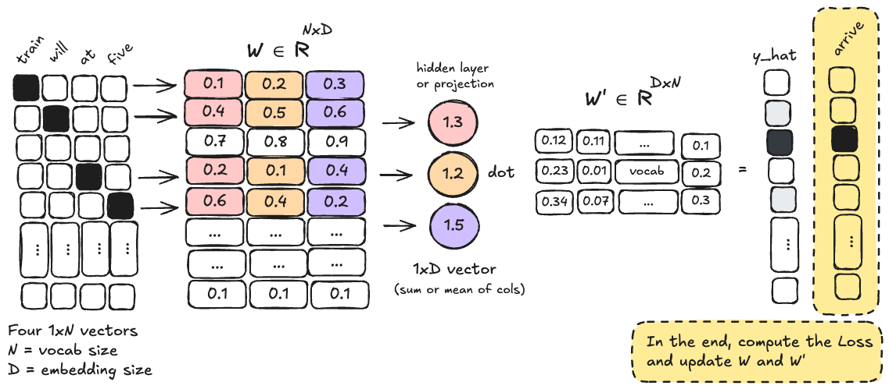

# Luonnollinen kieli

Tietojenkäsittelytieteissä luonnollisella kielellä tarkoitetaan kieliä kuten suomi, englanti, ranska tai japani, joita ihmiset käyttävät päivittäisessä viestinnässään. Tämä on vastakohta keinotekoisille kielille, kuten ohjelmointikielille (esim. Python, Java) tai merkintäkielille (esim. HTML, XML). Merkittävä ero näiden välillä on, että koneelle tarkoitetut kielet ovat tehty insinöörinäkökulmasta siten, että formaalit säännöt ovat muodostettu ensin. Konekieli on käyttökelpoinen vasta kun säännöt ovat tarkoin määritelty. Ihmisten käyttämät kielet ovat syntyneet päinvastoin: käyttö ensin, säännöt myöhemmin. [^dlwithpython]

> "As a result, while machine-readable language is highly structured and rigorous, natural language is messy—ambiguous, chaotic, sprawling, and constantly in flux."
>
> – François Chollet ja Matt Watson [^dlwithpython]

Termi *ambiguous* tarkoittaa, että luonnollisessa kielessä samalle asialle voi olla useita merkityksiä tai tulkintoja. Suomalaisittain kuuluisa esimerkki tästä on lyhyt lause: =="Kuusi palaa"== (*engl. the spruce is on fire / spruce returns / the number six is on fire / ... / six pieces*). Entäpä kuinka tulkitaan seuraava uutisotsikko:

> "Susi hyök­kä­si omis­ta­jan­sa kanssa pyö­rä­len­kil­lä olleen koiran kimp­puun kes­kel­lä asu­tus­ta Raa­hes­sa"
>
> – Pyhäjokiseutu 02.10.2024


**Kuva 1:** *Kirjaimellisesti tulkittu otsikko: "Susi hyökkäsi omistajansa kanssa pyörälenkillä olleen koiran kimppuun keskellä asutusta Raahessa.". Kuva luotu Gemini Nano Banana mallilla.*

Onko tilanne kenties ollut Kuvan 1 mukainen: susi ja hänen omistajansa olivat hyökkääjät, kun koiraraukka yritti pyöräillä karkuun? Vastaavia monitulkintaisia lauseita on Suomen Kuvalehden Jyvät & Akanat -palstalla viikoittain. Tässä kaksi tuoretta esimerkkiä lisäviihteenä 5/2026 numerosta: 

> "Nikotiinipussit muuttavat aivoja – kokenut lääkäri kertoo, miten pääset niistä pysyvästi eroon"
>
> – Iltasanomat 5.1.2026

> "Varkaudessa anastettiin omaisuutta marraskuussa"
>
> – Iltasanomat 7.1.2026

Täten lienee selvä, että koneellinen kielen käsittely haastavaa, mutta koska kieli on ihmisten pääasiallinen viestintäväline, on luonnollisen kielen käsittely (Natural Language Processing, NLP) keskeinen osa tietojenkäsittelyä ja tekoälyä. Käytännön sovelluksia ovat esimerkiksi **tekstin luokittelu** (spam, no spam), **konekäännökset** (ranska → suomi), **hakukoneet** ja **tekstin generointi** (*"Olipa kerran... ?"*). Näiden haastavien tehtävien suhteen suuret läpimurrot ovat varsin tuoreita, mutta yritystä on kuitenkin ollut viimeisen yli 60 vuoden ajan. [^dlwithpython]

## Historia

Nykyisten chatbottien suuret merkkipaalut ovat syntyneet lähitulevaisuudessa, mutta NLP:llä on pitkä historia. Historia voidaan jakaa kolmeen pääkauteen: säännöpohjainen (rule-based), tilastollinen (statistical) ja syväoppimiseen perustuva (deep learning-based) NLP – joka toki on myös tilastollista.

### Turingin koe

Kaiken luonnollisen kielen käsittelyn päämäärä ei ole välttämättä matkia ihmisen älykkyyttä, mutta tämä ajatus on kulkenut matkassa alusta asti – aivan kuten muussakin tekoälyn historiassa. Alan Turing julkaisi 1950 paperin otsikolla "Computing Machinery and Intelligence", jossa hän esitteli ajatuksen ==Turingin kokeesta== nimellä "The Imitation Game" [^turing1950]. Peli perustuu vanhaan seurapeliin, jolla salongissa on voinut viihdyttää vieraita: henkilöt A ja B istuvat erillään toisistaan, ja kolmas henkilö C esittää kysymyksiä kummallekin. A ja B ovat mies ja nainen, ja henkilön C tehtävä on päätellä kirjoitetun viestin perusteella, kumpi on kumpi. Turingin koe on sama asetelma, mutta A ja B ovat kone ja ihmminen. Jos C ei pysty luotettavasti erottamaan konetta ihmisestä, voidaan sanoa, että kone on läpäissyt Turingin kokeen. [^aimarketing]

Löydät internetistä helposti tätä koetta kritisoivaa sisältöä, ja myös väitteitä, että eri mallit ovat läpäisseet kokeen. Jos haluat tutustua aihepiiriin, kannattanee tutustua vuoden 2025 artikkeliin otsikolla *Large Language Models Pass the Turing Test*, jossa on vertailtu niin ELIZAa kuin tuoreita GPT-4.5-malleja. [^llmturing]

### ELIZA

Tunnetuin varhaisista *chatterbot*-sovelluksista on ELIZA, erityisesti skripti DOCTOR, joka kehitettiin 1960-luvulla MIT:ssä. Sen loi Joseph Weizenbaum, ja se simuloitsi Carl Rogerin asiakaskeskeistä psykoterapiaa. Ohjelma on nimetty fiktiivisen Eliza Doolittle hahmon mukaan, joka esiintyy George Bernard Shaw'n näytelmässä "Pygmalion" (ja myöhemmin musikaalissa "My Fair Lady"). ELIZA käytti yksinkertaisia sääntöjä ja avainsanojen tunnistusta vastatakseen käyttäjän syötteisiin, luoden vaikutelman ymmärryksestä. Kyseessä on siis *pattern-matching*-järjestelmä. [^demystifyingai]

> "There are even accounts of ELIZA’s responses being so human-like that it evoked emotional responses from people who forgot they were interacting with a computer, including Weizenbaum’s own secretary. This led to much discussion about ELIZA’s potential to pass the Turing Test, although there are no known accounts of ELIZA actually doing this."
>
> – Robert Barton ja Jerome Henry [^demystifyingai]

!!! tip "Kokeile!"

    ELIZA:sta löytyy JavaScript-toteutuksia, mutta yksi näppärä tapa saada pääsy siihen on APT-paketinhallinnasta löytyvä PERL-toteutus. Sen saat käyttöön näin:

    1. Luo Dockerfile. Katso sisältö alta.
    2. Aja `docker build -t eliza .`
    3. Aja `docker run -it --rm eliza`

    ??? note "Dockerfile"

        ```Dockerfile
        FROM ubuntu:latest

        ENV DEBIAN_FRONTEND=noninteractive

        RUN apt-get update && \
            apt-get install -y --no-install-recommends \
                perl \
                libchatbot-eliza-perl && \
            rm -rf /var/lib/apt/lists/*

        WORKDIR /app

        RUN cat > eliza.pl << 'EOF'
        #!/usr/bin/perl
        use strict;
        use warnings;
        use Chatbot::Eliza;

        my $eliza = Chatbot::Eliza->new;

        print "Eliza: Hello. How can I help you today?\n";

        while (1) {
            print "You: ";
            my $input = <STDIN>;
            last unless defined $input;

            my $response = $eliza->transform($input);
            chomp $response;
            print "Eliza: $response\n";
        }
        EOF

        RUN chmod +x /app/eliza.pl

        ENTRYPOINT ["/app/eliza.pl"]
        ```

    

    **Kuva 2:** *ELIZA vastailee opettajan murheisiin.*

ELIZA herätti yleisön mielenkiinnon ja sen ympärille syntyi hypeä. Weizenbaum päätyi itse taistelemaan tätä hypeä vastaan, aloittaen ikään kuin ristiretken omaa ohjelmaansa vastaan. ELIZA ei tiennyt mitään psykologiasta ja oli pikemminkin Carl Rogerin terapian karikatyyri tai parodia, joka lähinnä heijastaa kysymykset takaisin käyttäjälle. [^aiux]

### PARRY

Toinen varhainen chatbot on PARRY, joka kehitettiin 1970-luvulla psykiatri Kenneth Colbyn Stanfordissa. Applikaatio pyrki simuloimaan skitsofreniaa sairastavan potilaan puhetta. PARRY käytti monimutkaisempia sääntöjä ja malleja kuin ELIZA, pyrkien jäljittelemään skitsofrenian oireita, kuten vainoharhaisuutta ja epäjohdonmukaista ajattelua. [^demystifyingai] Ohjelman LISP-koodi on linkitettynä Wikipedia-artikkelissa ja löytyy Carnegie Mellonin arkistosta. Sen ajaminen modernilla koneella olisi haastellista, joten tyydytään kurkkaamaan ELIZA:n (DOCTOR) ja PARRY:n keskustelua, joka on dokumentoitu vuonna 1972. Keskustelun alku muotoiltuna alla: [^rfc439]

:health_worker: **DOCTOR**: Good Evening. Tell me your problems.  Please terminate input with a period or a question mark.

:robot: **PARRY**: People get on my nerves sometimes.

:health_worker: **DOCTOR**: I am not sure I understand you fully.

:robot: **PARRY**: You should pay more attention.

:health_worker: **DOCTOR**: Suppose you should pay more attention.

:robot: **PARRY**: You're entitled to your own opinion.

:health_worker: **DOCTOR**: What makes you think I am entitled to my own opinion?

### Myöhemmät kehitysvaiheet

| Nimi                                       | Kehittäjä         | Vuosi | Huomioitavaa                   |
| ------------------------------------------ | ----------------- | ----- | ------------------------------ |
| ELIZA                                      | Joseph Weizenbaum | 1966  | Simuloi psykoterapeuttia       |
| PARRY                                      | Kenneth Colby     | 1972  | Simuloi skitsofreenikkoa       |
| [Jabberwacky](http://www.jabberwacky.com/) | Rollo Carpenter   | 1988  | Online-julkaisu 1997           |
| MS Word AutoCorrect                        | Microsoft         | 1993  | Yksinkertainen sääntöpohjainen |
| ALICE                                      | Richard Wallace   | 1995  | Käyttää AIML-skriptauskieltä   |
| MedSpeak                                   | IBM               | 1996  | Lääketieteellinen litterointi  |
| VAL                                        | BellSouth         | 1996  | Puheentunnistus ja vastaus     |
| SmarterChild                               | Robert Hoffer     | 2001  | Agentti AOL ja Messengerissä   |
| [Cleverbot](https://www.cleverbot.com/)    | Rollo Carpenter   | 2008  | Jabberwackyn seuraaja          |
| Siri                                       | Adam Cheyer       | 2011  | Assistentti                    |
| Xiaoice                                    | Microsoft         | 2014  | Empaattinen chatbot            |
| Alexa                                      | Amazon            | 2014  | Assistentti                    |
| Melody                                     | Andrew Ng         | 2015  | Lääketieteellinen assistentti  |


Taulukko on koostettu kirjoista *Conversational Artificial Intelligence* [^conversational] ja *The Invisible Brand: Marketing in the Age of Automation, Big Data, and Machine Learning*. [^aimarketing]


### Asiantuntijajärjestelmät (Expert Systems)

Heti alkuun suosittelen, että kannattaa *silmäillä* seuraavia videoita. Sinun ei välttämättä tarvitse katsoa pitkiä videoita kokonaan, mutta silmäilemällä näet, miten niissä käsitellyt asiantuntijajärjestelmät toimivat:

* [MIT: 3. Reasoning: Goal Trees and Rule-Based Expert Systems](https://youtu.be/leXa7EKUPFk). 50-minuuttinen ideo, jossa Patrick Winston esittelee Genesis-ryhmän tuottamaa Genesis-ohjelmaa, joka kykenee selostaa Macbeth-kirjan tapahtumia (aivan videon lopussa). Edeltävässä osio on pohjustavaa teoriaa.
* [URBS: Lecture 13: Building an Expert System and PyKE](https://youtu.be/mzsk5_EmZq8?si=SpVnrGcKvosEw58h). 50-minuuttinen luento, jossa esitellään PyKE-kirjasto ja rakennetaan asiantuntijajärjestelmä. Pitääkö ottaa sateenvarjo mukaan vai ei?

Asiantuntijajärjestelmät ovat säännöpohjaisia järjestelmiä, jotka käyttävät tietokantaa sääntöjä ja faktoja päätöksenteon tai ongelmanratkaisun tukena.

> "Expert systems are computer programs designed to mimic the decision-making abilities of human experts by leveraging predefined rules and knowledge bases."
>
> – Vijay Kanabar ja Jason Wong [^airevolution]

Jos asiantuntijajärjestelmällä haluaa analysoida tekstin tapahtumia, tulee käyttää jonkin sortin *semantic parser* -ohjelmaa, joka muuttaa luonnollisen kielen lauseet koneen ymmärtämään muotoon. Genesiksen kohdalla tämä on START-niminen ohjelma, joka kääntää englantia Genesiksen sisäiseen esitysmuotoon. Tämä selitetään *A Commonsense Approach to Story Understanding*-artikkelissa [^genesis]. [START](https://start.csail.mit.edu/index.php) itsessään on Boris Katz:n ja InfoLab:n (MIT) kehittämä kysymyksiin vastaava hakukone, mutta Genesis käyttää sitä vain parsijana. Sisäinen kieli sisältää entiteettejä (substantiiveja), suhteita (henkilö A verbi henkilö B), funktioita ja sekvenssejä. Genesis käyttää apunaan [ConceptNet](https://conceptnet.io/)-tietokantaa, *knowledge graph*:ia, jonka avulla voit esimerkiksi tutkia sanan [dog](https://conceptnet.io/c/en/dog) suhteita muihin käsitteisiin. Näiden päälle ovi käyttäjä rakaentaa sääntöjä, kuten `if XX harms YY, YY becomes angry` tai `if XX eats food, XX becomes full`. Jatkossa, lause `Matt eats an apple` istuu tähän sääntöön, koska ConceptNet yhdistää `apple`-sanan `food`-käsitteeseen (*is type of edible fruit*).

Toivon mukaan on tässä vaiheessa selvää, että olisi äärimmäisen haastavaa luoda modernin suuren kielimallin tasoinen asiantuntijajärjestelmä. Asiantuntijajärjestelmät olivat kovinta huutoa 80-luvulla. Modernien kielimallien kohdalla tulet kuitenkin törmäämään termeihin *knowledge graph* ja *ontology*. 

### Haasteita vs. MLP

90-luvulta alkoi selkeä siirtymä tilastollisiin menetelmiin ja perinteiseen koneoppimiseen. Tämän kurssin osalta tämä aihepiiri alkaa FC-MLP-verkoista (fully connected multilayer perceptron). Kuten on jo opittu, MLP-versiot eivät kykene tunnistamaan spatiaalisuutta. Tähän käytimme kuvien (ja äänen) kanssa konvoluutioverkkoja aiemmissa luvuissa. Lauseen voi kuvitella 1-D -spatiaaliseksi dataksi, jossa sanat ovat "pikseleitä" peräkkäin. Näin Conv1D-kerrokset soveltuvat tekstin käsittelyyn ainakin paperilla, ja niitä on siihen myös käytetty. Ongelmia, joita Conv1D-kerrokset eivät kuitenkaan ratkaise, ovat mm.:

1. **Sanat eivät ole lukuja**. Kuvissa pikselit ovat numeerisia arvoja (esim. 0–255), mutta sanat ovat kategorisia muuttujia. On ensin keksittävä tapa kääntää lauseet listaksi numeroita.
2. **Lauseiden pituudet vaihtelevat**. Yksi lause voi olla =="Kissa istuu matolla."== ja toinen =="Kissa matolla istui olevaista pohtien."== Konvoluutioverkot olettivat kiinteän syötteen pituuden.
3. **Pitkäaikaiset riippuvuudet**. Conv1D-kerrokset havaitsevat paikallisia kuvioita hyvin (esim. 2–5 peräkkäistä sanaa), mutta niiden on vaikea mallintaa pitkän kantaman riippuvuuksia. Kuvittele teos, joka alkaa sanoilla: *"Seuraavat 100 asiaa eivät ole totta: (1) ..."*.
4. **Konteksti ja monet merkitykset**. Sanat voivat saada merkityksensä kontekstin perusteella. Muista: "kuusi palaa".
5. **Taivutusmuodot**. Monet kielet sallivat sanojen taivuttamisen, eli ovat jossain määrin *morphologically rich*. Mitenpä suomen =="epäjärjestelmällistyttämättömyydellänsäkäänköhän"== ja =="epäjärjestelmällinen"== liittyvät toisiinsa?

Todella, todella naiivi ratkaisu yllä oleviin ongelmiin keittiöfilosofin pohdinnalla olisi:

1. ✅ Tee sanoista lukuja One-Hot Encoding -menetelmällä.
2. ✅ Täytä lauseet nollilla (padding) niin, että kaikilla on sama pituus.
3. ⛔ ???
4. ⛔ ???
5. ⛔ ???

Kolme viimeisintä jäisivät siis tyystin ratkaisematta – ainakin opettajan keittiöfilosofian taidoilla. Näihin ongelmiin onneksi löytyy parempia ratkaisuja, joihin pureudutaan tässä ja seuraavissa luvuissa.

## NLP:n perusteet

### Tekstin esikäsittely: SpaCy

Modernissa NLP:ssä esikäsittely on usein virtaviivaistettu valmiiden kirjastojen, kuten [SpaCy](https://spacy.io/):n, avulla. SpaCy ei ole ainut. Vaihtoehtoja olisivat esimerkiksi NLTK ja Gensim. SpaCy on kuitenkin suorituskykyinen ja helppokäyttöinen, joten keskitymme siihen.

Kun syötät tekstiä SpaCy-putkeen (*engl. pipeline*), se suorittaa taustalla automaattisesti useita komponentteja. Tämä ei ole kielen käsittelyn kurssi, joten keskitymme pääasiassa käyttämään valmiita putkia. Yksi valmiiksi koulutettu putki on [en_core_web_sm](https://spacy.io/models/en). Kyseessä ei ole yksittäinen tilastollinen malli, vaan joukko NLP-komponentteja, jotka on ketjutettu yhteen. Alla on taulukko, jossa nämä ovat selitettynä auki linkkeineen, sekä tieto siitä, onko kyseinen komponentti koulutetttava tilastollinen (lue: koneoppimiseen perustuva) malli vai sääntöpohjainen menetelmä (lue: pattern matching).

| Komponentti                                           | Tyyppi | Tunnistaa                          | Esim                                                 | Mistä löytyy tulos?              |
| ----------------------------------------------------- | ------ | ---------------------------------- | ---------------------------------------------------- | -------------------------------- |
| [Tokenizer](https://spacy.io/api/tokenizer)           | Rule   | N/A                                |                                                      | `Doc` itsessään                  |
| [tok2vec](https://spacy.io/api/tok2vec)               | ML     | N/A                                |                                                      | `Doc.tensor` tai `Doc[i].vector` |
| [tagger](https://spacy.io/api/tagger)                 | ML     | Sanaluokat                         | NN (noun; apple), PRP (pronoun; they), JJ (adj; big) | `Doc[i].tag_`                    |
| [parser](https://spacy.io/api/dependencyparser)       | ML     | Sanojen keskinäiset riippuvuudet   | nsubj (subject; she), prep (prep modifier; on)       | `Doc[i].dep_`                    |
| [ner](https://spacy.io/api/entityrecognizer)          | ML     | Erisnimet                          | ORG (organization; Google)                           | `Doc[i].ent_type_`               |
| [attributeruler](https://spacy.io/api/attributeruler) | Rule   | Poikkeussäännöt esim. sanaluokille |                                                      | N/A                              |
| [lemmatizer](https://spacy.io/api/lemmatizer)         | Rule   | Sanan perusmuoto                   |                                                      | `Doc.lemmas`                     |

!!! tip

    Jos haluat tietää, mitä vaikkapa `PRP` tarkoittaa, voit tarkistaa sen `explain()`-metodilla.

    ```python
    nlp = spacy.load("se_malli_jonka_tagger_tai_parser_sinua_kiinnostaa")
    print(nlp.explain("PRP"))
    ```

!!! tip

    Kannattaa tutustua dokumentaatiosta sivuihin: 
    
    * [SpaCy Linguistic Features](https://spacy.io/usage/linguistic-features). Siellä käsitellään tarkemmin se, mikä on alla vain listattuna yhden esimerkin avulla.
    * [SpaCy Library Architecture](https://spacy.io/api). Tämä auttaa yllä olevan taulukon ymmärtämisessä visuaalisesti.
    * [SpaCy Training Pipelines & Models](https://spacy.io/usage/training). Tämä dokumentti selittää, miten SpaCy-mallit on koulutettu, ja paljastaa, mikä syväoppimiskirjasto sillä on käytössä konepellin alla.

    Jos haluaisit opetella SpaCyn syvällisemmin, kuten tehdä itse omia komponentteja putkeen, voisit aloittaa kurssin [Advanced NLP with spaCy](https://course.spacy.io/en/). Todennäköisesti haluaisit tutustua myös [YouTube: ExplosionAI-kanavaan](https://www.youtube.com/@ExplosionAI/), joka on SpaCyn kehittäjän kanava, sisältäen videoita sekä SpaCyn että Prodigyn käytöstä.


??? example "Kuinka ajaa alla olevat snippetit?"

    Sinulla pitää luonnollisesti olla SpaCy asennettuna (`uv add spacy`). Lisäksi sinun pitää ladata malli. Aja terminaalissa seuraava komento:

    ```bash
    uv add pip
    uv run spacy download "fi_core_news_sm"
    ```

    Tämän jälkeen käynnistä Marimo, luo uusi Notebook, ja ota malli käyttöön:

    ```python
    import spacy

    nlp = spacy.load("fi_core_news_sm")
    ```

#### Tokenisointi
Tekstin pilkkominen pienempiin yksiköihin, tokeneihin (sanat, välimerkit, erikoismerkit). Toisin kuin yksinkertainen `split(" ")`, älykäs tokenisoija ymmärtää esimerkiksi välimerkkien erottamisen sanoista.

```python
tokenized = nlp.make_doc("Kissa, se    on eläin?!")

for tok in tokenized:
    print(tok, end="|")
# Kissa|,|se|   |on|eläin|?|!|
```

#### Perusmuotoistaminen (Lemmatization)
Sanojen palauttaminen niiden sanakirjamuotoon eli perusmuotoon (esim. "juoksi" &rarr; "juosta", "kissojen" &rarr; "kissa"). Tämä on erityisen kriittistä suomen kielen kaltaisissa morfologisesti rikkaissa kielissä sanaston koon hallitsemiseksi.

```python
doc = nlp("Pienet pyöreät pippurit hyppivät")
for token in doc:
  print(token.lemma_, end=" ")
# pieni pyöreä pippuri hyppiä 
```

#### Sanaluokat (POS)
Jokaiselle tokenille ennustetaan sen sanaluokka (esim. substantiivi, verbi, adjektiivi). Onko kuusi numero vai mikä? Muuttuuko sanaluokka, jos annat lauseessa kontekstia, kuten kertomalla että *taskussani on kuusi pientä palaa kakkua*.

```python
doc = nlp("Kuusi palaa.")
for token in doc:
    print(f"{token.text} {token.pos_}")
# Kuusi NUM
# palaa VERB
```

#### Riippuvuussuhteet
Sanojen välisten syntaktisten suhteiden analysointi (engl. *syntactic dependency parsing*) – kuka tekee, mitä tekee, kenelle tekee. Tämä auttaa ymmärtämään lauseen rakennetta pintaa syvemmältä. Tähän löytyy jopa oma visualisointityökalu:

```python
from spacy import displacy

doc = nlp("Susi hyökkäsi omistajansa kanssa pyörälenkillä " 
+ "olleen koiran kimppuun keskellä asutusta Raahessa")

mo.Html(displacy.render(doc, style="dep"))
```


**Kuva 3:** *Riippuvuussuhteiden visualisointi SpaCy:llä.*

#### Nimettyjen entiteettien tunnistus (NER)
Errisnimien, organisaatioiden, paikkojen, päivämäärien ja rahasummien automaattinen tunnistus tekstivirrasta.

```python
doc = nlp("microsoft Microsoft MiCrOSofT MICROSOFT macrohard")

for token in doc:
    print(token.text, "==", token.ent_type_)
# microsoft == ORG
# Microsoft == ORG
# MiCrOSofT == 
# MICROSOFT == 
# macrohard == 
```

#### Morfologinen analyysi
Tunnistaa taivutusmuotoja.

```python
doc = nlp("Pöydällä")
doc[0].morph
# Case=Ade|Number=Sing
# eli adessiivi

doc = nlp("Pöydillä")
doc[0].morph
# Case=Ade|Number=Plur
# eli monikon adessiivi
```

#### Hukkasanat (Stop Words)
Hyvin yleisten ja usein merkitykseltään vähäisten sanojen (kuten "ja", "on", "että") suodattaminen pois, jotta malli voi keskittyä oleelliseen sisältöön.

```python
doc = nlp("Minua rassaa kun tuon niille jäätelöä, mutta kukaan ei niinku edes hymyile.")
for token in doc:
    print(token, end=" ") if not token.is_stop else print("---", end=" ")
# --- rassaa --- --- tuon --- jäätelöä , --- --- --- hymyile .
```

## Sanavektorit

!!! tip "Määritelmät"

    * **Embedding**: Yleinen termi, joka viittaa mihin tahansa tiheään numeeriseen esitykseen, joka säilyttää tietyn rakenteen tai suhteet alkuperäisessä datassa. Raschka:n mukaan se on *"a mapping from discrete objects, such as words, images, or even entire documents, to points in a continuous vector space"* [^llmfromscratch]. Tähän liittyy ainakin satavuotinen historia, sisältäen klassiset PCA:t (Principal Component Analysis) sekä modernit ongelmat/ratkaisut kuten MDE (MinimumDistortion Embedding) sekä tietenkin alla esiteltävät neuroverkkopohjaiset menetelmät. [^pymde]
    * **Word Embedding**: Erityisesti sanojen tiheä numeerinen esitys, joka säilyttää semanttisia suhteita sanojen välillä. Esimerkiksi Word2Vec ja GloVe ovat menetelmiä, jotka luovat sanavektoreita. [^llmfromscratch]
    * **Word Vector** eli **sanavektori**: Sama kuin aiempi, mutta korostaa sen vektoriluonnetta matemaattisena objektina.

    Huomaa, että on siis muitakin embedding-tyyppejä, kuten lause- tai osasana- (engl. subword) embeddingit. Pahoittelut finglishistä: en löydä hyvää käännöstä embedding-sanalle.

SpaCy laskee sanavektoreita, joten kurkataan, kuinka niihin pääsee käsiksi. SpaCy:n suomenkielisen pipelinen tapauksessa vektori on 96-ulotteinen. Esimerkiksi sanaa `Pizza` kuvaa 96 featurea. Nämä featuret on opittu tilastollisesti valtavasta määrästä tekstiä.

```python
doc = nlp("Pizza on ravitsevaa.")
for token in doc:
    print(f"{token.text:>12}: ", end="")
    for value in token.vector[:3]:
        print(f"{value:>5.2f}", end=" | ")
    print(f"... | {value:>5.2f}")
```

Output:

```
       Pizza:  0.49 | -5.49 | -3.25 | ... | -3.25
          on:  5.62 | -1.54 | -0.35 | ... | -0.35
  ravitsevaa:  4.88 |  3.93 |  0.55 | ... |  0.55
           .: -0.65 | -0.54 |  6.29 | ... |  6.29
```


Löydät vastaavan rakenteen myös `doc.tensor`-attribuutista, joka sisältää koko lauseen vektoritensorin, jonka muoto olisi tässä tapauksessa `(3, 96)`. PyTorchissa tulet käsittelemään niitä yleisimmin tensoreina kokoa: `(batch_size, seq_len, embedding_dim)`.


Mutta kuinka tähän outoon vektoriin ollaan päädytty? Tutustutaan alla eri menetelmiin, aloittaen Johdatus koneoppimiseen -kurssilta tutuksi tulleesta One-Hot Encoding -menetelmästä, edeten tiheisiin vektoreihin, joiden piirteet on opittu tilastollisesti. Seuraavassa luvussa tutustumme suurten kielimallien käyttämiin kontekstisidonnaisiin sanavektoreihin. Niiden ymmärtäminen on helpompaa, jos aloitetaan perusasioista.

### ⛔ One-Hot Encoding

Tämän pitäisi olla sinulle tuttu konsepti Johdatus koneoppimiseen -kurssilta. Yksinkertaisesti sanottuna, One-Hot Encodin muuntaa jokaisen sanan vektoriksi, jossa on yhtä monta ulottuvuutta kuin sanakirjassa on sanoja. Vektorin arvo on 1 siinä ulottuvuudessa, joka vastaa kyseistä sanaa, ja 0 muualla. Eli siis, jos meillä on 6 sanan sanasto (*engl. corpus*): ["kissa", "koira", "auto", "talo", "puu", "vene"], niin koko sanasto olisi enkoodattuna:

```python
vocab = {
    "kissa": [1, 0, 0, 0, 0, 0],
    "koira": [0, 1, 0, 0, 0, 0],
    "auto":  [0, 0, 1, 0, 0, 0],
    "talo":  [0, 0, 0, 1, 0, 0],
    "puu":   [0, 0, 0, 0, 1, 0],
    "vene":  [0, 0, 0, 0, 0, 1],
    "UNK":   [0, 0, 0, 0, 0, 0],  # Tuntematon sana
}
```

Jos koko sanasto on siis $400\,000$ sanaa, jokainen sana esitetään $400\,000$-ulotteisena vektorina, jossa vain yksi arvo on 1 ja loput $399\,999$ ovat 0. Tämä johtaa erittäin harvaan (sparse) esitykseen. Kukin vektori on orthogonaalinen toisiinsa nähden, mikä tarkoittaa, että sanojen välillä ei ole lainkaan semanttista yhteyttä. Esimerkiksi "kissa" ja "koira" ovat yhtä kaukana toisistaan kuin "kissa" ja "auto", vaikka ne ovat semanttisesti lähempänä toisiaan. Tämä metodi oli käytössä 1990-luvulla, mutta nykyisten kielimallien kohdalla sen voi unohtaa tyystin. [^appliednlp]

### Tiheät vektorit

Naiivi harva esitys on siis ongelmallinen. Seuraavaksi yksinkertaisin lähestymsistapa on käyttää tiheitä vektoreita, joissa jokainen sana esitetään matalammassa ulottuvuudessa (esim. 100 tai 300 ulottuvuutta). Tällaiset vektorit oppivat säilyttämään sanojen semanttisia suhteita, kuten synonyymit ja analogiat. Useita menetelmiä on kehitetty tällaisten sanavektorien luomiseksi, joista hyvät esimerkit ovat Word2Vec, GloVe ja fastText. [^appliednlp]

Word2Vec ei itsessään ole algoritmi vaan pikemminkin joukko malleja, jotka oppivat sanavektoreita tilastollisesti. Mikolov esitteli alkuperäisessä artikkelissaan kaksi päämallia: Continuous Bag of Words (CBOW) ja Skip-Gram. [^mikolov2013] Tutustumme erityisesti CBOW:iin alla.

Ennen Mikolovin artikkelia oli tyypillistä, että kukin NLP-tutkija kehitti/koulutti oman sanavektorimallinsa omaan käyttöönsä. Word2Vec:n mallit mullistivat tätä siten, että jatkossa tutkijat pystyivät hyödyntämään valmiiksi koulutettuja sanavektoreita, *pretrained word embeddings*, jotka oli koulutettu valtavilla tekstikorpuksilla (esim. Google News, Wikipedia). Näin sanavektorit muuttuivat standardoiduiksi resursseiksi, joita voitiin jakaa ja käyttää eri NLP-tehtävissä. [^appliednlp]

#### Word2Vec

!!! warning

    Vältä sekaannusta Bag of Words (BoW) -menetelmän kanssa, joka on eri asia kuin Continuous Bag of Words (CBOW). BOW on Naive Bayesin ja muiden perinteisten mallien esikäsittelymenetelmä, jossa lause esitetään sanakirjassa esiintyvien sanojen frekvensseinä ilman järjestystä.

    * BoW: 
        * Dokumentti-tason esitys, jossa lasketaan kunkin sanaston sanan esiintymiskerrat (tai muita tilastollisia esiintymisiä, kuten TF-IDF).
        * Ei vaadi minkään sortin koulutusta.
    * CBOW: 
        * Sanatason esitys.
        * Koulutetaan ennustamaan sanaa sen kontekstin perusteella.

Continuous Bag of Words (CBOW) -malli ennustaa keskimmäisen sanan ympäröivien sanojen perusteella. [^mikolov2013] Käydään algoritmi läpi esimerkin avulla. Kuvitellaan lause: =="Train will arrive at five"==. Meidän ikkunakoko on 2, eli otamme kaksi sanaa kummaltakin puolelta keskimmäistä sanaa. Meidän haluttu *embedding* ulottuvuus on 3. Täten *input* ja *target* ovat esikäsittelyn jälkeen:

```python
n = len(rest_of_vocab)
X = [
  [1,0,0,0,0] + [0]*n,  # train
  [0,1,0,0,0] + [0]*n,  # will
  [0,0,0,1,0] + [0]*n,  # at
  [0,0,0,0,1] + [0]*n   # five
]
y = [0,0,1,0,0] + [0]*n  # arrive
```

Näiden johdosta meillä on `Nx3`-kokoinen embedding matrix `W` (`N` sanaa sanastossa, 3 ulottuvuutta). Tämän matriisin **jokainen rivi on sanan vektoriesitys**. Tämä vektori on siis *embedding matrix*. Koulutuksen jälkeen tämä on se, mitä me haluamme käyttää sanavektoreina. Aluksi nämä arvot ovat satunnaisia. Syöte käytännössä valitsee `W`:stä neljä riviä (operaatiolla `X @ W`), jotka vastaavat tässä tapauksessa sanoja `train`, `will`, `at` ja `five`. Tämä *valinta* tapahtuu siten, että matriisin muut arvot saavat arvon nolla, jolloin vain näiden neljän sanan rivit vaikuttavat lopputulokseen.

Tämä operaatio kääritään vielä summan tai keskiarvon sisään, `h = torch.sum(X @ W, dim=0)`, jolloin saadaan kolmeulotteinen vektori `h`, joka on näiden neljän sanan vektoreiden summa. Tämän jälkeen lasketaan `h @ W2`, jossa `W2` on toinen painomatriisi, joka muuntaa takaisin sanatilaan. Alla olevassa kuvassa tämä on nimeltään $W'$. Tulos on vektori, jossa on `N` ulottuvuutta. Lopuksi käytetään softmaxia ja lasketaan tappio (loss) verraten ennustettua sanaa `y`:tä vastaan. Koko prosessi toistetaan valtavalla määrällä lauseita, jolloin `W` oppii säilyttämään sanojen semanttisia suhteita.



**Kuva 4:** *Continuous Bag of Words (CBOW) -mallin arkkitehtuuri. Kuva on mukailtu Mikolov:n alkuperäisestä artikkelista, mutta avattu yllä olevan tekstiesimerkin mukaiseksi.*

Seuraavaksi voisimme liu'uttaa tätä ikkunaa eteenpäin lauseessa, jolloin saamme lisää *input*- ja *target*-pareja. Seuraava ikkuna voisi olla: =="will arrive at five o'clock"==, jolloin `y` olisi `at`. Näin jatketaan koko korpuksen läpi useita kertoja.

CBOW ei suinkaan ole täydellinen, vaan siinä on seuraavat heikkoudet [^appliednlp]:

1. **Pieni ikkuna**. CBOW käyttää kiinteän kokoista liukuvaa ikkunaa, joka rajoittaa kontekstin määrää. Pitkän kantaman riippuvuudet jäävät huomiotta.
2. **Subword-tieto puuttuu**. CBOW käsittelee sanat kokonaisina yksikköinä. Esimerkiksi substansiitivsta muodostetun adjektiivin kantasanan yhteys jää huomiotta (`vaara` vs. `vaarallinen` tai `intelligent` vs. `intelligence`).
3. **Out of Vocabulary (OOV)**. CBOW ei pysty käsittelemään sanoja, joita ei ole nähty koulutuksen aikana. Tämä on ongelma harvinaisille sanoille tai kirjoitusvirheille.
4. **Staattisuus**. Jokaisella sanalla on yksi kiinteä vektoriesitys, joka ei muutu kontekstin mukaan. Ono se kuusi nyt sitten numero vai puu?

!!! question "Entä Skip-gram?" 

    Skip-gram toimii päinvastoin kuin CBOW: se ennustaa kontekstisanoja annetun sanan perusteella. Eli jos meillä on sana `arrive`, Skip-gram yrittää ennustaa sanat `train`, `will`, `at` ja `five`. Arkkitehtuuri on muuten samanlainen, mutta syöte ja tavoite ovat vaihtaneet paikkaa [^mikolov2013]. Skip-gram toimii erityisen hyvin harvinaisten sanojen kanssa, koska se keskittyy yksittäisiin sanoihin ja niiden konteksteihin. [^nlp101]

#### GloVe

GloVe julkaistiin 2014 Stanfordissa, vuosi Word2Vec:n jälkeen. GloVe korjaa CBOW:n ensimmäisenä puutteen (ks. yltä) hyödyntämällä koko korpuksen globaaleja yhteisesiintymistilastoja(*engl. co-occurrence matrix*) pelkän lokaalin ikkunan sijaan. GloVe rakentaa sanavektorit siten, että sanojen vektoreiden välinen etäisyys heijastaa niiden yhteisesiintymistiheyttä koko korpuksessa: tämä tehdään tekemällä dimensiovähennys yhteisesiintymismatriisille [^appliednlp].

Emme käsittele algoritmia tässä tarkemmin, mutta voit tutua sen verkkosivuihin [GloVe: Global Vectors for Word Representation](https://nlp.stanford.edu/projects/glove/). Sivuilta löytyy sekä julkaisu, kivoja kuvia, että linkki GitHub-koodiin (C-kieltä).

#### fastText

Facebook julkaisi fastText-algoritmin vuonna 2016. Kuten sen artikkelin otsikosta, *"Enriching Word Vectors with Subword Information"*, voi päätellä, fastText ottaa huomioon sanojen sisäiset osat (subwords), kuten n-grammit. Tämä auttaa käsittelemään harvinaisia sanoja ja morfologisesti rikkaita kieliä paremmin kuin Word2Vec tai GloVe. fastText edustaa kutakuinkin seuraavaa evoluutiovaihetta sanavektoreissa [^bojanowski2016].

Emme käsittele myöskään tätä algoritmia tarkemmin. Voit tutustua sen verkkosivuihin [fastText: Library for Efficient Text Classification and Representation Learning](https://fasttext.cc/). Sivuilta löytyy Explain Like I'm Five -video, linkki koodiin ja muuta hyödyllistä.

Se, mikä meitä kiinnostaa, on että mitkä CBOW:n heikkouksista on nyt korjattu [^appliednlp]:

1. ⛔ **Pieni ikkuna**. fastText käyttää edelleen kiinteän kokoista ikkunaa.
2. ✅ **Subword-tieto**. fastText jakaa sanat n-grammeihin.
3. ✅ **Out of Vocabulary (OOV)**. fastText voi luoda vektoreita tuntemattomille sanoille niiden n-grammien perusteella.
4. ⛔ **Staattisuus**. fastTextin sanavektorit ovat edelleen staattisia.

### Vektorien vertailu

TODO! Kun sanat on muutettu numeerisiksi vektoreiksi, voimme laskea niiden välisiä etäisyyksiä selvittääksemme, mitkä sanat tai dokumentit ovat sisällöllisesti lähimpänä toisiaan.

TODO! Yleisin tapa mitata kahden sanavektorin samankaltaisuutta on laskea niiden välinen kulma (kosini), joka on riippumaton itse vektorin pituudesta (skaalasta). Käytännön harjoituksissa hyödynnämme tähän Pythonin SciPy-kirjaston spatial.distance.cosine -funktiota.

#### Vektorien analogiat

> "We now evaluate our approach on word analogy
questions, of the form A is to B as C is to D,
where D must be predicted by the models." 
>
> — Mikolov et al., 2013 [^mikolov2013]

Koska embedding on piirrovektori, voidaan laskea vektoreiden välisiä eroja ja summia. Tämä mahdollistaa semanttisten analogioiden löytämisen. Esimerkiksi, jos meillä on sanat `king`, `man` ja `woman`, voimme tehdä seuraavanlaista matematiikkaa:

```python
import numpy as np

king_vector = nlp("king").vector
man_vector = nlp("man").vector
woman_vector = nlp("woman").vector
queen_vector = king_vector - man_vector + woman_vector
```

TODO! Vektoriavaruuden avulla voidaan laskea analogioita, kuten "kuningas - mies + nainen = kuningatar".

## Mallien arviointi (Metriikat)

TODO! Tekstiä tuottavien tai kääntävien mallien laadun mittaaminen on vaikeampaa kuin luokittelun, sillä "oikeita" vastauksia voi olla useita, ja siksi yksinkertainen tarkkuusprosentti (accuracy) ei riitä... tai ei ole edes määriteltävissä.

### Kielimallinnus: Perplexity

TODO! Perplexity (PPL) mittaa sitä, kuinka "hämmentynyt" tai epävarma kielimalli on ennustaessaan seuraavaa sanaa; matalampi arvo kertoo paremmasta kyvystä mallintaa kielen rakennetta. Matemaattisesti se voidaan johtaa mallin ristientropiasta ja on standardimittari perinteisille kielimalleille.

TODO! Perplexity voi olla vaikea käsite; sitä kannattaa ehkä avata intuitiolla: "Jos heität noppaa, perplexity on 6 (olet yhtä hämmentynyt kuin 1/6 todennäköisyys). Jos tiedät että noppa on painotettu antamaan aina kutosen, perplexity on 1."

### Konekäännös ja generointi: BLEU ja ROUGE

TODO! BLEU on konekäännösten standardimittari, joka laskee n-grammien päällekkäisyyttä koneen tuotoksen ja ihmisen tekemän referenssin välillä painottaen tarkkuutta (precision).

TODO! ROUGE on vastaava, erityisesti tiivistelmissä käytetty mittari, joka painottaa saantia (recall) eli sitä, kuinka suuri osa referenssitekstin sisällöstä löytyi koneen vastauksesta.


## Yhteenveto

Tiivistetään yllä löydetty, ELIZA:aa ja PARRY:ä seuraava historia lyhyesti väitteisiin.

### 1990-luku

* **Esiprosessointi ja sanojen tokenisointi**. Tilastolliset menetelmät ovat hyvin hauraita syötteen suhteen, joten sananmuodot, hukkasanat ja muut on käsiteltävä huolellisesti. Tiedät tämän Johdatus koneoppimiseen -kurssilta. Naive Bayes luulee esimerkiksi että `Kissa` ja `kissa` ovat eri sanoja, ellet erikseen käsittele datasettiä.
* **One-Hot & BoW**. Sanat esitettiin eristettyinä indekseinä tai frekvensseinä sanakirjassa, jossa esiintyy aivan jokainen mallin tuntema sana. [^appliednlp]
* **N-Gram**. Ainut tapa mallintaa kontekstia oli tarkastella peräkkäisten sanojen yhdistelmiä. Kärjistetysti tietyistä sanapareista (bigram) tai -kolmikoista (trigram) laskettiin todennäköisyydet, eli vaikkapa `new york` on yksi token.
* **RNN ja LSTM**. RNN oli 90-luvulla akateeminen kuriositeetti. Laskentatehoa oli todella vähän ja saatavat datasetit pieniä. Wikipediaa tai näytönohjaimia ei ollut olemassa.

### 2000-luku

* **Word Embeddings**. Bengio ja kollegat esittelivät sanavektorit kielimallinnukseen (tai käännöstyöhön). Sanavektori sisältää tietoa kontekstista, kuten sanojen `dog` ja `cat` samankaltaisuudesta. [^bengio2003]

### 2010-luku

* **Word2Vec**. Mikolov ja kollegat Googlessa esittelivät Word2Vecin (CBOW ja Skip-Gram), joka mahdollisti erittäin tehokkaan tavan oppia sanavektoreita suurista tekstikorpuksista. Huomaa sana *efficient* julkaisun otsikossa. Tämä jatkoi Bengion kehitystä. [^mikolov2013]
* **Seq2Seq**. Sutskever ja kollegat esittelivät encoder-decoder-arkkitehtuurin konekäännökseen, jossa RNN-verkko koodaa syötteen ja toinen RNN dekoodaa sen toiselle kielelle. Enkooderin ja dekooderin välissä on kiinteämittainen vektori, joka pyrkii sisältämään kaiken syötteen merkityksen. [^sutskever2014]
* **Attention seq2seq**. Huomattiin, että kiinteämittainen vektori on pullonkaula, joka rajoittaa mallin suorituskykyä erityisesti pitkille syötteille. Bahdanau ja kollegat esittelivät *attention*-mekanismin, joka sallii dekooderin keskittyä eri osiin syötettä eri aikoina, parantaen merkittävästi käännösten laatua. [^bahdanau2015]
* **Kontekstisidonnaiset sanavektorit**. Sanavektorit eivät ole enää staattisia, vaan ne riippuvat lauseen kontekstista.
* **Subword-tokenisointi**. Koko sanan käyttö tokenina on naiivi ratkaisu. Yksittäisen kirjaimen käyttö tokenina sisältää enemmän informaatiota, mutta on epätehokas ratkaisu. Välistä löytynee siis hyvä balanssi? Byte-Pair Encoding (BPE) ja vastaavat menetelmät pyrkivät muodostamaan tokenit dynaamisesti yleisimmistä osasanoista. [^bpe]
* **Transformers**. Tästä jatketaan tarkemmin [Transformers-luvussa](transformers.md).


## Tehtävät

!!! question "Tehtävä: Embeddings"

    Avaa Marimo Notebook `700_embeddings.py` ja tutustu koodiin. Suorita koodi ja tarkastele tuloksia. Kokeile muuttaa sanoja ja nähdä, miten vektorit muuttuvat. Notebookissa muun muassa:

    * Vertaillaan sanaparien etäisyyksiä (esim. `sielu` vs. `teräs`)
    * Tutustutaan 1000 yleisimmän suomenkielisen sanan keskinäisiin etäisyyksiin: mitkä ovat lähimmät ja kaukaisimmat sanat?
    * Tarkastellaan 2-ulotteiseen koordinaatistoon projisoituja sanavektoreita (PCA- ja t-SNE-menetelmillä)

!!! question "Tehtävä: SpaCY Playground"

    Tämä tehtävä on vapaaehtoinen: tee, jos se auttaa sinua ymmmärtämään konseptit yltä.

    Käytä `701_spacy_playground.py`-notebookia apuna esimerkiksi yllä olevan tekstin ymmärtämiseen. Voit kopioida ja liittää koodinpätkät ja kokeilla niitä itse. Notebookissa on lähinnä vain import ja mallin lataus valmiina.

## Lähteet

[^dlwithpython]: Watson, M & Chollet, F. *Deep Learning with Python, Third Edition*. Manning. 2025.
[^turing1950]: Turing, A. M. *Computing Machinery and Intelligence.* Mind. 1950. https://courses.cs.umbc.edu/471/papers/turing.pdf
[^aimarketing]: Ammerman, W. *The Invisible Brand: Marketing in the Age of Automation, Big Data, and Machine Learning*. McGraw-Hill. 2024.
[^llmturing]: Jones, C.R. & Benjamin, B. *Large Language Models Pass the Turing Test*. 2025. https://arxiv.org/abs/2503.23674
[^demystifyingai]: Barton, R. & Henry, J. *Demystifying Generative AI: A Practical and Intuitive Introduction*. Addison-Wesley Professional. 2026.
[^aiux]: Lew, G. & Schumacher, R. *AI and UX: Why Artificial Intelligence Needs User Experience*. Apress. 2020.
[^rfc439]: Unknown. *PARRY Encounters the DOCTOR*. 1973. https://www.rfc-editor.org/rfc/rfc439.html
[^conversational]: Rawat, R. et. al. *Conversational Artificial Intelligence*. Wiley-Scrivener. 2024.
[^airevolution]: Kanabar, V. & Wong, J. The AI Revolution in Project Management: Elevating Productivity with Generative AI*. Pearson. 2023.
[^genesis]: Williams, B. *A Commonsense Approach to Story Understanding*. MIT. 2016. https://groups.csail.mit.edu/genesis/papers/2017%20Bryan%20Williams.pdf
[^llmfromscratch]: Raschka, S. *Build a Large Language Model (From Scratch)*. Manning. 2024.
[^pymde]: Akshay and pymde contributors. *What is an embedding?*. pymde docs. https://pymde.org/getting_started/#what-is-an-embedding
[^appliednlp]: Patel, A & Arasanipalai, A. *Applied Natural Language Processing in the Enterprise*. O'Reilly. 2021.
[^mikolov2013]: Mikolov, T. et. al. *Efficient Estimation of Word Representations in Vector Space*. 2013. https://arxiv.org/abs/1301.3781
[^nlp101]: Kulshreshta, R. *NLP 101: Word2Vec — Skip-gram and CBOW*. Toward Data Science. 2019. https://medium.com/data-science/nlp-101-word2vec-skip-gram-and-cbow-93512ee24314
[^bojanowski2016]: Bojanowski, P. et. al. *Enriching Word Vectors with Subword Information*. 2016. https://arxiv.org/pdf/1607.04606
[^bengio2003]: Bengio, Y. et. al. *A Neural Probabilistic Language Model*. Journal of Machine Learning Research. 2003. https://www.jmlr.org/papers/volume3/bengio03a/bengio03a.pdf
[^sutskever2014]: Sutskever, I. et. al. *Sequence to Sequence Learning with Neural Networks*. 2014. https://arxiv.org/abs/1409.3215
[^bahdanau2015]: Bahdanau, D. et. al. *Neural Machine Translation by Jointly Learning to Align and Translate*. 2015. https://arxiv.org/abs/1409.0473
[^bpe]: Sennrich, R. et. al. *Neural Machine Translation of Rare Words with Subword Units*. 2016. https://arxiv.org/abs/1508.07909
