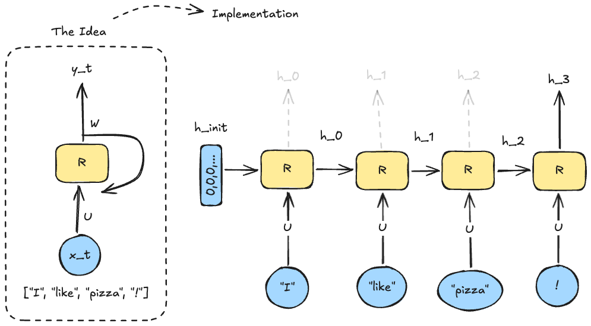
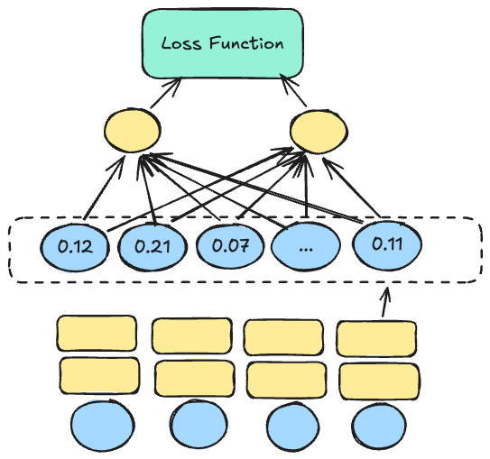
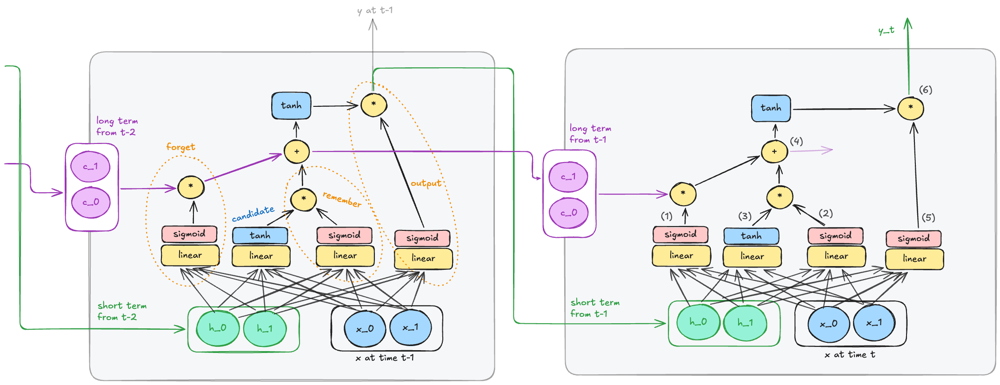

# RNN ja jälkeläiset

## Linkki aiemmin opittuun

Edellisessä osiossa keskityimme paljolti termiin *embedding*. Käsitteen ymmärtäminen helpottaa merkittävästi RNN:n ja sen seuraajien, kuten LSTM:n ja GRU:n, toimintaperiaatteen ymmärtämistä. Jos olet epävarma, kannattaa kerrata edellistä osiota ja käydä kävelyllä tai nukkua yön yli.

Toinen käsite, mikä kannattaa palauttaa mieleen, on *shared weights* eli jaetut painot. RNN:ssä, kuten konvoluutioverkoissakin, käytetään jaettuja painoja, mikä tarkoittaa, että samaa painojoukkoa käytetään useissa eri kohdissa verkkoa. Konvoluutioverkon kohdalla tämä on intuitiivista, koska paino on *kernel* eli suodatin, jonka vaikutusta kuvaan voi tarkastella visuaalisesti. RNN:ssä jaettu paino on konseptuaalisesti sama, mutta sen visualisointi on vaikeampaa, koska RNN käsittelee sekvenssidataa. Ihmismielellä on vaikeampi käsittää, kuinka samoja painoja voi soveltaa esimerkiksi lauseen eri sanoihin (tai siis niiden *embedding*-esityksiin).


**Kuva 1:** *Kaksi tuttua ja tuore tuttavuus vierekkäin. Konvoluutioverkko vähensi parametrien määrää hyödyntämällä paikallista rakennetta, jolloin kaikkea ei kytketä kaikkeen. RNN sen sijaan hyödyntää datan sekvenssiluonnetta, jolloin se voi hyödyntää aiempaa tietoa nykyisen syötteen käsittelyssä. Sivuun piirretty nuoli vie pieneen laatikkoon: yksi per neuroni. Tämä mahdollistaa "muistin", koska aktivoinnin vaikutus akkumuloituu tähän muuttujaan, joka on seuraavan syötteen käsittelyn laskennan osaksi. [^ldl]*

RNN:n ja CNN:n eroavaisuuksista kannattaa jo heti hyväksyä se, että ==konvoluutioverkko vaatii tietyn kokoisen inputin==. Sen sijaan RNN tarvitsee vain saman kokoisen *embedding*-esityksen, mutta sekvenssin pituus voi vaihdella. Tämä mahdollistaa sen, että ==RNN pärjää eri mittaisten lauseiden kanssa==. Konvoluutioverkkoa *voi* siis käyttää `Conv1D`-hengessä käsittelemään lauseita, mutta tällöin täytyy määritellä maksimipituus ja lyhentää tai täyttää lauseet sopiviksi. RNN:ssä tätä ei tarvita. Tämä on merkittävä etu lauseiden kanssa, jotka ovat luonnostaan eri mittaisia.

!!! danger

    Tässä on sekaannuksen vaara läsnä, joten korostetaan asiaa. RNN:kin tarvitsee paddingia **batch-käsittelyä varten**, mutta se ei vaadi sitä yksittäisen lauseen käsittelyyn.

## Motivaatio

RNN:t ovat neuroverkkoarkkitehtuuri, joka on suunniteltu käsittelemään sekvenssidataa, kuten tekstiä, ääntä tai aikasarjoja. On tärkeää painottaa sanaa *toistuva* tai *sekvenssi*. Ratkomme samankaltaisia ongelmia kuin aiemmin kurssilla, mutta nyt data on järjestetty sekvensseiksi: peräkkäisyys voi olla selkeä temporaalinen järjestys, kuten aikasarjoissa, tai ihan vain sanojen peräkkäisyys lauseessa.

Alla on taulukko, joka havainnollistaa erilaisten ongelmatyyppien ratkaisua. Taulukko mukailee Magnus Ekmanin vastaavaa [^ldl]. Alempi rivi edustaa sekvenssidataa eli tämän viikon aihetta, ylempi rivi on aiemmilta viikoilta tuttua kauraa:

|                  | Regressio                 | Luokittelu                | Multiclass luokittelu           |
| ---------------- | ------------------------- | ------------------------- | ------------------------------- |
| **Ei-sekvenssi** | Ennusta talon hinta       | Tunnista sairaus          | Tunnista MNIST-digit            |
| **Sekvenssi**    | Ennusta ensi kuun kysyntä | Tunnista sataako huomenna | Ennusta seuraava sana lauseessa |

!!! tip

    Joissakin kirjoissa/kursseissa käsitellään ensin aikasarjat, toisissa kielelliset ongelmat. Tällä kursilla on valittu aloittaa kielellisistä ongelmista, koska ne ovat intuitiivisia heti ensivilkaisulla: lauseiden kääntämistä kielestä toiseen ja niin edelleen. Lisäksi suurten kielimallin (LLM) suosion takia meillä kaikilla on jokin kosketuspinta tämän tyypin koneoppimismalleihin loppukäyttäjän näkökulmasta.

## RNN:n perusidea

> "A recurrent neural network (RNN) is a neural network that consists of a hidden state $h$ and an
optional output $y$ which operates on a variable length sequence $x = (x_1, \ldots, x_T)$. At each time
step $t$, the hidden state $h_{t}$ of the RNN is updated by ..."
>
> — Cho et. al. [^gru]

Yllä esitellyssä kuvassa RNN:ään kuuluivat verkon takaisinkytkentään liittyvät pienet keltaiset laatikot. Näistä voi käyttää termiä *hidden state*. Kuten kuvatekstissä sanottiin, nämä käytännössä edustavat `accumulator`-muuttujaa loopissa. Tarkastellaan tätä lyhyen kuvitteellisen Python-toteutuksen avulla:

```python
# Hyperparametrit
embedding_size = 4   # Embedding-vektorin pituus (d_x)
hidden_size    = 3   # Hidden state -vektorin pituus (d_h)

# Embedding on vektori, joka edustaa sanaa.
vec_I    = [0.1, 0.2, 0.3, 0.4]   # sana "I"

# Lauseet ovat listoja näistä vektoreista:
# "I am not an"      → 4 sanaa → 4 aika-askelta
# "I will not buy"   → 4 sanaa → 4 aika-askelta
sentence1, target1 = ([vec_I, vec_am,   vec_not, vec_an],  label_A)
sentence2, target2 = ([vec_I, vec_will, vec_not, vec_buy], label_B)
batch = [(sentence1, target1), (sentence2, target2)]

for sentence, target in batch:
    # Nollataan muisti jokaisen lauseen alussa!
    hidden_state = [0] * hidden_size

    for word_vector in sentence:
        # Joka aika-askeleella RNN saa syötteeksi:
        #   1) nykyisen sanan embedding-vektorin
        #   2) edellisen aika-askeleen hidden staten
        # ja palauttaa uuden hidden staten.
        hidden_state = rnn_cell(word_vector, hidden_state)

    # Silmukan jälkeen hidden_state on tiivistelmä koko lauseesta.
    # Tämän perusteella tehdään ennustus ja lasketaan virhe.
    prediction = output_layer(hidden_state)
    loss = loss_function(prediction, target)
    # backpropagation kulkee kaikkien aika-askelten läpi (BPTT)
```

Matemaattisesti sekä koodina RNN-mallin yhden `rnn_cell`:n laskenta, jota lasketaan loopissa, on [^ldl] [^geronpytorch]:

$$
h^{(t)} = \sigma(W \cdot h^{(t-1)} + U \cdot x^{(t)} + b)
$$

```python
def rnn_cell(x_t, h_prev):
    h_part = W @ h_prev   # shapes: (d_h, d_h) @ (d_h,) → (d_h,)
    x_part = U @ x_t      # shapes: (d_h, d_x) @ (d_x,) → (d_h,)

    h_t = tanh(x_part + h_part + b)
    return h_t
```

Muuttujat ovat selitettynä alla:

* $t$ on aika-askel, joka vastaa sanan sijaintia lauseessa ($t=0, 1, 2, \ldots$).
* $x^{(t)}$ on syötevektori ajanhetkellä $t$ eli kyseisen sanan *embedding*. 
    * Koko: $d_x$ (embedding_size).
* $h^{(t)}$ on *hidden state* ajanhetkellä $t$. Tämä on verkon "muisti". 
    * Koko: $d_h$ (hidden_size).
* $h^{(t-1)}$ on edellisen aika-askeleen hidden state. Alussa ($t=0$) tämä on tyypillisesti nollavektori.
* $W$ on $d_h \times d_h$ painomatriisi, joka painottaa edellistä hidden statea.
* $U$ on $d_h \times d_x$ painomatriisi, joka painottaa nykyistä syötevektoria.
* $b$ on bias-vektori (koko $d_h$).
* $\sigma$ on aktivointifunktio, tyypillisesti tanh.

Huomaa, että $d_h$ (hidden_size) on vapaasti valittava hyperparametri — se **ei** ole sama kuin lauseen pituus. Huomaa myös, että painomatriisit $W$ ja $U$ sekä bias $b$ ovat **jaettuja painoja**: samaa matriisia ja vektoria käytetään kaikissa aika-askeleissa.

Tässä vaiheessa nohevilla opiskelijoilla on toivon mukaan kysymyksiä mielissään. Yksi selkeä kysymysaihio on, että jos batch:n on oltava matriisi (joka kerrotaan painomatriisilla $U$), niin miten lauseet tai tekstit, jotka ovat eri mittaisia, mahtuvat samaan matriisiin? Juurihan yllä todettiin, että RNN ei vaadi tietyn mittaisia syötteitä. Naiivi vastaus olisi pitää `batch_size` 1:ssä eli toteuttaa pedanttinen SGD. Tämä on toki mahdollista, mutta ei tehokasta. 

Ratkaisu on lisätä täytettä (PAD) syötteen loppuun. Yksittäinen batch-Tensor on siis muotoa `(samples, sequence_length, features)`, missä `max_sentence_length` on suurimman samplen pituus batch:ssä, ja `features` on embedding. Alla on datasetti, jossa on muutamia sampleja. Ensimmäinen on kenties satu: *"Once (upon a ... and lived) happily ever after"*. Toinen lienee Raamattu: *"Alussa (loi Jumala ... olkoon kaikkien) kanssa. Amen"*. Alimmat näkyvät samplet ovat pari sanaa lyhyempiä, joten ne loppuvat keltaisella värillä korostettuun `vec_PAD`-täytteeseen, joka on siis $d_x$-ulotteinen *embedding* siinä missä kaikki muutkin tokenit. [^llmfromscratch]

|         | t=0         | ... | t=max-2     | t=max-1     | t=max       |
| ------- | ----------- | --- | ----------- | ----------- | ----------- |
| sample1 | vec_Once    | ... | vec_happily | vec_ever    | vec_after   |
| sample2 | vec_Alussa  | ... | vec_kanssa  | vec_DOT     | vec_Amen    |
| sample3 | vec_Turussa | ... | vec_END     | ==vec_PAD== | ==vec_PAD== |
| ...     | ...         | ... | ...         | ...         | ...         |
| sampleN | vec_Olipa   | ... | vec_Loppu   | ==vec_PAD== | ==vec_PAD== |

!!! tip

    Jos haluat, voit tutustua PyTorchin [torch.nn.utils.rnn.pad_packed_sequence](https://docs.pytorch.org/docs/stable/generated/torch.nn.utils.rnn.pad_packed_sequence.html) funktioon. Tämän käyttöä käsitellään Géronin kirjassa luvussa 14. [^geronpytorch]

### Ongelmatyypit sekvenssidatalle

Alla oleva jako tyyppeihin on peräisin Andrej Karpathyn blogipostauksesta otsikolla [The Unreasonable Effectiveness of Recurrent Neural Networks](https://karpathy.github.io/2015/05/21/rnn-effectiveness/), joka on yksi RNN:n klassikkolähteistä. Jaottelu on hyvin intuitiivinen ja auttaa hahmottamaan, millaisiin ongelmiin RNN:t sopivat. [^karpathy]


**Kuva 2:** *RNN-arkkitehtuurien taksonomia. [^karpathy] [^geronpytorch]*

#### Vector-to-Vector

Tämä taksonomian yksinkertaisin malli voidaan käsitellä hyvin lyhyesti: siitä puuttuu hidden state ja koko `R`-kirjaimen tarkoittama *recurrent* -elementti. Sisään menee `d_x`-ulotteinen vektori ja ulos tulee `d_y`-ulotteinen vektori (tai skaalari). Tämä on siis perinteinen feedforward-verkko eli kurssilta tuttu MLP. Se on käytännössä mukana vain kuriositeettina. [^karpathy]

#### Sequence-to-Vector

Tässä "many-to-one" -mallissa syötesekvenssi, kuten tekstilause tai ääninäyte, käsitellään aikasarjana ja tiivistetään yhdeksi tulosvektoriksi, jota käytetään tyypillisesti luokittelutehtävissä, kuten tunneanalyysissa tai roskapostin tunnistuksessa. [^geronpytorch]

Tällaisen löydät harjoituksesta `713_nvidia_language_model_embedding.py`. Vaikka malli inferenssivaiheessa tuottaa useita sanoja peräkkäin, arkkitehtuuri on many-to-one: se ennustaa aina yhden seuraavan sanan kerrallaan ja tulosta syötetään takaisin mallille (autoregressio).

#### Vector-to-Sequence

Tämä "one-to-many" -arkkitehtuuri ottaa syötteenään yhden vektorin, esimerkiksi kuvan piirrevektorin, ja tuottaa siitä sarjan tuloksia, mikä on yleistä esimerkiksi kuvatekstien automaattisessa generoinnissa, jossa kuvasta luodaan sanajono. [^karpathy] Toinen esimerkki voisi olla nimen generointi, jossa syötteenä on henkilön kotimaa (vektoroituna One-Hot -esityksenä) ja mallin tavoitteena on tuottaa sarja merkkejä, jotka muodostavat sukunimen. Tähän liittyy myöhemmin tehtävä.

#### Sequence-to-Sequence

Tämä on *many-to-many* -malli, joka on Karparthyn sanoin *synced sequence input and output*. Toisin sanoen sisään menee $n$-mittarinen sekvenssi ja ulos tulee $n$-mittarinen sekvenssi – eli yhtä pitkä syöte ja tuloste. Sinänsä se siis on *seq2seq*, mutta käytännössä tätä termiä käytetään kokemukseni mukaan lähinnä sellaiseen malliin, jossa syöte ja tuloste voivat olla eri mittaisia, kuten kielenkäännöksessä. Tämä on siis *synced* seq2seq, joka ei ole sama asia kuin encoder-decoder, joka esitellään alla.

Esimerkkinä *many-to-many*-malleista voisi olla videon kehysten luokittelu, jossa jokaiselle kehyssekvenssin kehykselle halutaan tuottaa luokitus [^karpathy]. Tai kenties syöte on lista sanoja, ja ulos lista binääriluokittimen tuloksia, että onko kyseinen sana verbi.

#### Encoder-Decoder

!!! warning

    Tämä on kurssin kannalta edistynyt käsite, ja sitä käsitellään Géronin kirjassa koko luku 14. Tämän 5 opintopisteen kurssin puitteissa emme ehdi syventyä tähän aiheeseen. Käsitellään se vain maininnan tasolla. Harjoituksessa `712_seq2seq_translation_tutorial.py` tutustut tähän koodin kautta.

    Jos haluat tutustua aiheeseen syvemmin kurssin laajuuden ulkopuolella, esimerkiksi projektien yhteydessä, voit aloittaa lukemalla Géronin kirjan loppuun ja tutustumalla julkaisuihin, joita kyseinen [PyTorch tutoriaali](https://docs.pytorch.org/tutorials/intermediate/seq2seq_translation_tutorial.html) suosittelee. Etsi sivulta väliotsikko "Recommended Reading".

Encoder-Decoder on toteutustavaltaan Sequence-to-Sequence -malli, mutta *synced*-ominaisuus on poistettu. Arkkitehtuuri on täten kaksivaiheinen: ensin *Encoder* lukee koko syötteen (esim. englanninkielisen lauseen) ja tiivistää sen yhdeksi kontekstivektoriksi (*state*), jonka jälkeen *Decoder* purkaa tuon vektorin halutuksi tulosteeksi (esim. ranskankieliseksi lauseeksi), mahdollistaen näin syötteen ja tulosteen eroavat pituudet ja irrelevanssin aikajärjestyksen suhteen. [^geronpytorch] Termistön suhteen huomio, että encoder-decoder välissä vektori tunnetaan monilla nimillä. Voit törmätä ainakin seuraaviin termeihin: *context vector, state vector, thought vector, latent vector*.

Arkkitehtuurissa on seq2vec -malli, *encoder*, jonka perään on kytketty vec2seq -malli, *decoder*. Encoder lukee koko syötteen ja tiivistää sen yhdeksi vektoriksi, joka tunnetaan nimellä *context vector*. Yllä (Kuvassa 2) vain Encoder-osuus saa syötteen: tämä johtuu siitä, että piirroksessa kyseessä on ulkoinen syöte. Decoder toki saa syötteen, mutta se on oma edellisen aika-askeleensa ennuste. Koulutusvaiheessa Decoder saa toki ulkoisen syötteen (eli ground-truth-sekvenssin). Tämä liittyy *teacher forcing* -tekniikkaan, jossa mallia ohjataan oikeaan suuntaan syöttämällä sille oikeat vastaukset, kun taas inferenssivaiheessa malli joutuu luottamaan omiin ennusteisiinsa. [^llmfromscratch]

!!! danger

    Sekaannusvaara, taas.

    * Synced many-to-many: Joka aika-askeleella tuotetaan output (esim. NER-taggaus, videon kehysluokittelu). Tämä ei ole encoder-decoder.
    * Encoder-Decoder: Encoder lukee ensin koko syötteen, sitten decoder tuottaa tulosteen. Syöte ja tuloste voivat olla eri pituisia. Konvention mukaan tämä on synonyymi seq2seq:lle.

Encoder-Decoder voidaan toteuttaa kahdella erillisellä `nn.Module`-luokalla, kuten `EncoderRNN` ja `DecoderRNN` (ks. `712_seq2seq_translation_tutorial.py`), tai yhdellä luokalla, jossa encoder- ja decoder-vaiheet ovat saman `forward()`-metodin
sisällä. Se, onko tai eikö ole kahta eri luokkaa, ei yksin määrittele arkkitehtuuria — ero syntyy siitä, onko kyseessä *synced* vai *unsynced* many-to-many.

## RNN:n koulutus

### Unrolling

Yllä käytetty `for`-loop on vastavirta eli *backpropagation* algoritmin kannalta huono. Muuttuja `hidden_state` on akkumulaattori, joka ylikirjoitetaan joka aika-askeleella, joten menneiden aika-askelten aktivointeja ei ole tallessa. RNN:n koulutuksessa käytetäänkin *unrolling* -tekniikkaa, jossa verkko "puretaan" useiksi kopioiksi, jotka on kytketty toisiinsa. Kuinka useaksi kopioksi? Batchen suurimman sekvenssin pituuden verran. [^ldl] [^geronpytorch]



**Kuva 3:** *RNN:n "unrolling" eli purkaminen. Katkoviivat edustavat sitä, että verkko voi olla jonkin yllämainitun taksonomien mukainen. Kustakin RNN-solusta lähtevä arvo joko osallistuu tai ei osallistu lopulliseen lähtöön, riippuen siitä, minkä tyyppisestä ongelmasta on kyse. [^ldl] [^geronpytorch]*

### BPTT

Kun verkko on avattu, se on tavallinen feedforward-verkko. Voimme siis käyttää tavallista backpropagation-algoritmia. Termi tälle koko strategialle on *Backpropagation Through Time* (BPTT). Algoritmi on siis sama kuin ennenkin, mutta koska prosessiin liittyy temporaalinen elementti, sille on annettu nimi. [^ldl] [^geronpytorch]



**Kuva 4:** *Muista, että RNN on vain lineaarinen verkko, joka on avattu useiksi kopioiksi. Meillä on yhä jokin loss function, jonka haluamme minimoida, ja usein ennen tätä on Linear-kerros, joka muuttaa hidden state -vektorin halutun kokoiseksi outputiksi.*

### Rajoitteet ja ongelmat

Syvät verkot kärsivät ongelmasta *vanishing* ja *exploding gradient*, johon olet törmännyt kurssin tehtävissä aiemmin. Kun luku kerrotaan useita kertoja peräkkäin `< 1` luvulla, kuten vaikka `0.25`, luku lähestyy nollaa. Jos se kerrotaan useita kertoja `> 1` luvulla, kuten `1.25`, luku kasvaa eksponentiaalisesti. RNN:ssä tämä tapahtuu, koska sama painomatriisi, $W$ tai $U$, kerrotaan useita kertoja peräkkäin. Jos RNN:stä tekee syvän, kuten alla olevassa kuvassa, ongelma luonnollisesti pahenee. [^ldl]


**Kuva 5:** *Monikerroksinen RNN. Violetilla ja punaisella värillä on korostettu sitä, että kaikki saman kerroksen neuronit jakavat $W_k$ painon, kuten myös $U_k$ painon.[^ldl] [^geronpytorch]*

Syvyyden lisääminen RNN:ään pahentaa entisestään *vanishing* ja *exploding gradient* -ongelmia, jotka ovat RNN:n suurimpia haasteita. Kuvittele, että haluat selvittää $U_1$:n eli ensimmäisen kerroksen jaettua painomatriisia, jolla $x^{(t)}$ kerrotaan. Tämä matriisi on mukana ==jokaisessa kerroksessa==, joten gradientti kulkee läpi kaikkien kerrosten, mikä tarkoittaa, että se kerrotaan useita kertoja peräkkäin. [^ldl]

### Ongelmien mitigointi

Alla on Learning Deep Learning -kirjan [^ldl] taulukon suomennettu ja tiivistetty versio, jossa on esiteltynä yleisiä tapoja yrittää mitigoida katoavia (*engl. vanishing*) ja räjähtäviä (*engl. exploding*) gradientteja RNN:issä. Se, auttaako kyseinen tekniikka katoaviin vai räjähtäviin gradientteihin, on merkitty taulukossa emojein.

| Tekniikka                 | Katoava | Räjähtävä | Huomiot                         |
| ------------------------- | ------- | --------- | ------------------------------- |
| Glorot tai He valinta     | ✅       | ⛔         | Riippuu aktivointifunktiosta.   |
| Batch Normalization       | ✅       | ⛔         | Puree piilotettuihin kerroksiin |
| Ei-saturoituva aktivointi | ✅       | ⛔         | Esim. ReLU                      |
| Gradient Clipping         | ⛔       | ✅         | Puree kaikkiin kerroksiin       |
| CEC + Portit              | ✅       | ✅         | Lue alta LSTM:n kohdalta lisää  |

## Kehittyneemmät RNN-arkkitehtuurit

### LSTM

Hochreiter ja Schmidhuberin vuonna 1997 esittelemä LSTM on RNN-variantti, joka on suunniteltu keventämään RNN:n vanishing gradient -ongelmaa sekä parantamaan pitkäaikaista muistin säilyttämistä. Räjähtävät ja katoavat gradientit ovat oire siitä, että $W$-painomatriisin arvot ovat erisuuria kuin $1$. Ekman kirjoittaa: *"[...] with a large enough number of timesteps, the only way to avoid vanishing and exploding gradients is to use weights with a value of 1, which kind of defeats the purpose because we want to be able to adjust the weights"* [^ldl]. Mallin kouluttamisen idea on säätää painoja, joten painojen pitäminen kiinteästi arvossa 1 ei ole ratkaisu. Tästä äärimmäisen naiivista ajatuksesta on kuitenkin johdettavissa *constant error carousel* -tekniikka, joka on LSTM:n ydin. [^lstm] Julkaisun tiivistelmässä tämä avataan näin: *"Multiplicative
gate units learn to open and close access to the constant error flow"* [^lstm]. Tyypillisen LSTM-solun kuvauksen sijasta, joka löytyy vaikkapa Géronin kirjasta, alla on kuva, jossa korostetaan, kuinka kaksi LSTM-solua kytkeytyvät toisiinsa. Kuvaa kannattaa tuijottaa siten, että sinulla on saatavilla myös tyypillinen LSTM-solun kuva (esim. Figure 13-12 Géronin kirjasta). Myös alkuperäisen julkaisun Figure 1 on hyödyllinen ymmärryksen apuna, mutta sen kohdalla on syytä huomioida, että esitelty malli on naiivi LSTM, jossa cell state -yhteyden paino on kiinteästi 1 (constant error carousel), eli cell state kulkee muuttumattomana eteenpäin ilman kertoimen vaikutusta. [^lstm] Alkuperäisestä 1997 LSTM:stä et myöskään löydä *forget gate* -mekanismia, joka on myöhemmin lisätty LSTM:ään. [^lstm-forget]



**Kuva 6:** *LSTM-arkkitehtuuri. Kuvassa on kaksi LSTM-solua. Kuvaaja pyrkii yhdistämään eri lähteistä vastaavien kuvaajien parhaat puolet [^geronpytorch] [^ldl] [^lstm]. Oikeanpuoleiseen soluun on merkitty pienin numeroin, `(1)...(6)`, vaiheet, jotka ovat alla matemaattisina kaavoina.*

LSTM:ssä on kolme porttia ja lisäksi *candidate*, jotka kaikki tuottavat $d_h$ ulotteisia vektoreita, jotka osallistuvat laskentaan. Yhdessä nämä neljä ovat:

* **Forget gate**: Päätös siitä, mitä tietoa vanhasta *cell state* -vektorista säilytetään tai unohdetaan. Käytetään sigmoid-aktivointia, joka tuottaa arvoja välillä 0 (unohtaa kaiken) ja 1 (säilyttää kaiken). [^geronpytorch]
* **Input gate**: Päätös siitä, mitä uutta tietoa syötteestä lisätään *cell state* -vektoriin. [^geronpytorch]
* **Output gate**: Päätös siitä, mitä tietoa *cell state* -vektorista käytetään nykyisen aika-askeleen outputiksi. [^geronpytorch]
* **Candidate**: Tuottaa ehdotetun uuden informaation, joka voidaan lisätä *cell state* -vektoriin, perustuen nykyiseen syötteeseen ja edelliseen hidden stateen. [^ldl]

Kuvasta ja lähteistä voi koostaa, että:

* LSTM-solut jakavat neljä painomatriisia: $W_f$, $W_i$, $W_o$ ja $W_c$. [^ldl] [^geronpytorch]
* $h$ on hidden state vektori, jonka pituus on $d_h$. [^ldl] [^geronpytorch]
* $c$ on cell state vektori, joka toimii LSTM:n muistina, ja sen pituus on jaettu $h$:n kanssa, eli $d_h$. [^ldl] [^geronpytorch]
* $x$ on syötevektori, jonka pituus on $d_x$ (embedding_size).
    * On mahdollista tehdä `concat(x, h)` ja käyttää tätä yhdistettyä vektoria syötteenä porttien laskentaan, jolloin painomatriisit $W_f$, $W_i$, $W_o$ ja $W_c$ olisivat muotoa $(d_h + d_x) \times d_h$. [^ldl]
* Muistin tarve skaalautuu $d_h$ ja embedding-koon, $d_x$, mukaan.

Aiheeseen liittyviä kuvaajia ja selostusta löytyy netistä reilusti. Yksi hyvä lähde on vastavirta-algoritmeista tuttu Christopher Olah. Hänen blogistaan löydät kenties tyypillisimmän tavan abstrahoida LSTM:n [^colahblog] – saman, jota Géron käyttää kirjassaan – merkinnästä [Understanding LSTM Networks](https://colah.github.io/posts/2015-08-Understanding-LSTMs/)

LSTM on käytetyin RNN-variantti: sen hyödyt ovat pitkälti samat kuin RNN:n, mutta *cell state* ja *gating* -mekanismien ansiosta se kykenee paremmin säilyttämään tietoa pitkissä sekvensseissä. [^towardds]

!!! info "Matemaattiset kaavat"

    $$
    \begin{align}
    f^{(t)} &= \sigma( W_f [ h^{(t-1)}, x^{(t)} ] + b_f ) \tag{1} \\
    i^{(t)} &= \sigma( W_i [ h^{(t-1)}, x^{(t)} ] + b_i ) \tag{2} \\
    \tilde{C}^{(t)} &= \tanh ( W_c [ h^{(t-1)}, x^{(t)} ] + b_c ) \tag{3} \\
    C^{(t)} &= f^{(t)} * C^{(t-1)} + i^{(t)} * \tilde{C}^{(t)} \tag{4} \\
    o^{(t)} &= \sigma( W_o [ h^{(t-1)}, x^{(t)} ] + b_o ) \tag{5} \\
    h^{(t)} &= o^{(t)} * \tanh ( C^{(t)} ) \tag{6}
    \end{align}
    $$

    Yllä olevat kaavat ovat kirjasta Learning Deep Learning [^ldl]. Löydät Géronin kirjasta vastaavat kaavat, mutta niissä on ei ole käytetty `concatenate`-tekniikkaa, joten painomatriiseja on tuplamäärä [^geronpytorch]. Kaavojen numerot vastaavat seuraavia vaiheita, ja ne on merkitty yllä olevaan kuvaan (Kuva 6).

### GRU

Kyunghyun Cho ja kollegat esittelivät GRU-arkkitehtuurin 2014 [^gru]. GRU on käytännössä yksinkertaistettu LSTM, joka yksinkertaisuudestaan huolimatta suoriutuu LSTM:ään verrattavalla tavalla [^geronpytorch]. Alkuperäinen Cho:n ja kumppaneiden julkaisu ei sisällä lyhennettä *GRU* laisinkaan. Julkaisun aihe on seq2seq Encoder-Decoder -arkkitehtuuri, mutta ikään kuin kylkiäisenä esitellään tämä uusi yksinkertaistettu LSTM-variaatio:

> "In addition to a novel model architecture, we also
propose a new type of hidden unit (f in Eq. (1))
that has been motivated by the LSTM unit but is
much simpler to compute and implement"
>
> — Cho et. al. [^gru]

## Tehtävät

!!! question "Tehtävä: RNN videoiden avulla"

    Jos yllä oleva selostus ei selkeyttänyt aihetta, etsi myös muita lähteitä. 
    
    * Yksi ehdotus on Lex Fridmanin [MIT 6.S094: Recurrent Neural Networks for Steering Through Time](https://youtu.be/nFTQ7kHQWtc?t=2164)-luento, joka on saatavilla YouTubessa. Videon alku on kertausta vastavirta-algoritmista, joten voit hypätä suoraan 36:04 kohtaan, josta RNN:t alkavat. Erityisesti videon lopun Application-osiot ovat varsin korvaamattoman tasokasta sisältöä.
    * Myös StatQuestin soittolista [Neural Networks / Deep Learning](https://youtube.com/playlist?list=PLblh5JKOoLUIxGDQs4LFFD--41Vzf-ME1&si=FBwTC2HDHZhTr6Nw) sisältää useita videoita, joissa käsitellään esim.:
        * RNN
        * LSTM
        * Word2Vec (viime viikon aihe)
        * Seq2Seq Encoder-Decoder
        * Attention

!!! question "Tehtävä: Sukunimien luokittelu Pt.1"

    Avaa Marimo Notebook `710_...py` ja tutustu koodiin. Kyseessä on [NLP From Scratch: Classifying Names with a Character-Level RNN](https://docs.pytorch.org/tutorials/intermediate/char_rnn_classification_tutorial.html)-tutoriaali PyTorchin dokumentaatiosta, joka on käännetty Marimo-malliin sopivaksi. Suorita koodi ja tarkastele tuloksia.

    Mallin koulutus vei Macbook Pro:lla MPS:ää käyttäen 12 minuuttia. CUDA-PC:llä koulutus meni 2 minuutissa.

!!! question "Tehtävä: Sukunimien luokittelu Pt.2"

    Palaa aiempaan `710`-alkuiseen Notebookiin. Kouluta malli uusiksi siten, että se ymmärtää myös suomalaisia sukunimiä. Käytä tässä apuna Avoidata.fi-palvelusta löytyvää Digi- ja väestöviraston julkaisemaa datasettiä [Väestötietojärjestelmän suomalaisten nimiaineistot](https://avoindata.suomi.fi/data/fi/dataset/none) (CC BY). Tee siis seuraavat:

    1. Lataa Excel-tiedosto
    2. Valitse kaikki sukunimet, joita on 700 tai yli
    3. Kopioi valitut leikepöydälle
    4. Liitä tiedostoon `data/names/Finnish.txt`

    Nyt sinulle pitäisi olla datasetissä uusi label `Finnish`, joka sisältää toista tuhatta suomenkielistä sukunimeä. Kouluta malli uudestaan, kenties eri tiedostonimellä, ja tarkastele tuloksia. Tunnistaako se sinut oikein? Mahdoitko olla training- vai test-datassa vai et kummassakaan?

!!! question "Tehtävä: Sukunimien generointi"

    Tutustu `711_char_rnn_generation_tutorial.py`-tiedostoon, joka on Marimo-muotoon käännetty versio [NLP From Scratch: Generating Names with a Character-Level RNN](https://docs.pytorch.org/tutorials/intermediate/char_rnn_generation_tutorial.html)-tutoriaalista. Tässä tutoriaalissa käytetään samaa dataa kuin edellisessä, mutta nyt mallin tavoite on generoida uusia sukunimiä eri kielille. Tutustu Notebookin koodiin ja selvitä, kuinka malli koulutetaan ja kuinka sitä kutsutaan. Muista, että tarkoituksena ei ole pelkästään ajaa koodia, vaan ymmärtää, miten se toimii. Tee tämä ymmärrys näkyväksi oppimispäiväkirjassasi.

    Huomaa, että dataset on sama kuin edellisessä tehtävässä, joten sinun äskettäin lisäämäsi suomalaiset sukunimet ovat nyt mukana myös tässä mallissa. Generointiin voit käyttää Notebookissa olevia valmiita funktioita:

    ```python
    samples('Finnish', 'ABCDEFGHIJKL')
    Artinen
    Bartanen
    Charinen
    Dantalak
    Eantara
    Fintanen
    # + ???
    ```

    Malli kouluttautui opettajan Macbook Pro:lla noin 1 minuutissa.

!!! question "Tehtävä: Konekäännös (Seq2Seq + Attention)"

    Tutustu `712_seq2seq_translation_tutorial.py`-tiedostoon, joka on Marimo-muotoon käännetty versio [NLP From Scratch: Translation with a Sequence to Sequence Network and Attention](https://pytorch.org/tutorials/intermediate/seq2seq_translation_tutorial.html)-tutoriaalista. Tässä tehtävässä rakennetaan neuroverkko, joka kääntää ranskaa englanniksi.

    Malli hyödyntää [Sequence to Sequence](https://arxiv.org/abs/1409.3215) (seq2seq) -arkkitehtuuria, jossa kaksi RNN-verkkoa toimivat yhdessä: toinen enkoodaa syötteen ja toinen dekoodaa sen käännökseksi. Tämän lisäksi mallissa käytetään [Attention-mekanismia](https://arxiv.org/abs/1409.0473), joka antaa dekooderin keskittyä syötteen tiettyihin osiin käännöstä generoidessaan. Attention käydään läpi tarkemmin seuraavassa [Transformers](transformers.md)-osiossa, joten voit palata siltä osin tähän Notebookiin myöhemmin.

    Tehtävänäsi on suorittaa Notebook, tutustua koodiin ja varmistaa, että ymmärrät Attention-mekanismin perusperiaatteen.

    Malli kouluttautui opettajan Macbook Pro:lla noin 8 minuutissa.

!!! question "Tehtävä: Kielimalli ja sanaulottuvuudet"

    Tutustu `713_nvidia_language_model_embedding.py`-tiedostoon. Tämä on muokattu versio NVIDIA:n Learning Deep Learning -kirjan (ja videosarjan) esimerkistä. Tehtävässä koulutetaan LSTM-pohjainen kielimalli, joka ennustaa seuraavaa sanaa annetun kontekstin perusteella. Samalla malli oppii sanaulottuvuudet (word embeddings).

    Tehtävänäsi on suorittaa Notebook ja tutustua koodiin. Kiinnitä erityisesti huomiota siihen, miten mallin oppimia embedding-vektoreita voidaan lopuksi hyödyntää etsimällä sanoille merkityksellisesti lähimpiä naapureita vektoriavaruudessa.

    Malli kouluttautui opettajan Macbook Pro:lla noin 4 minuutissa.

    !!! tip

        Huomaa, että tämä ei siis ole encoder-decoder -malli vaan iteratiivisesti ajettu seq2vec. Jos haluat tutustua Magnus Ekmanin versioon encoder-decoder -arkkitehtuurista, joka on toteutettu LSTM:llä, voit tutustua LDL:n repositoriosta löytyvään [v7_3_neural_machine_translation.ipyn](https://github.com/NVDLI/LDL/blob/main/pt_framework/v7_3_neural_machine_translation.ipynb) Jupyter Notebookiin. Malli on vastaava kuin `712_seq2seq_translation_tutorial.py`-tiedostossa, mutta kohtalaisen tiiviillä koodilla toteutettu.

## Lähteet

[^ldl]: Ekman, M. *Learning Deep Learning: Theory and Practice of Neural Networks, Computer Vision, NLP, and Transformers using TensorFlow*. Addison-Wesley. 2025.
[^geronpytorch]: Géron, A. *Hands-On Machine Learning with Scikit-Learn and PyTorch*. O'Reilly. 2025.
[^karpathy]: Karpathy, A. "The Unreasonable Effectiveness of Recurrent Neural Networks". 2015. https://karpathy.github.io/2015/05/21/rnn-effectiveness/
[^llmfromscratch]: Raschka, S. *Build a Large Language Model (From Scratch)*. Manning. 2024.
[^towardds]: Dancker, J. *A Brief Introduction to Recurrent Neural Networks*. Towards Data Science. 2022. https://towardsdatascience.com/a-brief-introduction-to-recurrent-neural-networks-638f64a61ff4/
[^lstm]: Hochreiter, S., & Schmidhuber, J. (1997). Long short-term memory. Neural computation. 1997. https://deeplearning.cs.cmu.edu/S23/document/readings/LSTM.pdf
[^lstm-forget]: Gers, F. A., Schmidhuber, J., & Cummins, F. *Learning to forget: Continual prediction with LSTM. Neural computation*. 2000. doi: 10.1049/cp:19991218
[^gru]: Cho, K., van Merriënboer, B., Gulcehre, C., Bahdanau, D., Bougares, F., Schwenk, H., & Bengio, Y. *Learning phrase representations using RNN encoder-decoder for statistical machine translation*. 2014. https://arxiv.org/abs/1406.1078
[^colahblog]: Olah, C. *Understanding LSTM Networks*. 2015. https://colah.github.io/posts/2015-08-Understanding-LSTMs/