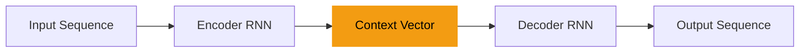

# Transformers

Aloitetaan töksäyttämällä heti alkuun määritelmä siitä, mikä transformer on: se on [Attention is All You Need](https://arxiv.org/abs/1706.03762)-artikkelissa vuonna 2017 esitelty neuroverkkopohjainen arkkitehtuuri, joka on suunniteltu erityisesti käsittelemään kieltä, mutta arkkitehtuuri on sittemmin taipunut myös muun datan käsittelyyn. Artikkelin tiivistelmä kertoo paljon:

> "We propose a new simple network architecture, the Transformer,
based solely on attention mechanisms, dispensing with recurrence and convolutions
entirely. Experiments on two machine translation tasks show these models to
be superior in quality while being more parallelizable and requiring significantly
less time to train."
>
> – Ashish Vaswani et. al. [^attention2017]

!!! danger

    Termeissä sekaannusvaara. Yleisesti käytetty Hugging Facen Python-kirjasto on nimeltään `transformers`, mutta se ei ole sama asia kuin transformer-arkkitehtuuri. Hugging Facen `transformers`-kirjasto on nimetty sen mukaan, että se tarjoaa työkaluja transformer-pohjaisten mallien rakentamiseen ja hyödyntämiseen.

## Motivaatio: RNN:n haasteet

> "The big limitation of encoder–decoder RNNs is that the RNN can’t directly access earlier hidden states from the encoder during the decoding phase. Consequently, it relies solely on the current hidden state, which encapsulates all relevant information. This can lead to a loss of context, especially in complex sentences where dependencies might span long distances."
>
> — Sebastian Raschka [^llmfromscratch]

Edellisessä luvussa opit, että LSTM ja GRU mallit paikkasivat RNN:n ongelmia, mutta eivät täysin ratkaisseet niitä. Erityisesti pitkät riippuvuudet ja kontekstin vaikutus sanan merkitykseen aiheuttivat haasteita. Palaako se kuusi vai palaako kuusi? Jääneitä ongelmia olivat siis ainakin [^buildingaiagents]:

* **Kohdistus (engl. *alignment*):** Käännöksessä eri kielten sanajärjestys ja rakenteet vaativat kohdennusta. Esimerkiksi `the cat` kummatkin sanat viittaavat suomenkielisessä käännöksessä many-to-one -hengessä sanaan `kissa`.
* **Katoavat tai räjähtävät gradientit:** Vaikka LSTM toi ratkaisuja, ongelma ei poistunut.
* **Ei-parallelisoitavuus:** RNN:n aikaisemmat tilat vaikuttavat nykyiseen tilaan, mikä estää tehokkaan rinnakkaisprosessoinnin.

Transformer-arkkitehtuuri, esitelty vuonna 2017, mullisti tätä siten, että *attention*-mekanismilla korvattiin *recurrence* eli RNN:stä tuttu syklisyys kokonaan. [^dlwithpython] Attention ei itsessään ole uusi keksintö: voit kurkata siihen liittyvää historiaa [Attention (machine learning)](https://en.wikipedia.org/wiki/Attention_(machine_learning))-Wikipedia-artikkelista. Tutustutaan alla tarkemmin siihen, mitä *attention* on.

## Attention

On hyvä pohtia heti alkuun motivaatiota: miksi tarvitsemme attentionia? Olet tutustunut RNN:n kohdalla encoder-decoder-arkkitehtuuriin, jossa encoderin tehtävänä on tiivistää koko syötesekvenssi yhdeksi vektoriksi, joka sitten dekoodataan tulosteeksi. Tämän tiivistyksen tulisi sisältää ==kaikki oleennainen informaatio== syötteestä. [^ldl]



Sanan kohdalla *embedding* tai *context vector* on jo tämän kurssin harjoituksissa osoittautunut hyödylliseksi, viitaten siihen, että Zellig Harrisin *distribution hypothesis*-teorialla on paikkansa maailmassa. Entäpä kun pitää tiivistää kokonaisuus, joka on merkittävästi monimutkaisempi kuin yksittäinen sana (tai sanan osatekijä, wordpiece)? Tarkastellaan seuraavaa kaoottista virkettä:

> "Nimikirjassa oleva merkintä virantoimituksesta pidättämisestä on poistettava, jos virantoimituksesta pidättämistä koskeva päätös tai virantoimituksesta pidättämisen perusteena ollut irtisanominen tai virkasuhteen purkamista koskeva päätös kumotaan taikka virkamiehen virantoimituksesta pidättämisen syynä olleessa oikeudenkäynnissä ei ole todettu syyllistyneen rangaistavaan tekoon."
>
> — 1322/89, § 3 [^nimikirja]

Kykenetkö tulkitsemaan lauseen sisällön kertalukemalla vasemmalta oikealle, vai joudutko välillä palaamaan taaksepäin? Enkooder-dekooder-malli ja sen *context embedding* ei välttämättä juuri edusta sitä, kuinka ihminen tulkitsee tekstikokonaisuuden. Ihminen esimerkiksi silmäilee edes-takaisin ja tulkitsee yksittäisten sanojen merkityksen kontekstin valossa. ==Attention voidaan nähdä tämän prosessin mimikointina==. [^ldl]

!!! tip

    Kyseinen lause on poimittu Kielikellon artikkelista, jossa käsitellään säädöskielen virke- ja lauserakenteen ongelmia. Käy kurkkaamassa, kuinka Kielikellon artikkelissa sama lause on selkeytetty listan avulla. [^kielikello]


Tavallisen, aiemmin kurssilta tutun seq2seq RNN:n **kiinteän pituuden kontekstivektorista** tulee siis pullonkaula [^ml-algos-depth] [^llmfromscratch]. Attention-mekanismi tarjoaa tähän ratkaisuna **dynaamisen kontekstivektorin**, joka lasketaan uudestaan joka ikiselle dekooderin aika-askeleelle [^buildingaiagents]. Tällöin Attention Decoder voi itsenäisesti päättää, mihin se keskittää huomionsa dekoodatessaan käännöstä.

> "In simple words, during translation, we have a context vector that is dynamically updated and tells us how much attention we should give to each part of the input sequence."
>
> — Raieli & Iuculano [^buildingaiagents]


**Kuva 1:** *Kuvassa näkyy vasemmalla enkooderi-RNN ja oikealla dekooderi-RNN. Näiden välissä on attention-mekanismi, joka saa syötteenä kaikkien aika-askeleiden piilotetut tilat (ks. koodi yllä). Kullekin dekooderin aika-askeleelle lasketaan kohdistuspisteet (alignment scores), jotka kuvaavat sitä, kuinka hyvin dekooderin nykyinen tila vastaa kutakin enkooderin tilaa. Kohdistuspisteet voidaan laskea monella tavalla, joista yksi on pistetulo (eli cosine similarity ilman magnitude-jakajaa).* [^ldl]

#### Query, Key ja Value (Q, K, V)

Attention-mekanismissa käytetyt termit *Query*, *Key* ja *Value* on lainattu tiedonhaun ja tietokantojen maailmasta, joissa niitä käytetään informaation järjestämiseen ja hakemiseen. Kuten Géron kirjoittaa, nämä termit ovat modernin implementaation mukaisia termejä aiemmin esitellylle. [^geronpytorch]

```python
def attention(QUERY, KEY, VALUE):
    # Calculate alignment scores (e.g., dot product)
    scores = np.dot(QUERY, KEY.T) # (1)!
    
    # Normalize scores to get attention weights
    attention_weights = softmax(scores)
    
    # Compute the attention vector as a weighted sum of values
    return np.dot(attention_weights, VALUE) # (2)!
```

1. Query on sama kuin $h_t$ dekooderin nykyisessä aika-askeleessa. Key on sama kuin $h_s$ enkooderin aika-askeleissa.
2. Value on $h_s$ enkooderin aika-askeleissa, aivan kuten Key, mutta se edustaa sitä informaatiota, jota dekooderi hyödyntää.

Intuition tasolla nämä kolme termiä voidaan ymmärtää seuraavasti:

* **Query (Kysely):** Vastaa tietokantahakua. [^llmfromscratch]
* **Key (Avain):** Toimii kuten tietokannan avain indeksoinnissa. Sekvenssin kaikilla jäsenillä on oma avain. [^llmfromscratch]
* **Value (Arvo):**  Vastaa avain-arvo -parin varsinaista sisältöä tietokannassa. [^llmfromscratch]
  
Value edustaa siis haluttua informaatiota. Kun malli on avainten perusteella päätellyt, mitkä syötteen osat ovat olennaisimpia kyselylle, se hakee hyödynnettäväksi niitä vastaavat arvot. (BY-NC-ND) [^llmfromscratch]


**Kuva 2:** *Kuvan Q, V ja K laskelmat ovat Transformers-arkkitehtuurista, mutta sama logiikka pätee myös RNN:n enkooderi-dekooderi-arkkitehtuurissa. Huomaa, että Q, K ja V lasketaan lineaarisella projektiolla syöte-embeddingeistä. Tässä laskelma on matriisimuodossa. $N$ on input-vektorin dimensio eli sanojen määrä. $D$ on embedding-koko. Softmax ajetaan sarakekohtaisesti.* [^udlbook]

Näillä kaikilla kolmella – Q, K, V – on erilaiset roolit, mutta niiden kaikkien laskenta on samankaltaista: ne saadaan lineaarisella projektiolla syöte-embeddingeistä. Tämä tarkoittaa, että syötteen embeddingit muunnetaan kolmeen eri avaruuteen (Q, K ja V) käyttämällä kolmea erillistä painomatriisia. Näin malli oppii erottamaan, miten se hakee tietoa (Q), miten se vertaa sitä syötteeseen (K) ja mitä tietoa se lopulta hyödyntää (V). [^transformers-def-guide]

## Transformer-arkkitehtuuri

Alkuperäisen Attention is All you Need -julkaisun transformer-arkkitehtuuri on pähkinänkuoressa [^ldl] [^attention2017]:

* Encoder-Decoder-arkkitehtuuri, jossa on attention-mekanismi.
* ... tarkemmin multi-head self-attention.
* Positionaalinen koodaus mallintaa sanajärjestystä.
* Ei rekurrenssia, vaan kaikki laskelmat tehdään rinnakkain.

Tutustutaan alla sen pariin merkittävimpään osatekijään otsikko kerrallaan.

### Self-Attention

Attention-mekanismin menestys on synnyttänyt useita variaatioita eri tappiofunktioita käyttäen. Näistä erityisesti *self-attention* on merkittävä, sillä se poimii informaatiota suoraan syötteestä itsestään ilman tarvetta verrata sitä mihinkään ulkoiseen tietoon. [^buildingaiagents] Toisin sanoen linkki dekooderiin katkaistaan: myös $Q$ tulee syötteestä; ei enkooderin piilotiloista.

> "Self-attention is the key component of transformer architecture. A transformer is a Seq2Seq model that uses attention in the encoder as well as the decoder, thus eliminating the need for RNNs"
>
> — Smolyakov [^ml-algos-depth]


**Kuva 3:** *Self-attention-mekanismissa sama sekvenssi toimii sekä queryn, keyn että valuen laskennan perustana. Tämä katkaisee kytköksen decoderiin. (BY-NC-ND)* [^udlbook]

Self-attentionin perusajatusta voidaan havainnollistaa kirjastometaforalla. Kuvittele, että etsit kirjastosta tietoa **Marsin kolonialisointia** käsittelevää esseetä varten (*Query*). Sinun ei tarvitse lukea jokaista hyllyssä olevaa kirjaa kannesta kanteen (*Value*) löytääksesi oikean teoksen. Sen sijaan selaat kirjojen selkämyksiä ja otsikoita (*Key*) löytääksesi ne, jotka vastaavat hakua. Toisin sanoen, self-attention on menetelmä, jonka avulla malli voi etsiä kontekstista juuri sen tiedon tai "edustuksen", jota se sillä hetkellä tarvitsee. [^buildingaiagents]

!!! danger

    Termien sekaannusvaara. ==Attention==-mekanismit mahdollistavat mallien keskittymisen eri osiin sekvenssejä, joita kutsutaan queryksi, keyksi ja valueksi. ==Self-attention== puolestaan viittaa erityisesti mekanismiin, jossa sama sekvenssi toimii queryn, keyn ja valuen laskennan perustana, mikä mahdollistaa sisäisten suhteiden ymmärtämisen sekvenssin sisällä. [^azure-book]

### Multi-Head Self-Attention

Jos kytket samaan inputtiin monta paralleelia self-attention blokkia, sinulla on **multi-head**-ratkaisu käsissäsi. Kullakin niistä on oma $Q$, $K$ ja $V$ matriisi ja kukin oppii omat painonsa. Lopuksi lähdöt ketjutetaan (engl. concatenate) ja yhdistetään taas kerran uudella lineaarisella projisiolla – eli tarvitaan uusia koulutettavia parametreja. Kurssikirjassa multi-headin merkitystä kuvataan näin: *"Multiple heads seem to be necessary to make self-attention work well. It has been speculated that they make the self-attention network more robust to bad initializations."* [^udlbook]

Voita ja kumppanit tutkivat 2019 asiaa, ja päättelivät, että *"only a small subset of heads appear to be important for the translation task. Important heads have one or more interpretable functions in the model, including attending to adjacent
words and tracking specific syntactic relations.* [^voita2019]. Eli eri päät löytävät erilaisia tokeneiden välisiä kytköksiä, mutta kaikki niistä eivät ole välttämättä merkityksellisiä, joten mallin parametrikokoa voi pienentää *pruning*-tekniikalla: eli katkomalla päitä kuin Hercules Hydralta.


**Kuva 4:** *Tähän mennessä vastaan tulleet osatekijät kun kytkee yhteen, ja ujuttaa väliin layer normalizationit regulaatoimaan, samme kuvassa näkyvän transformer-blokin: multi-head self-attention, layer normalization, MLP sekä vielä yksi layer normalization. Näitä voi kytkeä peräkkäin samalla tavalla kuin vaikkapa aiemmin nähtyjä Conv2D-blokkeja. (BY-NC-ND) [^udlbook]*

Se, mitä tässä materiaaleissa ei käsitellä, on ==masked== multi-head self-attention, joka on osa Transformer-dekoorin rakennetta.

### Positional Encoding

Transformer-arkkitehtuurissa kaikki laskennat tehdään rinnakkain, paralleelisti, mikä ajaa siihen, että RNN:n sekvenssijärjestyksen tuoma sanajärjestys kadotetaan. Ongelma ratkaistaan lisäämällä *positional encoding* kuhunkin embedding-vektoriin. Tämä encoding on vektori, joka ynnätään elementti elementiltä syötteeseen. Eli jos syötteen embedding on $e$ ja positionaalinen encoding on $p$, syötteen embedding muunnetaan $e' = e + p$. [^ldl] Tämän järjestystä kuvaavan vektorin voi joko oppia koulutuksessa tai laskea. Alkuperäisessä artikkelissa käytettiin laskukaavaa, joka hyödyntää sinin ja kosinin funktioita eri taajuuksilla. [^attention2017] Tämä kaava on poikkeaa hieman parillisten ja parittomien indeksien osalta, mutta perusidea on sama: eri taajuuksilla olevat sinit ja kosinit luovat uniikkeja positionaalisia koodeja, jotka auttavat mallia erottamaan sanojen järjestyksen. Kaava on seuraava:

$$
element_{(pos, i)} = \begin{cases}
\sin\left(\frac{pos}{10000^{\frac{i}{d}}}\right) & \text{if } i \text{ is even} \\
\cos\left(\frac{pos}{10000^{\frac{i-1}{d}}}\right) & \text{if } i \text{ is odd}
\end{cases}
$$

Jossa:

* $pos$ on sanan paikka sekvenssissä (esim. 0, 1, 2, ...)
* $i$ on embedding-vektorin elementin indeksi (esim. 0, 1, 2, ...)
* $d$ on embedding-vektorin koko (esim. 512)

### Toiminta kokonaisuutena

3Blue1Brown on tehnyt sen verran hyvää työtä transformer-arkkitehtuurin kokonaisuuden toiminnasta, joten viiton sinut suoraan katsomaan hänen videotaan. Video on upotettu alle.

<iframe width="560" height="315" src="https://www.youtube.com/embed/eMlx5fFNoYc?si=998SG9QHp6ENmjuQ" title="YouTube video player" frameborder="0" allow="accelerometer; autoplay; clipboard-write; encrypted-media; gyroscope; picture-in-picture; web-share" referrerpolicy="strict-origin-when-cross-origin" allowfullscreen></iframe>

**Video 1:** *3Blue1Brownin video, Attention in transformers, step-by-step | Deep Learning Chapter 6, selventää hyvin attention-mekanismia transformer-arkkitehtuurissa*

On äärimmäisen suositeltavaa katsoa myös soittolistan seuraava video, [How might LLMs store facts | Deep Learning Chapter 7](https://youtu.be/9-Jl0dxWQs8?si=1tflE3dKxDw7baCv), joka selventää, mihin (kenties) tieto tallentuu transformer-mallissa. Eli siis: kuinka malli kykenee jatkamaan lausetta, joka vaatii tosielämän faktatietoa, kuten *"Mika Häkkinen on kuuluisa urheilija lajissa..."*.

On syytä huomata, että vaikka Transformer ei sisällä rekursiivisia tai konvoluutiokerroksia perinteisessä mielessä, dekooderi toimii autoregressiivisesti – se tuottaa sanoja yksi kerrallaan ja syöttää edellisen tulosteen takaisin seuraavan askeleen syötteeksi. Tämä muistuttaa RNN:n takaisinkytkentää, mutta liittyy mallin käyttötapaan eikä itse arkkitehtuuriin. [^ldl]

Jos arkkitehtuuria vertaa konvoluutioverkkoihin, on kiintoisaa, että vaikka Transformer ei eksplisiittisesti hyödynnä konvoluutioita, self-attention-kerrokset oppivat käytännössä usein konvoluutiomaisia operaatioita painojen jakamisen kautta. Oleellinen ero kuitenkin on, että self-attention voi kohdistua mihin tahansa syötteen kohtaan, kun taas konvoluutio rajautuu vain ytimen (engl. *kernel*) kattamiin naapuripositioihin. [^ldl]

Lopulta tätä kokonaisuutta voi tiivistää siten, että kyseessä on yhä enkooderi-dekooderi-arkkitehtuuri, mutta rinnakkaistettavuus erottaa sen RNN-pohjaisista malleista. Alkuperäisessä julkaisussa arkkitehtuuria käytettiin nimenomaan kääntämiseen, mutta Transformer suoriutuu myös muista tehtävästä. Pelkästään kielen käsittelyssä siitä löytyy muunnelmia, kuten GPT ja BERT. [^ldl]


## Arkkitehtuurin variaatiot

!TODO! Nämä voisi käydä lyhyesti läpi, ehkä. Encoder-only BERT, Decoder-only GPT, Encoder-Decoder T5 eli thö öriginääl thing.

## Mallien arviointi (Metriikat)

Tekstiä tuottavien tai kääntävien mallien laadun mittaaminen on vaikeampaa kuin luokittelun, sillä "oikeita" vastauksia voi olla useita, ja siksi yksinkertainen tarkkuusprosentti (accuracy) ei riitä – tai ei ole edes määriteltävissä. Ihminen voi arvioida tuotetun tekstin laatua käsin, mutta tämä on aikaa vievää ja subjektiivista. [^ml-q-ai] Joitakin suoritus kykymittareita siis tarvitaan, mutta on ymmärrettävä, että ne eivät tulkitse laatua kuten ihminen. Suorituskykymittarit voidaan jakaa kahteen kategoriaan:

* **Ulkoiset (engl. extrinsic)**: Mittaavat mallin suorituskykyä todellisessa tehtävässä vertaamalla mallin tuottamaa tulosta ihmisen tuottamaan referenssiin. Esimerkkejä ovat BLEU, ROUGE ja BertSCORE.
* **Sisäiset (engl. intrinsic)**: Mittaavat mallin tuottaman tekstin sisäisten ominaisuuksien perusteella, ilman ulkoista sovellusta tai tehtävää. Tätä edustaa alla Perplexity.

Perplexity, sisäinen suorituskykymittari, voidaan rinnastaa luokittelussa käytettävään ristientropia-tappiofunktioon. Mitä matalampi perplexity, sitä vähemmän malli "hämmentyy" ennustaessaan seuraavaa sanaa. Se ei kuitenkaan suoraan kerro, kuinka hyvä malli on tuottamaan ihmismäistä tekstiä tietyssä tehtävässä.

Vastaavasti BLEU ja ROUGE ovat **ulkoisia mittareita**, jotka vertautuvat kuvantunnistuksen tarkkuusprosenttiin (accuracy). Ne mittaavat mallin suorituskykyä loppukäyttäjän näkökulmasta vertaamalla tulosta ihmisen tekemään mallivastaukseen. BLEU on luonteeltaan tarkkuuspainotteinen (precision) ja soveltuu hyvin konekäännösten arviointiin, kun taas ROUGE on saantipainotteinen (recall) ja on yleinen tiivistelmien laadun mittari. Vaikka mallia koulutetaan minimoimaan perplexityä (tai tappiofunktiota), lopullinen tavoite on usein maksimoida nämä ulkoiset laatumittarit. [^ml-q-ai]

### Perplexity

Perplexity on sukua koulutuksen aikana minimoitavaan ristientropiaan (cross-entropy). Käytännössä se mittaa mallin epävarmuutta. Toisin päin sanottuna: se mittaa, kuinka yllättynyt (engl. *surprised* tai.. wait for it.. *perplexed*) malli on nähdessään oikean sanan. [^transformers-def-guide] Se on IBM:n tutkijoiden vuonna 1977 julkaisema mittari, mutta: *"Perplexity remains a primary benchmark to this day and is a popular metric for evaluating sequential neural networks (including the GPT family of models)."* [^comet]

Matemaattisesti perplexity lasketaan ennustettujen todennäköisyyksien perusteella ja normalisoidaan lauseen pituudella. Jos malli antaa oikeille sanoille korkeita todennäköisyyksiä, perplexity on matala (lähellä ykköstä). Kaava sille on seuraava: [^ml-q-ai]

$$
Perplexity(s) = 2^{-\frac{1}{N} \log_2 p(s)}
$$

...jossa $s$ on syötesekvenssi, $N$ on sekvenssin pituus ja $p(s)$ on mallin ennustama todennäköisyys sekvenssille. Tuo kaava ei paljasta, kuinka mallin ennustama todennäköisyys sekvenssille itsessään lasketaan. Se on:

$$
p(s) = \prod_{i=1}^{N} P(w_i | w_1, w_2, ..., w_{i-1})
$$

Eli lause `s = "Pizza may be life"` voidaan purkaa sanoiksi `w_1 = "Pizza"`, `w_2 = "may"`, `w_3 = "be"` ja `w_4 = "life"`. Malli ennustaa todennäköisyyden jokaiselle sanalle, ottaen huomioon kaikki aiemmat sanat. Eli siis:

$$
\begin{align*}
P(w_1 | \text{start}) & = P(\text{"Pizza"} | \text{start}) \\
P(w_2 | w_1) & = P(\text{"may"} | \text{"Pizza"}) \\
P(w_3 | w_1, w_2) & = P(\text{"be"} | \text{"Pizza"}, \text{"may"}) \\
P(w_4 | w_1, w_2, w_3) & = P(\text{"life"} | \text{"Pizza"}, \text{"may"}, \text{"be"})
\end{align*}
$$

Nämä todennäköisyydet saadaan mallin outputista (softmax). Merkintä `P(word|context)`, joka esiintyy Hugging Facen [Perplexity of fixed-length models](https://huggingface.co/docs/transformers/en/perplexity)-dokumentissa, muistuttanee sinua Naive Bayes -mallin todennäköisyyslausekkeista, kuten myös *epävarmuus* tai *entropia*. Perplexity on siis eräänlainen "käänteinen" todennäköisyys, joka mittaa mallin epävarmuutta ennustuksistaan.

Suosittelen tutustumaan Machine Learning Q and AI -kirjan repositoriosta löytyvään [perplexity.ipynb](https://github.com/rasbt/MachineLearning-QandAI-book/blob/main/supplementary/q19-evaluation-llms/perplexity.ipynb)-tiedostoon, jossa on esimerkkejä siitä, kuinka perplexity lasketaan käytännössä. [^ml-q-ai]. Jos haluat selkeästi kommentoidun koodiesimerkin, katso Cometin blogilta [Perplexity for LLM Evaluation](https://www.comet.com/site/blog/perplexity-for-llm-evaluation/).

### BLEU

BLEU (Bilingual Evaluation Understudy) on kenties tunnetuin ja laajimmin käytetty mittari konekäännösten laadun arviointiin. Sitä hyödyntävät lähes kaikki kielen kääntämiseen kykenevät kielimallit, mukaan lukien OpenAI:n Whisper ja GPT-mallit. Menetelmä perustuu vertailuun: mallin tuottamaa tekstiä verrataan ihmisen tekemään referenssikäännökseen. Käytännössä BLEU mittaa sanastollista päällekkäisyyttä laskemalla tarkkuutta (precision) eli sitä, kuinka moni mallin tuottama sana tai sanajono (n-grammi) esiintyy myös referenssit tekstissä [^ml-q-ai]. Sen kaava on:

$$
\begin{align*}
BP & = \begin{cases}
1 & \text{if } c > r \\
e^{(1 - \frac{r}{c})} & \text{if } c \leq r
\end{cases} \\
BLEU & = BP \cdot \exp\left( \sum_{n=1}^{N} w_n \log p_n \right)
\end{align*}
$$

...jossa:

* $c$ on mallin tuottaman tekstin pituus
* $r$ on referenssitekstin pituus
* $N$ on n-grammin range (usein 4-grammi)
* $w_n$ on painoarvo n-grammille (usein tasapainotettu, eli $w_n = \frac{1}{N}$)
* $p_n$ on `correct_n-grams / tota_n_grams` eli mallin tuottamien n-grammien tarkkuus

Alla Pekka Huttusen aiemmasta kurssitoteutuksesta lainattu esimerkki:

* Original: Rakastan oppia uusia asioita tekoälystä.
* Reference: I love to learn new things about AI.
* Candidate 1: ==I love== love ==new== ==AI.==
* Candidate 2: ==I love to learn== ride a bike ==.==
* Candidate 3: ==I love== learning ==about== artificial intelligence ==.==

!!! info 
    Lukuohje: keltaisella korostetut osat ovat n-grammeja, jotka esiintyvät referenssissä. Ensimmäisen lauseen toista `love`-sanaa ei lasketa, koska se on jo laskettu ensimmäisen `love`-sanan kohdalla. Täten `len(I, love, new, AI, .`) on 5 ja `len(Candidate_1)` on 6, joten 1-grammien tarkkuus on 5/6.

| Metric     | Candidate 1 | Candidate 2 | Candidate 3 |
| ---------- | ----------- | ----------- | ----------- |
| 1-grams    | 5/6         | 5/8         | 4/7         |
| 2-grams    | 2/5         | 3/7         | 1/6         |
| 3-grams    | 0/4         | 2/6         | 0/5         |
| 4-grams    | 0/3         | 1/5         | 0/4         |
| lenght $c$ | 6           | 8           | 7           |


??? "Tarkemmat laskelmat (klikkaa auki)"

    Alla vielä laskennat:

    **Candidate 1**

    $$
    \begin{align*}
    BP & = e^{(1 - \frac{9}{6})} = 0.6065 \\
    BLEU & = 0.6065 \cdot \exp\left( \frac{1}{4} (\log \frac{5}{6} + \log \frac{2}{5} + \log \frac{0}{4} + \log \frac{0}{3}) \right) \\
    BLEU & = 0.6065 \cdot \exp\left( -0.1823 - 0.9162 - \infty - \infty \right) \\
    BLEU & = 0.6065 \cdot 0 = 0
    \end{align*}
    $$

    **Candidate 2**

    $$
    \begin{align*}
    BP & = e^{(1 - \frac{9}{8})} = 0.8825 \\
    BLEU & = 0.6065 \cdot \exp\left( \frac{1}{4} (\log \frac{5}{8} + \log \frac{3}{7} + \log \frac{2}{6} + \log \frac{1}{5}) \right) \\
    BLEU & = 0.6065 \cdot \exp\left(\frac{1}{4} (-0.4700 - 0.8472 -1.0986 - 1.6094) \right) \\
    BLEU & = 0.6065 \cdot 0.3655 = 0.323
    \end{align*}
    $$

    **Candidate 3**

    $$
    \begin{align*}
    BP & = e^{(1 - \frac{9}{7})} = 0.7515 \\
    BLEU & = 0.6065 \cdot \exp\left( \frac{1}{4} (\log \frac{4}{7} + \log \frac{1}{6} - \infty - \infty) \right) \\
    BLEU & = 0.7515 \cdot 0 = 0
    \end{align*}
    $$


Kyseessä on merkkijonojen vertailuun perustuva mittari. Se ei ymmärrä sanojen merkityksiä tai kielioppia. Esimerkiksi synonyymien käyttö tai sanajärjestyksen muutos voi laskea pisteitä, vaikka käännös olisi sisällöllisesti oikein. Toisaalta merkitykseltään väärä lause voi saada korkeat pisteet, jos se sisältää oikeat sanat. [^ml-q-ai]

Nykykäsityksen mukaan BLEU onkin hyödyllinen työkalu ensisijaisesti mallin kehityksen seurantaan (model selection) koulutuksen aikana, jossa se toimii sujuvuuden indikaattorina. Lopulliseen laadunvarmistukseen (model evaluation) tai virheiden etsintään se ei sovellu yhtä hyvin, ja nykyään sen rinnalle tai tilalle on noussut kehittyneempiä vaihtoehtoja, kuten METEOR ja COMET.[^ml-q-ai].

Aivan kuten Perplexity, myös BLEU:n käytöstä löytyy [bleu.ipynb](https://github.com/rasbt/MachineLearning-QandAI-book/blob/main/supplementary/q19-evaluation-llms/bleu.ipynb)-tiedostosta lisätietoa aiemmin mainitun kirjan reposta.

### ROUGE

TODO! Obvious.

### BERTScore

TODO! Obvious.

## Tehtävät

!!! question "Tehtävä: Perplexity"

    Aja tiedosto `720_perplexity.py`. Kyseessä on **Transformers - The definitive Guide** -kirjan [^transformers-def-guide] esimerkki, joka on toteutettu PyTorchilla. Koodi on muutoin samaa, mutta se on saatettu yhteen Suomen kielen kanssa. Tutustu koodiin ja käytä sitä leikkikenttenä. Lopussa on soluja, jotka sallivat sinun selvittää jonkin keksimäsi lauseen PPL-arvon, näin:

    ```python
    Perplexity("Ainola on säveltäjä Jean Sibeliuksen ja hänen puolisonsa Aino Sibeliuksen asuintalo, joka on vuodesta 1974 alkaen toiminut kotimuseona")
    ```

    Lause on lainaus [Ainola](https://fi.wikipedia.org/wiki/Ainola)-artikkelista suomenkielisestä Wikipediasta. Wikipediaa on käytetty yhtenä lähteenä käyttämämme mallin `LumiOpen/Viking-7B` koulutuksessa. Huomaa, että mallin ajaminen GPU:lla vaatii noin 16 GB VRAM:ia. CPU:lla ajettaessa et saa Out Of Memory -varoituksia, mutta malli on toki hieman hidas.

!!! question "Tehtävä: ???"

    Tutustu `721_neural_machine_translation_transformer.py`-tiedostoon. Tämä on muokattu versio NVIDIA:n Learning Deep Learning -kirjan (ja videosarjan) esimerkistä. Tehtävässä koulutetaan Transformers-malli kääntämään yhdestä kielestä toiseen.

    20 epookin koulutus kesti opettajan Macbook:lla noin 12.5 minuuttia. Huomaa, että MPS ei ole tuettu, joten koulutus tapahtui CPU:lla. Ubuntu-koneella meni noin 1.5 minuuttia GPU:lla.

## Lähteet

[^attention2017]: Vaswani, A. et. al. *Attention is All You Need*. 2017. https://arxiv.org/abs/1706.03762
[^llmfromscratch]: Raschka, S. *Build a Large Language Model (From Scratch)*. Manning. 2024.
[^buildingaiagents]: Raieli, S. & Iuculano, G. *Building AI Agents with LLMs, RAG, and Knowledge Graphs*. Packt. 2025.
[^dlwithpython]: Watson, M & Chollet, F. *Deep Learning with Python, Third Edition*. Manning. 2025.
[^ldl]: Ekman, M. *Learning Deep Learning: Theory and Practice of Neural Networks, Computer Vision, NLP, and Transformers using TensorFlow*. Addison-Wesley. 2025.
[^nimikirja]: 1322/1989. *Nimikirjan pitäminen eräistä henkilöstöryhmistä*. https://www.finlex.fi/fi/lainsaadanto/1989/1322
[^kielikello]: Virtaniemi, A. *Kiiloja ja sokkeloita. Säädöskielen virke- ja lauserakenteen ongelmia*. 1992. https://kielikello.fi/kiiloja-ja-sokkeloita-saadoskielen-virke-ja-lauserakenteen-ongelmia/
[^ml-algos-depth]: Smolyakov, V. *Machine Learning Algorithms in Depth*. Manning. 2025.
[^geronpytorch]: Géron, A. *Hands-On Machine Learning with Scikit-Learn and PyTorch*. O'Reilly. 2025.
[^udlbook]: Prince, S. *Understanding Deep Learning*. The MIT Press. 2023. https://udlbook.github.io/udlbook/
[^transformers-def-guide]: Koenigstein, N. *Transformers: The Definitive Guide*. O'Reilly. 2026.
[^azure-book]: Esposito, F. *Programming Large Language Models with Azure Open AI: Conversational programming and prompt engineering with LLMs*. Microsoft Press. 2024.
[^voita2019]: Voita, E., Talbot, D., Moiseev, F., Sennrich, R. & Titov, I. *Analyzing Multi-Head Self-Attention: Specialized Heads Do the Heavy Lifting, the Rest Can Be Pruned*. 2019. https://arxiv.org/abs/1905.09418
[^ml-q-ai]: Raschka, S. *Machine Learning Q and AI*. No Starch Press. 2024.
[^comet]: Morgan, A. *Perplexity for LLM Evaluation*. 2024. https://www.comet.com/site/blog/perplexity-for-llm-evaluation/
