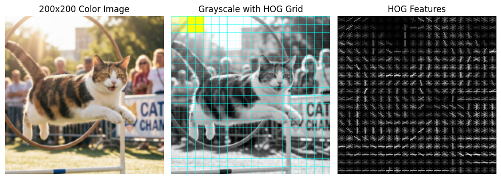
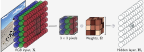

# Konvoluutioverkot

## Perusteet

### Motivaatio

Olet tutustunut kurssilla FCNN-verkkoihin, ja niiden rajat alkoivat löytyä Cifar10-datasetin kohdalla. Edellisen luvun tehtävässä koulutit FCNN-verkon – kenties arkkitehtuurilla `3072-1024-512-10` –, ja pääsit noin 55% tarkkuuteen. Tutustuessasi wikipedian [Cifar10](https://en.wikipedia.org/wiki/CIFAR-10)-sivuun huomasit, että jo 2010-luvun alkupuolella verkot kykenivät yli 95 % tarkkuuteen. On hyvä muistaa, että 95 % on jo merkittävän suuri tarkkuus. Graham lainaa Karpathyä, että: *"For comparison, human performance on CIFAR-10 is estimated to be 6%."* [^fractionalmp] Lukema on siis *error rate*, ei *accuracy*.

Miten tämä on mahdollista? Lienee selvää, että 2010-luvun alussa ratkaisu tuskin oli kasvattaa verkkoa ilman arkkitehtuurimuutoksia. Alla on taulukossa esiteltynä `3072-1024-512-10` FCNN-verkon parametrien lukumäärä. 


| Layer      | Shape                    | Count         |
| ---------- | ------------------------ | ------------- |
| fc1.weight | torch.Size([1024, 3072]) | 3,145,728     |
| fc1.bias   | torch.Size([1024])       | 1,024         |
| fc2.weight | torch.Size([512, 1024])  | 524,288       |
| fc2.bias   | torch.Size([512])        | 512           |
| fc3.weight | torch.Size([10, 512])    | 5,120         |
| fc3.bias   | torch.Size([10])         | 10            |
| **Total**  |                          | **3,676,682** |

Olet varmasti kokeillut tätä ratkaisua itsekin: verkon kokoa kasvattamalla ei päästä kovin pitkälle. Mikä siis avuksi? Historiasta löytyy vastaus: konvoluutioverkot (Convolutional Neural Networks, CNN). Alla näkyy kurssikirjasta kuva, joka havainnollistaa konvoluutioverkkojen suorituskykyä MNIST-datasetin avulla [^udlbook].


**Kuva 1:** MNIST konvoluutioverkolla (2050 parametria) vs. FCNN:llä (150,185 parametria). [^udlbook]

Ihmiseen kun vertaa, niin jo vuonna 2014 Grahamin **Fractional Max-Pooling** -malli saavutti huimat tulokset: *"we obtained test errors of 4.50% (1 test), 3.67% (12 tests) and 3.47% (100 tests)"* [^fractionalmp]. Konvoluutioverkot mahdollistavat siis huomattavan tehokkaan tavan käsitellä kuvia. Ja mikä oli Grahamin mallin parametrien määrä? **74 miljoonaa** parametria (jos `filter_growth_rate = 160`). Tosin paperissa mainitaan myös 12M parametria käyttänyt malli (`filter_growth_rate = 64`). Tämä pienempi malli on se, mikä on toteutettu kurssin koodissa.

$74 \text{M}$ parametrin malli ylsi Grahamin paperin mukaan $3.47 \%$ virheeseen CIFAR-10 datasetin kanssa. Opettajan kouluttamalla, pienemmällä $12 \text{M}$ parametrin mallilla päästiin noin $92 \%$ tarkkuuteen eli $8 \%$ virheeseen. Tutustut tähän toteutukseen myöhemmin tehtäväosiossa, ja tähän tutustutaan myös [Case Study: Fractional Max-Pooling (Graham, 2014)](#case-study-fractional-max-pooling-graham-2014)-otsikon alla hieman tarkemmin.


**Kuva 2:** *300 epookin koulutuksen aikaiset tarkkuus- ja virhekäyrät Grahamin Fractional Max-Pooling -mallille (12M parametria).*

### Rautavaatimukset

Vuonna 2014 olisi ollut mahdollista käyttää esimerkiksi GeForce GTX TITAN -korttia, jossa on 6 GB muistia. Muistiin mahtuisi $\frac{6 \times 1024^3}{4} \approx 1600 \text{M}$ parametria (per BATCH). Jos *batch size* on 32, niin silloin käytössä on $\frac{1600}{32} \approx 50 \text{M}$ parametria. Tämä on yhä reilusti enemmän kuin edellä esitellyssä pienemmässä 14 miljoonan parametrin verkossa. Koulutusvaiheessa muistiin pitää mahtua myös aktivoinnit, gradientit ja optimointiin liittyvät muuttujat. Näitä lukemia voi laskea (ks. kurssikirja!), mutta sen voi myös selvittää kokeilemalla. Alla on typistetty `nvidia-smi`-komennon tulos koulutuksen aikana (GeForce RTX 3060 Ti, 8 GB muistia):

```
+-------------------------------------------------------------------+
| Processes:                                                        |
|  GPU   GI   Type   Process name                        GPU Memory |
|        ID                                              Usage      |
|===================================================================|
|    0   N/A     C   ...n/notebooks/.venv/bin/python3       2650MiB |
+-------------------------------------------------------------------+
```

Jos 12M parametria vie 32-kokoisella erällä `2650 MiB` muistia, niin suuremman mallin (`filter_growth_rate = 160`) huimat 74M parametria veisi noin `74/12 * 2650 ≈ 16342 MiB`, eli noin 16 GB muistia. Jos mallin halutaan mahtuvan 6 GB VRAM:iin, niin batch-kokoa pitäisi pienentää. Jos batch-koko lasketaan neljännekseen (`32/4 = 8`), niin tällöin muistia tarvittaisiin enää `16342 / 4 ≈ 4085 MiB`, eli noin 4 GB.

12M mallin kouluttamiseen kului opettajan GeForce RTX 3060 Ti:llä ==yli 11 tuntia== (300 epookkia, noin 2 min 17 sek per epookki).

!!! note "Syötekuva ja parametrien määrä"

    VGG-16-konvoluutioverkossa käytetään tyypillisesti kuvia koossa 224×224×3 (RGB, 3 kanavaa). Dataset on nimeltään ImageNet, jossa on 1000 eri luokkaa ja miljoonia kuvia. Konvoluutioverkossa VGG-16 on tästä huolimatta kokonaisuudessaan vain 138M parametria.

    Kuinka olisi FCNN-verkon laita, jos input on `224x224x3` ja ensimmäinen piilotettu kerros `4096` neuronia? Input olisi siis `150,528`-pituinen vektori. Tällöin ==pelkästään ensimmäisen== piilotetun kerrokset olisivat parametrimäärältään:

    $$
    150,528 \times 4096 \approx 617 \text{M}
    $$

### Lyhyt historia

Alla olevan historian parametriluvut ovat hyvinkin suuntaa-antavia, sillä useimmista arkkitehtuureista voi muovata eri kokoisia malleja. Lukema liittyy usein alkuperäiseen julkaisuun.

* **1980**: Konvoluutioverkkojen juuret ulottuvat 1980-luvulle, jolloin Kunihiko Fukushima esitteli Neocognitron-mallin, josta polveutuvat myöhemmät konvoluutioverkot. [^neocognition] 
* **1998**: LeNet-5, tunnetuin näistä LeNet-X -malleista. ~60k parametria [^lenet5].
* **2012**: AlexNet, merkittävä edistysaskel syvien konvoluutioverkkojen koulutuksessa, joka voitti ImageNet-kilpailun ylivoimaisesti. [^alexnet].
* **2014**: GoogLeNet (Inception v1), joka esitteli Inception-kerroksen ja syvän arkkitehtuurin. ~6.8 M parametria. [^googlenet].
* **2015**: VGG-16, syvä konvoluutioverkko, joka käytti nimensä mukaisesti 16 kerrosta. ~138 M parametria. [^vgg16] [^vgg16neurohive].
* **2015**: ResNet, esitteli "residual connections", jotka mahdollistivat erittäin syvien verkkojen koulutuksen. ~19 M parametria. [^resnet] [^resnetmedium].
* **2015**: U-Net, erityisen mielenkiintoinen arkkitehtuuri segmentointiin. ~31 M parametria. [^unet].
* **2017**: Mask R-CNN, joka yhdisti objektin tunnistuksen ja segmentoinnin. ~44 M parametria. [^maskrcnn].
* **2018**: DenseNet, joka käytti tiheitä yhteyksiä kerrosten välillä parantaakseen tiedonsiirtoa ja vähentääkseen gradientin katoamista. ~28 M parametria. [^densenet].
* **2020**: Vision Transformer (ViT), joka sovelsi transformer-arkkitehtuuria kuvantunnistukseen, tarjoten vaihtoehdon perinteisille konvoluutioverkoille. ~86 M parametria (ViT-Base). [^vit].

## Piirrevektorit käsin

On hyödyksi pohtia, miten kuvia käsitellään perinteisissä tietokonenäön sovelluksissa ennen konvoluutioverkkojen aikakautta. Yksi keskeinen käsite on **feature vector** eli piirrevektori, joka tiivistää kuvan olennaiset piirteet matemaattiseen muotoon. Piirrevektori voi näytää vaikka tältä:

```python
# Piirrevektoreita
features = [
    [0.1, 0.5, 0.3, ..., 0.7], # kuva 1
    [0.3, 0.6, 0.1, ..., 0.4], # kuva 2
    ...,
]

# Nyt voisimme kouluttaa esimerkiksi binääriluokittelijan
labels = [0, 1, ..., 0]  # 1 = kissa, 0 = koira
model.fit(features, labels)
```

Vektoreita voi etsiä monin eri tavoin, ja nämä tavat voidaan jakaa kahteen pääkategoriaan:

* **Image descriptor**: Koko kuva-alueen värijakauma histogrammina, mediaaniväri tai jokin/jotkin muut globaalit ominaisuudet.
    * 1 kuva sisään, 1 vektori ulos.
* **Feature descriptor**: Kuvaa kuvan ==paikallisia== piirteitä, kuten reunat, kulmat tai tekstuurit.
    * 1 kuva sisään, N vektoria ulos (N on paikallisten alueiden määrä).

Koko kuvan pinta-alaa kuvaavat piirteet voivat olla harvoissa tapauksissa hyödyllisiä, mutta usein paikalliset piirteet tarjoavat enemmän informaatiota. Kuvan voi myös jakaa pienempiin osiin (esim. 100x100 pikselin kuva -> 10x10 pikselin ruudukko) ja laskea kullekin osalle (engl *cell*) piirrevektori.

Muista, että tämän kurssin aiheena eivät ole perinteiset tietokonenäön menetelmät, vaan konvoluutioverkot. ==Ethän siis käytät tähän osioon kymmeniä tunteja==, ellei kalenterisi ole harvinaisen väljä. Riittää, että tunnistat perusidean, mikä tarjoaa mahdollisuuden ymmärtää konvoluutioverkkojen hyötyjä paremmin.

Tutustutaan alla lyhyesti kahteen globaaliin *image descriptor* -menetelmään: LBP ja HOG.

### LBP

Tekstuureita voi kuvastaa esimerkiksi Local Binary Patterns (LBP) -menetelmällä, jonka esittelivät Ojala et al. vuonna 2002 Oulun yliopiston julkaisussa "Multiresolution Gray Scale and Rotation Invariant Texture Classification with Local Binary Patterns" [^lbp]. Paperi on ladattavissa kirjautumatta [Stanfordin CS216B kurssin linkistä](http://vision.stanford.edu/teaching/cs231b_spring1415/papers/lbp.pdf). LBP perustuu pikselin vertailuun sitä ympäröivien pikseleiden kanssa. Naiivi toteutus vertailee 3x3 alueen keskustaa muihin. Jos ympäröivä pikseli on kirkkaampi tai yhtä kirkas kuin keskuspikseli, sille annetaan arvo 1, muuten 0. Näin muodostuu 8-bittinen binaariluku, joka voidaan muuntaa desimaaliluvuksi. Kellonvastaisesti oletetaan siis, että ympäröivät pikselit ovat arvoltaan $x_0 \times 2^0 + x_1 \times 2^1 + ... + x_7 \times 2^7$. Tämä luku kuvaa kyseisen pikselin tekstuuria. Monimutkaisemmassa esimerkissä voidaan valita säde, jolloin ympäröivät pisteet eivät olekaan välittömästi keskuspikselin vieressä, vaan kauempana. Katso Kuva 3, jossa tämä toteutus on havainnollistettu.


**Kuva 3:** *Local Binary Patterns (LBP) -menetelmä vertailee keskuspikseliä sitä ympäröiviin pikseleihin. Kuva: By Xiawi - Own work, CC BY-SA 3.0, https://commons.wikimedia.org/w/index.php?curid=11743214*

!!! tip "Käytännössä?"

    Jos haluat kokeilla LBP:tä Pythonissa, niin `skimage`-kirjasto tarjoaa valmiin toteutuksen: [Local Binary Pattern for texture classification](https://scikit-image.org/docs/0.25.x/auto_examples/features_detection/plot_local_binary_pattern.html). Jos haluat nähdä kokonaisemman esimerkin, Adrian Rosebrockin blogipostaus [Face Recognition with Local Binary Patterns (LBPs) and OpenCV](https://pyimagesearch.com/2021/05/03/face-recognition-with-local-binary-patterns-lbps-and-opencv/) on hyvä paikka aloittaa. Huomaa, että näissäkin tapauksissa on vahva oletus, että sinulla on jokin tapa rajata kiinnostava alue kuvasta (esim. kasvot). Tähän voi käyttää perinteisiä tietokonenäön menetelmiä, kuten Haar-cascade -luokittelijoita tai HOG+SVM -yhdistelmää.

### HOG

HOG (Histogram of Oriented Gradients) on toinen suosittu piirrevektorin muodostamismenetelmä. Dalal ja Triggs esittelivät HOG:n vuonna 2005 julkaistussa artikkelissaan "Histograms of Oriented Gradients for Human Detection". Artikkeli on ladattavissa [Inria:n sivuilta](http://lear.inrialpes.fr/people/triggs/pubs/Dalal-cvpr05.pdf). Termin "oriented gradients" voi suomentaa suunnatuiksi kaltevuuksiksi. Sinulle on jo aiemmin kurssilta tuttu käsite *gradientti*, joka kuvaa funktion muutosnopeutta. Tässä muutoksella tarkoitetaan pikselin kirkkausarvon muutosta. Tämä muutos selvitetään – laita seuraava sana korvan taakse – *konvoluutiosuodattimilla* (esim. Sobel), jotka laskevat pikselin kirkkausarvon muutoksen horisontaalisesti (x-suunta) ja vertikaalisesti (y-suunta). Näin saadaan jokaiselle pikselille kaksi arvoa: $G_x$ ja $G_y$. Näiden avulla voidaan laskea gradientin suuruus ja suunta:

$$
\text{magnitude} = \sqrt{G_x^2 + G_y^2}
$$

Kuva jaetaan soluihin (engl. *cells*), esimerkiksi 10x10 pikselin alueisiin. Kustakin solusta lasketaan histogrammi, jossa on esimerkiksi 9 laaria (esim. 0-19°, 20-39°, ..., 160-179°). Pikselin gradientin kontribuutio painotetaan sen suuruudella, eli jyrkemmät muutokset vaikuttavat enemmän. Nämä laarit osallistuvat lohkoihin (engl. *blocks*), jotka liukuvat kuvan yli askelein siten, että lohkojen alueet voivat olla päällekkäisiä. Jokaisesta lohkosta saadaan normaaliarvoitu histogrammi, joka yhdistetään lopulta yhdeksi pitkäksi piirrevektoriksi koko kuvalle. Piirrevektorin pituus riippuu solujen ja lohkojen koosta sekä histogrammin laarien määrästä. Sen voi laskea näin, jos meillä on `200x200` kuva:

```python
ppc = 10                       # pixels per cell
cbp = 2                        # cells per block
cells_xy = 200 // ppc          # 20 cells per dimension
blocks_xy = cells_xy - 1       # 19 blocks per dimension (assuming stride 1)
feat_per_block = cbp ** 2 * 9  # 2x2 cells per block, 9 bins per histogram
fd = blocks_xy ** 2 * feat_per_block
# Output: 12996
```

Voi olla hyödyllistä silmäillä läpi myös: [Medium.com | Katthik Mittal: A Gentle Introduction Into The Histogram Of Oriented Gradients](https://medium.com/analytics-vidhya/a-gentle-introduction-into-the-histogram-of-oriented-gradients-fdee9ed8f2aa)



**Kuva 4:** *HOG-piirteiden visualisointi. Kuva on 200x200 pikseliä ja solun koko 10x10 (turkoosi viiva). Keltaiset neliöt näyttävät blockin (2x2 solua, yhteensä 20x20 pikseliä) kolme ensimmäistä sijaintia, kun block liukuu yhden solun askelin x-suunnassa. Opacity kasvaa (0.2 → 0.3 → 1.0) havainnollistamaan liukumisen etenemistä. HOG-kuvassa gradientti määrää viivan suunnan ja voimakkuus paksuuden. Kissakuva: Nanobanana.*

!!! tip "Mitä tällä siis tekee?"

    Vastaavan HOG-piirrevektorin voisi syöttää esimerkiksi:

    1. SVM-luokittelijalle
    2. FCNN-verkolle
    
    Jos laskisit HOG-piirteet MNIST-numeroista, niin voisit käyttää FCNN:ää kuten kurssilla aiemminkin on käytetty. Erona olisi, että pelkän pikselin intensiteetin sijaan syötteenä olisi tietoa reunojen suunnista ja voimakkuuksista. Neuroverkkojen osalta tämä lähestymistapa on kuitenkin vanhentunut, sillä konvoluutioverkot pystyvät oppimaan piirteet suoraan kuvista ilman erillistä piirrevektorin laskentaa.

### FAST ja SIFT

Edellä esitellyt LBP ja HOG laskevat piirteitä koko kuvasta (tai rajatusta/ikkunoidusta osasta). Toinen lähestymistapa on tunnistaa ensin **kiinnostavat pisteet** (keypoints) kuvasta ja laskea piirrevektori ==vain näiden pisteiden== ympäriltä. Ensimmäiseen vaiheeseen, jossa tunnistaan kiinnostavat pisteet, voidaan käyttää erilaisia algoritmeja, kuten: **FAST**, **Harris** tai **DoG**. Jälkimmäiseen vaiheeseen, jossa lasketaan kustakin kiinnostavasta pisteestä piirrevektori, voidaan käyttää menetelmiä kuten **SIFT** tai **SURF**.

Käsitellään lyhyesti näistä kenties yksinkertaisin kombinaatio: FAST + SIFT.

**FAST (Features from Accelerated Segment Test)**: Etsii kiinnostavia pisteitä vertaamalla pikselin kirkkausarvoa sitä ympäröiviin pikseleihin. Tämä ei ole erityisen kaukana siitä, miten LBP toimii.


**Kuva 5:** *FAST-algoritmin pikselimalli. Keskuspikseli (kirkas) verrataan ympäröiviin pikseleihin (tummat). Jotta pikseli luokiteltaisiin kulmaksi, sen ympärillä täytyy olla jatkuva kaari, jossa vähintään n peräkkäistä pikseliä (säteellä r) poikkeavat keskuspikselin kirkkaudesta samaan suuntaan – kaikki joko kirkkaampia tai tummempia – vähintään kynnysarvon t verran. Kuva: Jingjin Huang, Guoqing Zhou, Xiang Zhou and Rongting Zhang, CC [BY 4.0](https://creativecommons.org/licenses/by/4.0), via Wikimedia Commons*

**SIFT (Scale-Invariant Feature Transform)**: Kun kiinnostavat pisteet on löydetty FAST:lla, seuraava vaihe on muodostaa piirrevektorit. SIFT:n esitteli David Lowe vuonna 2004 julkaistussa artikkelissaan "Distinctive Image Features from Scale-Invariant Keypoints" [^sift]. SIFT laskee kullekin kiinnostavalle pisteelle piirrevektorin, joka on tyypillisesti 128-ulotteinen. Toteutus ei juuri poikkea HOG:sta, sillä SIFT käyttää myös kaltevuuksia (oriented gradients) piirteiden laskentaan. SIFT ottaa 16x16 alueen kiinnostavan pisteen ympäriltä ja jakaa sen 4x4 soluun (cells). Jokaisesta solusta lasketaan 8-bittinen histogrammi kaltevuuksista, käyttäen gaussian-painotusta, jolloin kaukana olevat pikselit vaikuttavat vähemmän. Lopuksi nämä histogrammit yhdistetään yhdeksi pitkäksi piirrevektoriksi. 4x4 solua, joissa kussakin 8 laaria, antaa yhteensä $4 \times 4 \times 8 = 128$-ulotteisen vektorin.

!!! tip

    Voi olla hyödyllistä käyttää 20 sekuntia elämästään katsoen kahta seuraavaa linkkiä, joissa esitellään kombinaatiotyökalut, jotka hoitavat sekä kiinnostavien pisteiden etsinnän että piirrevektorin laskennan. Katso erityisesti kuvat:

    * [scikit-image: ORB feature detector and binary descriptor](https://scikit-image.org/docs/0.25.x/auto_examples/features_detection/plot_orb.html)
    * [scikit-image: SIFT feature detector and descriptor extractor](https://scikit-image.org/docs/0.25.x/auto_examples/features_detection/plot_sift.html)

    Bonus: jos aihe kiinnostaa enemmänkin, tutustu OpenCV:n dokumentaation osioon [Feature Detection and Description](https://docs.opencv.org/4.12.0/db/d27/tutorial_py_table_of_contents_feature2d.html). Jo pelkkä kuvien katselu voi konkretisoida aihetta.

## Piirrevektorit konvoluutioverkoissa

### Arkkitehtuuri

Aiemmasta opitusta on hyötyä, sillä konvoluutioverkkojen *head* eli viimeiset kerrokset ovat tuttuja FC-kerroksia (eli *fully connected*). Mallin viimeiste kerrotset ovat siis tyypillinen FCNN, joka ottaa syötteenään piirrevektorin ja tuottaa luokitusennusteen. Konvoluutioverkkojen voima piilee kuitenkin niiden *body*-osassa, joka koostuu uudenlaisista termeistä: **konvoluutiokerros** (*convolutional*) ja **koontikerros** (*pooling*).


**Kuva 6:** *Yksinkertainen konvoluutioverkon arkkitehtuuri. Kuva on luotu [NN-SVG](https://alexlenail.me/NN-SVG/AlexNet.html)-työkalulla.*

Yllä oleva kuva havainnollistaa konvoluutioverkon arkkitehtuuria yksinkertaistetusti. Syöte on 224×224×3 RGB-kuva. Verkko koostuu kolmesta pääosasta:

**1. Konvoluutiokerrokset (body):** Kolme suurta laatikkoa vasemmalla edustavat konvoluutiokerroksia, jotka tunnistavat kuvan piirteitä. Ensimmäinen kerros tuottaa 96 kappaletta 55×55-kokoisia piirrekarttoja. Kolmannessa kerroksessa piirrekartat ovat kutistuneet 13×13-kokoisiksi, mutta niitä on enemmän (384 kpl). Kerroksien välissä näkyvä sini-punainen "lyijykynä" kuvaa konvoluutio-operaatiota: lyijykynän runko edustaa $n \times n$ suodinta (kernel), joka liukuu syötteen yli, ja kärki osoittaa kohtaan, johon suotimen tulos tallennetaan.

**2. Litistäminen (flatten):** Konvoluutiokerrosten tuottamat 3D-piirrekartat litistetään yhdeksi pitkäksi vektoriksi.

**3. Täysin kytketyt kerrokset (head):** Oikealla olevat kaksi pystysuoraa palkkia edustavat perinteisiä FCNN-kerroksia. Nämä ottavat litistetyn piirrevektorin syötteenään ja tuottavat lopulta 10-ulotteisen logit-vektorin (tässä oletetaan 10 luokkaa).

!!! warning

    Tämä on AlexNet-tyyppinen visualisointi, jossa pooling-kerrokset on jätetty pois yksinkertaisuuden vuoksi. Todellisuudessa pooling-kerrokset pienentävät piirrekarttojen kokoa konvoluutiokerrosten välissä.

### Konvoluutiokerros


**Kuva 7:** *2D-konvoluutiokerros. Kukin lähtöarvo on painotettu summa lähimmistä 3×3 syötteistä (plus bias ja aktivointi). Ylärivin kuvat a ja b esittelevät, kuinka suodin liikkuu kuvassa. Seuraava kerros ($H_1$ eli käytännössä piirrekartta eli feature map) syntyy 3x3 syötteen ja painojen pistetulosta. Alarivin kuvat c ja d esittelevät, kuinka nollilla toppaamiinen (zero-padding) mahdollistavat reunapikseleiden arvojen käytön. [^udlbook]*



**Kuva 8:** *RGB-kuvassa, kuten myös myöhemmissä piirrekartoissa, on enemmän kuin 1 kanava. RGB-kuvan tapauksessa filtteri on kokoa $3 \times 3 \times 3$ (leveys x korkeus x syvyys). Jokainen kanava (R, G, B) kerrotaan vastaavalla suotimella. Nämä summataan yhteen, lisätään bias, ja aktivoidaan jolloin saadaan yksi arvo piirrekarttaan. [^udlbook]*

Pysähdy tässä välissä ja lue tämä visuaalisesti ja selkeästi toteutettu selostus aiheesta: [A Comprehensive Guide to Convolutional Neural Networks — the ELI5 way](https://medium.com/data-science/a-comprehensive-guide-to-convolutional-neural-networks-the-eli5-way-3bd2b1164a53)

Konvoluutiokerros suorittaa syötteelle konvoluution, joka on matemaattinen operaatio, jossa pieni suodin (kernel/filter) liukuu syötteen yli ja laskee pistetulon (dot product) suotimen ja syötteen vastaavien osien välillä. Tämä prosessi mahdollistaa paikallisten piirteiden, kuten reunojen, kulmien ja tekstuurien, tunnistamisen kuvasta. Aiheeseen tutustumiseen auttaa, jos tutkit, kuinka erilaiset suotimet (esim. reunojen tunnistamiseen tarkoitetut Sobel-suotimet) toimivat. Tähän on mainio apusivusto: [Setosa.io | Image Kernels explained visually](https://setosa.io/ev/image-kernels/).

Peräkkäin kytketyt konvoluutiokerrokset mahdollistavat yhä monimutkaisempien piirteiden oppimisen. Alkuvaiheen kerrokset saattavat tunnistaa yksinkertaisia piirteitä, kuten reunat ja kulmat, kun taas syvemmät kerrokset voivat yhdistellä näitä piirteitä muodostaakseen monimutkaisempia kuvioita, kuten kasvoja tai esineitä. Kukin konvoluutiokerros ottaa seuraavat parametrit sisäänsä [^pyisgurus]:

* Syöte: $W_1 \times H_1 \times D_1$ (leveys x korkeus x syvyys/kanavat)
* Filttereiden määrä: $K$ (eli syvyyssuunnan koko)
* Suotimen koko: $F$ (esim. $3 \times 3$)
* Askel (stride): $S$ (usein 1)
* Toppaus (padding): $P$ (usein $K//2$ eli 'same' toppaus)

Konvoluutiokerroksen lähtö täten kokoa:

* Leveys: $W_2 = \frac{W_1 - F + 2P}{S} + 1$
* Korkeus: $H_2 = \frac{H_1 - F + 2P}{S} + 1$
* Syvyys: $D_2 = K$

Tämä osuus on jätetty lyhyeksi, koska aihe on niin kattavasti selitetty kurssikirjoissa, yllä olevassa Medium-artikkelissa ja esimerkiksi StatQuestin sekä 3Blue1Brownin videoissa.

### Koontikerros

Koontikerros (pooling layer) on konvoluutioverkon komponentti, joka suorittaa alinäytteistämisen (downsampling) syötteelle. Tämän kerroksen päätarkoituksena on vähentää piirrekarttojen (engl. feature maps, activation maps) spatiaalista kokoa (leveys ja korkeus), mikä auttaa vähentämään laskennallista kuormitusta, muistinkäyttöä ja ylikoulutuksen riskiä. Koontikerros tiivistää tärkeimmät piirteet säilyttäen samalla olennaisen informaation. Näitä on montaa eri sorttia, mutta yleisimmät ovat **max-pooling** ja **average-pooling**. Näiden PyTorch-toteutukset löytyvät `torch.nn.MaxPool2d` ja `torch.nn.AvgPool2d` -luokista. Näiden 2-ulotteisten koontikerrosten lisäksi on olemassa myös 1-ulotteisia ja 3-ulotteisia versioita, joita käytetään vastaavasti 1D- ja 3D-datassa. Géron esittelee myös harvinaisemmat tyypit: **depthwise pooling** ja **global average pooling** [^geronpytorch].


**Kuva 9:** *Max-pooling toteutettuna 5x5 taulukkoa vasten. Suotimen koko on 3x3. Ylemmässä esimerkissä askel on 1, alemmassa askel on 2. Kummassakin tapauksessa on esitelty kolme ensimmäistä askelta.*

Kukin koontikerros ottaa seuraavat parametrit sisäänsä [^pyisgurus]:

* Syöte: $W_1 \times H_1 \times D_1$ (leveys, korkeus, syvyys/kanavat)
* Suotimen koko: $F$ (esim. $2 \times 2$)
* Askel (stride): $S$

Koontikerroksen lähtö täten kokoa:

* Leveys: $W_2 = \frac{W_1 - F}{S} + 1$
* Korkeus: $H_2 = \frac{H_1 - F}{S} + 1$
* Syvyys: $D_2 = D_1$

Hyvin tyypillinen koontikerros on $2 \times 2$ max-pooling, jossa askeleena on 2. Tämä tarkoittaa, että kuvan leveys ja korkeus puolittuvat jokaisella pooling-kerroksella. Kärjistäen kyseessä on siis `resize(50 %, interpolation=max)`-operaatio. Muista kuitenkin, että tässä ei sinänsä enää pienennetä *kuvaa* vaan *piirrekarttoja*.

## Case Study: Fractional Max-Pooling (Graham, 2014)

Tässä osiossa syvennytään Benjamin Grahamin vuonna 2014 esittelemään **Fractional Max-Pooling** -arkkitehtuuriin, joka saavutti aikanaan poikkeuksellisen alle 4 % virheasteen CIFAR-10-datasetillä. Malli on erinomainen esimerkki siitä, kuinka konvoluutioverkkojen suunnittelussa voidaan poiketa valtavirran konventioista ja saavuttaa silti huipputuloksia. Motivaatio arkkitehtuurin valinnalle case studyyn on juurikin tämä: älä lukitse itseäsi ajattelemaan, että on vain yksi tapa rakentaa konvoluutioverkkoja tai muitakaan neuroverkkoja.

Case studyn koodi on toteutettu `501_fractional_max_pooling.py`-tiedostossa. Tähän osioon liittyy osion ensimmäinen tehtävä. Lue se alta.

#### Arkkitehtuurin filosofia ja suotimien kasvu

Tyypillisesti konvoluutioverkoissa, kuten VGG:ssä tai ResNetissä, kanavien määrä kaksinkertaistetaan tietyin väliajoin (esim. 64 $\to$ 128). Grahamin mallissa lähestymistapa on kuitenkin erilainen: kanavien määrä kasvaa lineaarisesti kaavalla $160 \times n$, missä $n$ on kerroksen järjestysnumero. Tämä lineaarinen kasvu johtaa verkon syventyessä massiiviseen parametrimäärään. Kun perinteiset verkot saattavat pysytellä kymmenissä miljoonissa parametreissa, Grahamin malli CIFAR-10:lle sisältää noin 75 miljoonaa parametria. Tämä osoittaa, että suuri parametrimäärä ei välttämättä johda ylikouluttumiseen, kunhan verkon muut rakenteelliset valinnat tukevat oppimista.

#### Fractional Max-Pooling -mekanismi

Mallin keskeinen innovaatio on nimensä mukainen Fractional Max-Pooling. Perinteinen $2\times2$ max-pooling puolittaa kuvan koon jokaisella askeleella, mikä rajoittaa verkon syvyyttä pienillä kuvilla. Grahamin ratkaisussa skaalauskerroin on $\sqrt[3]{2}$ (noin 1,26). Tämä maltillisempi koon pienentäminen mahdollistaa huomattavasti syvemmät verkot ilman, että piirrekartat kutistuvat liian nopeasti $1\times1$-pikselin kokoon.

Lisäksi menetelmä hyödyntää satunnaisuutta. Pooling-alueet voidaan valita joko limittäin (overlapping) tai erillisinä (disjoint), ja niiden sijainti arvotaan. Tämä tuo verkkoon sisäänrakennettua regularisointia, sillä verkko ei voi luottaa siihen, että tietyt piirteet löytyvät aina täsmälleen samasta kohdasta suhteessa pooling-ruudukkoon.

#### Moderni "Head" -rakenne

Verkon loppuosa poikkeaa myös perinteisestä. Sen sijaan, että piirrekartat litistettäisiin (flatten) ja syötettäisiin tiheille (Dense/Linear) kerroksille, malli käyttää $1\times1$ konvoluutiota (C1). Tämä kerros projisoi piirteet suoraan luokkien lukumäärää vastaavaksi vektoriksi.

#### Regularisointi ja koulutuksen erikoisuudet

Koska malli on valtava suhteessa datasetin kokoon, regularisointi on kriittistä. Mallissa sovelletaan "kasvavaa dropoutia": ensimmäisissä piilotetuissa kerroksissa dropout on 0 %, ja se kasvaa lineaarisesti 50 %:iin verkon loppupäätä kohden.

Toinen tekninen erikoisuus liittyy verkon syötteen kokoon. Koska pooling-suhde on murtoluku, verkon vaatima syötekoko ei ole triviaali laskea. Käytännössä haluttu output-koko päätetään ensin, ja vaadittu input-koko lasketaan "takaperin" kertomalla kokoa skaalauskertoimella jokaisen kerroksen kohdalla. Tämä johtaa usein siihen, että alkuperäisiä kuvia on pehmustettava (padding) runsaasti.

#### Inferenssi: Verkko on itsessään ensemble

Pooling-vaiheen satunnaisuudesta johtuen saman kuvan ajaminen verkon läpi useaan kertaan tuottaa hieman erilaisia ennusteita. Tätä ominaisuutta hyödynnetään testausvaiheessa (inference). Lopullinen luokitus ei perustu yhteen ajokertaan, vaan usean (esim. 12) ajokerran keskiarvoon (Model Averaging). Tämä toimii ikään kuin "köyhän miehen ensemble-menetelmänä", parantaen luotettavuutta ilman tarvetta kouluttaa useita erillisiä verkkoja. Tätä ei ole toteutettu kurssin koodissa, mutta voit halutessasi kokeilla tätä itse. Se hoituisi jotakuinkin näin:

```python
outputs = [model(image) for _ in range(12)]   # Run 12 times
avg_output = torch.stack(outputs).mean(dim=0) # Average predictions
```

## Tehtävät

!!! question "Tehtävä: Tutustuminen Fractional Max-Pooling -toteutukseen"

    Avaa tiedosto `notebooks/nb/500/501_fractional_max_pooling.py`. Tutki koodia ja pohdi oppimispäiväkirjassasi seuraavia kysymyksiä:

    *   **Käänteinen koon laskenta:** Miten `get_fmp_sizes`-funktio toimii? Miksi verkon kerrosten koot lasketaan "lopusta alkuun" (output $\to$ input)?
    *   **Dynaaminen padding:** Toteutuksessa käytetään dynaamista paddingia (`pad_total`). Miksi tämä on välttämätöntä juuri tässä arkkitehtuurissa, kun taas esimerkiksi VGG-verkossa pärjätään kiinteällä paddingilla?
    *   **Verkon "pää" (Head):** Miten `FMPNet`-luokan `forward`-metodin loppuosa eroaa perinteisestä `nn.Linear`-kerroksesta? Miksi tässä on käytetty $1\times1$ konvoluutiota (`convC1`)? Onko kenties niin, että matemaattisesti $1\times1$ konvoluutio $1\times1$ kokoisella spatiaalisella kartalla on identtisen täysin kytketyn kerroksen kanssa?
    *   **Ensemble-ennustaminen:** Miten mallin ennusteet lasketaan testausvaiheessa? Miksi sama kuva syötetään verkolle useita kertoja? Eikö neuroverkko olekaan deterministinen? Miksi minun toteutus toimii, vaikka siinä ei syötetä kuin kerran?
    *   **Suotimien kasvu:** Miksi `filter_growth_rate` on toteutettu siten, että kanavien määrä kasvaa lineaarisesti ($k \times n$)? Tähän vastataan alkuperäisessä paperissa.
  
    Mallin kouluttamiseen meni opettajan GeForce RTX 3060 Ti:llä ==yli 11 tuntia== (300 epookkia, noin 2 min 17 sek per epookki). Saat kouluttaa mallin itse tai voit käyttää valmista mallia, joka on tallennettu tiedostoon `notebooks/gitlfs-store/502_cifar10_fractionalmaxp.pth`. Huomaa, että repositorio tulee kloonata Git LFS -tuen kanssa, jotta malli löytyy koneeltasi. Jos tämä on täysin vieras konsepti, lue: [How to Git | GitLab: LFS](https://sourander.github.io/how-to-git/kaytto/lfs/)

!!! question "Tehtävä: FMP ja MNIST"

    Toteuta tiedostoon `notebooks/nb/500/503_fractional_max_pool_MNIST.py` versio Grahamin mallista, joka on sovitettu MNIST-datasetille.

    Alkuperäisessä paperissa (Graham, 2014) on määritelty MNIST:lle kevyempi arkkitehtuuri kuin CIFAR-10:lle. Etsi paperista (tai kokeile itse) sopivat parametrit ja muokkaa koodia seuraavasti:

    *   **Dataset:** Vaihda CIFAR-10 $\to$ MNIST. Huomioi, että MNIST on mustavalkoinen (1 kanava), kun taas CIFAR-10 on värillinen (3 kanavaa).
    *   **Arkkitehtuuri:** Paperin mukaan MNIST-mallissa käytetään eri määrää kerroksia ja eri kasvukerrointa.
        *   CIFAR-10-mallissa kerroksia oli 12 ja kasvukerroin suuri.
        *   MNIST-mallille riittää vähempi määrä kerroksia ja pienempi kasvukerroin.
        *   Myös skaalauskerroin $\alpha$ voi olla eri (esim. $\sqrt{2}$ vs $\sqrt[3]{2}$), jotta kuva kutistuu sopivasti 28x28-koosta.
    *   **Tavoite:** Kouluta malli ja vertaa saavuttamaasi tarkkuutta.
        * Pärjännet reilusti pienemmällä epookkimäärällä kuin 300.   
  
    Oikean arkkitehtuurin myötä mallin luomisen jälkeen pitäisi tulostua `Total trainable parameters: 438,826` ja `debug_forward_pass()`-funktion pitäisi tulostaa jotakuinkin seuraavaa viimeisissä riveissään::

    ```
    [Head] Input: torch.Size([1, 192, 2, 2]) (Expected 2x2)
    -> ConvC2 (2x2 kernel): torch.Size([1, 192, 1, 1]) (Should be 1x1)
    -> ConvC1 (1x1 kernel): torch.Size([1, 10, 1, 1]) (Channels = Num Classes)
    -> Final Output (Flattened): torch.Size([1, 10])
    ```

    !!! tip
    
        Voit kokeilla, kauan mallin koulutus kestää GPU vs. CPU. Jos haluat säästää aikaa, selvitä 10 epookkiin kuluva aika ja skaalaa se haluamaasi epookkimäärään. Opettajan GPU:lla kesti noin 7 sekuntia per epookki (batch size 32). Jos CPU olisi käytössä, niin mikä seuraavista olisi oikea arvio?

        - 10 sekuntia per epookki (+ 43 %)
        - 30 sekuntia per epookki (+ 329 %)
        - 1 min 30 s per epookki (+ 1186 %)
        - 2 min 30 s per epookki (+ 2043 %)

!!! question "Tehtävä: LeNet ja MNIST"

    Toteuta tiedostoon `notebooks/nb/500/504_lenet_MNIST.py` LeNet-5 -arkkitehtuuri MNIST-datasetille. Vertaile sen suorituskykyä toteuttamaasi  Grahamin Fractional Max-Pooling -malliin. Saat itse valita, toteutatko mahdollisimman orjallisesti alkuperäisen mallin vai Adrian Rosebrockin tulkitseman modernisoidun version. 
    
    **Vaihtoehto 1: Orjallinen LeNet-5**
    
    Mallin arkkitehtuuri löytyy LeCunin alkuperäisestä paperista [^lenet5]. Jos haluat olla uskollinenalkuperäiselle arkkitehtuurille, voit käyttää LeCunin tanh-aktivointifunktiota, jonka toteutus on $1.7159 \times \tanh(\frac{2}{3}x)$.

    Alkuperäisessä paperissa mainitaan 32x32 syötekoko. MNIST on 28x28, joten voit lisätä kuviin 2 pikselin pehmusteen (padding) joka reunalle, jolloin kuvat ovat 32x32-kokoisia. Tämä prosessi liittyy paperin lauseeseen: *"In the first version, the images were centered in a 28 x 28 image by computing the center of mass of the pixels, and translating the image so as to position this point at the center of the 28x28 field In some instances, this 28x28 field was ex tended to 32x32 with background pixels"*.

    **Vaihtoehto 2: Modernisoitu LeNet-5**

    Modernisoitu versio on Adrian Rosebrockin blogipostauksesta [LeNet – Convolutional Neural Network in Python](https://pyimagesearch.com/2016/08/01/lenet-convolutional-neural-network-in-python/) tai hänen kirjastaan *Deep Learning for Computer Vision with Python*. Tässä versiossa käytetään ReLU-aktivointia. Arkkitehtuuri on seuraava:
    
    | Layer Type | Output Size | Filter Size / Stride |
    | ---------- | ----------- | -------------------- |
    | Input      | 28x28x1     |                      |
    | Conv1      | 28x28x20    | 5x5 / K = 20         |
    | Act1       | 28x28x20    | ReLU                 |
    | Pool1      | 14x14x20    | 2x2 / S = 2          |
    | Conv2      | 14x14x50    | 5x5 / K = 50         |
    | Act2       | 14x14x50    | ReLU                 |
    | Pool2      | 7x7x50      | 2x2 / S = 2          |
    | FC1        | 500         |                      |
    | Act3       | 500         | ReLU                 |
    | FC2        | 10          |                      |
    | Softmax    | 10          |                      |

!!! question "Tehtävä: (Valinnainen) HOG"

    Tämä on valinnainen tehtävä. Kokeile `505_hog.py`-tiedostoa jotakin kuvaa vasten. Kyseisellä Notebookilla on luotu yllä oleva *"Kissa hyppää hularenkaasta"*-triptyykki.

## Lähteet

[^fractionalmp]: Graham, B. *Fractional Max-Pooling*. University of Warwick. 2014 (version 4: 2015). https://doi.org/10.48550/arXiv.1412.6071
[^udlbook]: Prince, S. *Understanding Deep Learning*. The MIT Press. 2023. https://udlbook.github.io/udlbook/
[^neocognition]: Fukushima, K. *Neocognitron: A Self-organizing Neural Network Model for a Mechanism of Pattern Recognition Unaffected by Shift in Position*. Princeton. https://www.cs.princeton.edu/courses/archive/spr08/cos598B/Readings/Fukushima1980.pdf
[^lenet5]: LeCun, Y., Bottou, L., Bengio, Y., & Haffner, P. *Gradient-Based Learning Applied to Document Recognition*. Proceedings of the IEEE, 86(11). http://vision.stanford.edu/cs598_spring07/papers/Lecun98.pdf
[^alexnet]: Krizhevsky, A., Sutskever, I., & Hinton, G. E. *ImageNet Classification with Deep Convolutional Neural Networks*. https://papers.nips.cc/paper/2012/file/c399862d3b9d6b76c8436e924a68c45b-Paper.pdf
[^googlenet]: Szegedy, C. et. al. *Going Deeper with Convolutions*. https://arxiv.org/abs/1409.4842
[^vgg16]: Simonyan, K., & Zisserman, A. *Very Deep Convolutional Networks for Large-Scale Image Recognition*. https://arxiv.org/abs/1409.1556
[^vgg16neurohive]: Hassan, M. *VGG16 – Convolutional Network for Classification and Detection*. Neurohive. https://neurohive.io/en/popular-networks/vgg16/
[^resnet]: He, K., Zhang, X., Ren, S., & Sun, J. *Deep Residual Learning for Image Recognition*. https://arxiv.org/abs/1512.03385
[^resnetmedium]: Azeem. *Understanding ResNet Architecture: A Deep Dive into Residual Neural Network*. https://medium.com/@ibtedaazeem/understanding-resnet-architecture-a-deep-dive-into-residual-neural-network-2c792e6537a9
[^unet]: Ronneberger, O., Fischer, P., & Brox, T. *U-Net: Convolutional Networks for Biomedical Image Segmentation*. https://arxiv.org/abs/1505.04597
[^maskrcnn]: He, K., Gkioxari, G., Dollár, P., & Girshick, R. *Mask R-CNN*. https://arxiv.org/abs/1703.06870
[^densenet]: Huang, G., Liu, Z., Van Der Maaten, L., & Weinberger, K. Q. *Densely Connected Convolutional Networks*. https://arxiv.org/abs/1608.06993
[^vit]: Dosovitskiy, A. et. al. *An Image is Worth 16x16 Words: Transformers for Image Recognition at Scale*. https://arxiv.org/abs/2010.11929
[^lbp]: Ojala, T., Pietikäinen, M., & Mäenpää, T. *Multiresolution Gray Scale and Rotation Invariant Texture Classification with Local Binary Patterns*. IEEE Transactions on Pattern Analysis and Machine Intelligence, 24(7), 971-987. 2002. https://doi.org/10.1109/34.1000236
[^sift]: Lowe, D. G. *Distinctive Image Features from Scale-Invariant Keypoints*. 2004. https://www.cs.ubc.ca/~lowe/papers/ijcv04.pdf
[^pyisgurus]: Rosebrock, A. *PyImageSearch Gurus Course: 8.5.1 A CNN Primer*. https://www.pyimagesearch.com/pyimagesearch-gurus-course/
[^geronpytorch]: Géron, A. *Hands-On Machine Learning with Scikit-Learn and PyTorch*. O'Reilly. 2025.
