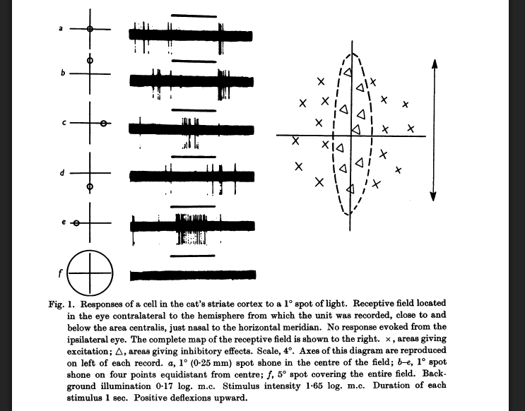
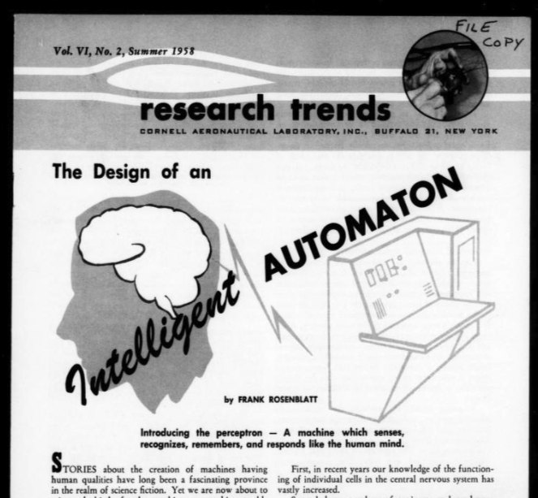
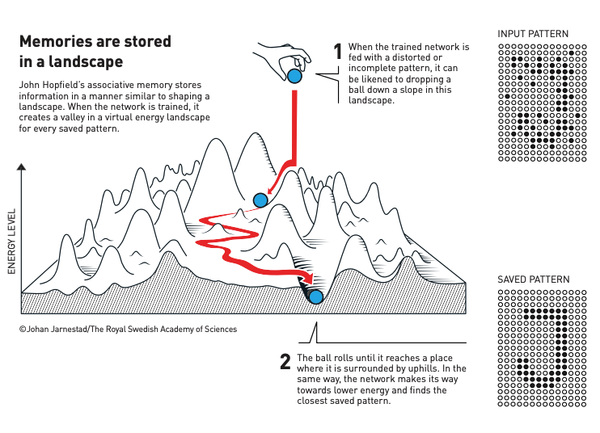
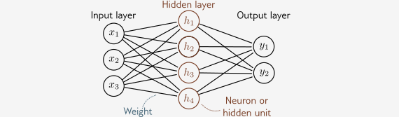
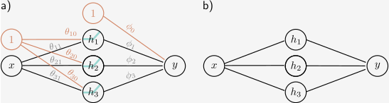
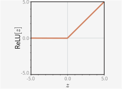
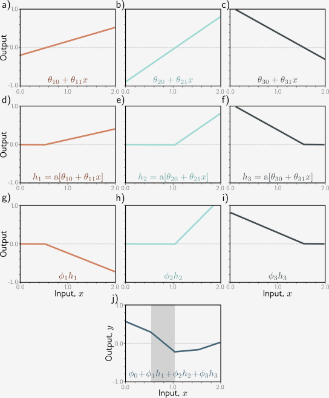
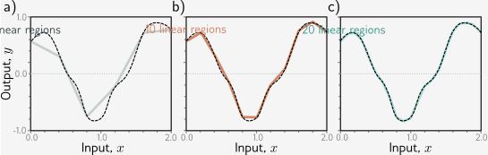

# Neuroverkot 101

## Määritelmä

### Koneoppimista

Neuroverkot (engl. neural networks) ovat koneoppimisen malleja, jotka on inspiroitu ihmisen aivojen rakenteesta ja toiminnasta. Neuroverkot pystyvät oppimaan monimutkaisia kuvioita datasta, ja niitä käytetään laajalti erilaisissa sovelluksissa, kuten kuvantunnistuksessa, puheentunnistuksessa ja luonnollisen kielen käsittelyssä. Koneoppimisen (mukaan lukien sen alaisuuteen kuuluvan syväoppimisen) voi tiiviisti määritellä seuraavasti:

> "Fit a given set of data points into an appropriate function (mapping an input to an output) that picks up on the important signals in the data and ignores the noise, then make sure this function performs well on new data."
> 
> — Hala Nelson [^mathforai]

Kannattaa kerrata omista Johdatus koneoppimiseen -kurssin muistiinpanoista, kuinka tekoäly, koneoppiminen ja syväoppiminen liittyvät toisiinsa. Voit myös kerrata sieltä muita määritelmiä koneoppimisesta.

Se, kuinka neuroverkot eroavat Johdatus koneoppimiseen -kurssin malleista, on:

* Neuroverkot pystyvät oppimaan itse piirteet (feature learning). Tämä ei tarkoita, että *feature engineering* vaihe olisi turha, mutta tätä työtä voi ulkoistaa neuroverkolle.
* Neuroverkot pystyvät mallintamaan monimutkaisempia, epälineaarisia suhteita datassa.

### Epälineaarista

Varmistetaan jo heti kurssin alussa, että on ymmärrys siitä, mitä lineaarisuus tarkoittaa tässä kontekstissa. Lineaariset kaavat tai funktiot on helppo tunnistaa siitä, että ne on helppo kirjoittaa. Piirteet esiintyvät funktiossa omassa luonnollisessa muodossaan. Funktiossa ei esiinny esimerkiksi: neliöjuuria, potensseja, logaritmisa, siniä, cosinia tai muuta selkeästi ei-lineaarista. [^mathforai] Esimerkki Pythonilla olisi:

```python
def linear_function(x1, x2, x3):
    return w1 * x1 + w2 * x2 - w3 * x3 + w0
```

Ei-lineaariset funktiot ovat monimutkaisempia. Syötteen ja tuloksen välillä on epälineaarinen suhde. [^mathforai] Esimerkki Pythonilla:

```python
import math

def nonlinear_function(x1, x2, x3):
    return w1 * math.sqrt(x1) + w2 * (x2 / x3) + w3 * math.sin(x3) + w0
```

Neuroverkot kykenevät mallintamaan epälineaarisia funktioita, koska ne käyttävät epälineaarisia aktivointifunktioita (kuten ReLU, sigmoid tai tanh) piilotetuissa kerroksissaan. Tämä mahdollistaa monimutkaisten kuvioiden oppimisen datasta.

## Historia

### All or nothing

Syväoppiminen ei suinkaan ole syntynyt ChatGPT:n myötä 2020-luvulla. Vuonna 1943 **Warren McCulloch** ja **Walter Pitts** julkaisivat artikkelin *"A Logical Calculus of the Ideas Immanent in Nervous Activity"*, jossa he esittivät yksinkertaisen mallin keinotekoisesta neuronista. Malli perustui "all-or-nothing" -periaatteeseen, jossa neuronin aktivaatio tapahtuu, kun syötteiden painotettu summa ylittää tietyn kynnyksen. Kyseessä olivat siis binääriset neuronit, jotka toimivat loogisina portteina. [^fastaibook]

> "Pitts was self-taught, and by age 12, had received an offer to study at Cambridge University with the great Bertrand Russell. He did not take up this invitation, and indeed throughout his life did not accept any offers of advanced degrees or positions of authority. Most of his famous work was done while he was homeless."
> 
> — Gugger & Howard, Deep Learning for Coders with fastai and PyTorch [^fastaibook]

### Kissakokeet

50-luvun lopulla **David Hubel** ja **Torsten Wiesel** tutkivat, kuinka aivokuoressa käsitellään visuaalista informaatiota. He havaitsivat, että tietyt neuronit reagoivat spesifisiin visuaalisiin ärsykkeisiin, kuten viivoihin ja reunoihin [^dlillustrated]. He saivat tästä Nobelin fysiologian ja lääketieteen palkinnon vuonna 1981. [^nobel1981] Hubel ja Wiesel suorittivat kokeensa näyttämällä visuaalisia ärsykkeitä anestesioiduille kissoille. Näiden 24 kissaraudan hermosolujen aktivaatiota tarkkailtiin mittalaitteilla aivokuoresta. [^hubelwiesel] Liekkö kirja (ja elokuva) Kellopeliappelsiini ottanut tästä vaikutteita?

Hubel ja Wiesel yrittivät aluksi stimuloida kissojen näköaivokuoren neuroneja yksinkertaisilla muodoilla kuten pisteillä, mutta eivät saaneet mitään vastetta. Sitten sattuma ja vahinko astuivat peliin: *"And then, as with many of the great discoveries, from X-rays to penicillin to the microwave oven, Hubel and Wiesel made a serendipitous observation: As they removed one of their slides from the projector, its straight edge elicited the distinctive crackle of their recording equipment to alert them that a primary visual cortex neuron was firing."* [^dlillustrated] Nämä neuronit, joihin signaali tulee ensimmäisenä silmien suunnasta, saivat nimen "simple cells". Nämä solut kytkeytyvät edelleen monimutkaisempiin "complex cells" -soluihin, jotka reagoivat viivoihin ja reunoihin eri kulmissa. Kun näitä verkkoja kasataan useita kerroksia, meillä on syvä neuroverkko, joka pystyy tunnistamaan monimutkaisia kuvioita, kuten kasvoja, esineitä ja maisemia.



**Kuva 1:** *Otos Hubelin ja Wieselin tutkimuksesta. Kuva näyttää, miten primaari näköaivokuori (V1) reagoi eri kohtiin verkkokalvon näkökentässä osuvista pistemäisistä valoista reseptiivisen kentän kautta.* [^hubelwiesel]

!!! tip

    Aivokuori on evoluution myöhäinen kehitystuote, joka selittää nisäkkäiden monimutkaista käyttäytymistä verrattuna vanhempiin eläinryhmiin. [^dlillustrated]
    
    Aivoja kutsutaan "harmaaksi aineeksi", koska ulkopinta (aivokuori) on harmaata. Suurin osa aivoista on kuitenkin valkoista ainetta, joka kuljettaa tietoa pitkiä matkoja. Sen hermosolut on päällystetty valkoisella rasvaisella kalvolla, joka nopeuttaa signaalien johtumista. [^dlillustrated]

### Perceptron

1950-luvun tapahtui samanaikaisesti myös muuta. **Frank Rosenblatt** jalosti McCulloch ja Pittsin ajatusta kehittäen tavan kouluttaa neuroverkkoja. Näin syntyi Mark I Perceptron, joka oli yksi ensimmäisistä neuroverkkopohjaisista malleista. [^fastaibook] Kyseinen malli ei ollut teoriaa vaan se saatiin toteutettua siten, että se tunnisti yksinkertaisia kuvioita, kuten neliön ja ympyrän. Voit tutustua alkuperäiseen artikkeliin lähteiden kautta löytyvästä PDF-tiedostosta. [^researchtrends]



**Kuva 2:** *Lehtileike Research Trends -lehden kesän 1958 numerosta. Huomaa ingressi: "Introducing the perceptron — A machine which senses, recognizes, remembers, and responds like the human mind."* [^researchtrends]

### AI-talven alku

MIT:n tohtori **Marvin Minsky** ja **Seymour Papert** julkaisivat vuonna 1969 kirjan *Perceptrons*, jossa he osoittivat, että yksittäinen kerros ei pysty ratkaisemaan tiettyjä ongelmia, kuten XOR-ongelmaa. Howard ja Gugger [^fastaibook] toteavat, että samassa Perceptrons-kirjassa esiteltiin myös ratkaisuja ongelmaan, kuten useiden kerrosten käyttö. Heidän mukaansa vain rajoitukset saivat huomiota, ja näin alkoi parin vuosikymmenen "talvi", jolloin neuroverkkojen tutkimus hiipui.

### 80-luvun kevät

AI-talven jälkeen alkoi taas tapahtua. 1986 **David Rumelhart**, **James McClelland** ja PDP Research Group julkaisivat moniosaisin artikkelin *Parallel Distributed Processing (PDP)*. Howard ja Gugger nostavat tämän viimeisen 50 vuoden käänteentekevimmäksi julkaisuksi. PDP:n asettamat vaatimusket, kuten "joukko prosessointiyksiköitä" ja "ulostulon funktio", ovat edelleen keskeisiä neuroverkkojen määritelmässä. Skaala on toki kasvanut: 80-luvulla verkoissa oli yleensä 2 kerrosta. Jo tällöin, 80- ja 90-luvuilla, koneoppimisella oli jo oikeita käyttötarkoituksia, mutta AI-tutkimus koki yhä tietynlaista AI-talvea. Vasta äskettäin, 2010-luvun lopulla, alkoi nykyinen AI-kevät. [^fastaibook] Avainsanoja tässä nykyisen kevään alussa ovat esimerkiksi AlexNet, AlphaGo, GAN, GPU.

<iframe width="560" height="315" src="https://www.youtube.com/embed/v0A8zNek68o?si=btx_I46lSsoSxgGa" title="YouTube video player" frameborder="0" allow="accelerometer; autoplay; clipboard-write; encrypted-media; gyroscope; picture-in-picture; web-share" referrerpolicy="strict-origin-when-cross-origin" allowfullscreen></iframe>

**Video 1:** *Stanfordin tohtori Jay McClelland vastaa Podcastissä kysymykseen "What is Parallel Distributed Processing?" eli PDP. Videolla keskustellaan siitä, miksi ihminen muistaa helpommin hänelle esitetyn kirjaimen, jos esitetyt kirjaimet muodostavat sanan.*

<iframe width="560" height="315" src="https://www.youtube.com/embed/H0oEr40YhrQ?si=coHhJ_PINndgwQpu" title="YouTube video player" frameborder="0" allow="accelerometer; autoplay; clipboard-write; encrypted-media; gyroscope; picture-in-picture; web-share" referrerpolicy="strict-origin-when-cross-origin" allowfullscreen></iframe>

**Video 2:** *Yann LeCun esiintyy vuonna 1989 videolla esittelemässä LeNEt 1 -verkkoa (9760 parametria), joka kykenee tunnistamaan käsinkirjoitettuja numeroita. Datasetti tunnetaan nimellä MNIST. Tämä kyseinen video on ConvNet-verkon avulla kuvanlaadultaan paranneltu versio alkuperäisestä. Videolla esiintyy siis konvoluutioverkkojen esi-isä, ja videota on korjailtu vuosikymmeniä myöhemmin sen kunnioittamiseksi.*

80-luvulla vaikuttivat myös 2024 Nobelilla palkitut John J. Hopfield ja Geoffrey Hinton. [^nobel2024] Daniel Crevier nostaa Hopfieldin työn merkityksen esilleen esiin kirjassaan *AI: The Tumultuous Search for Artificial Intelligence*. Hän kirjoittaa, että AI-talvi loppui osaltaan 80-luvulla Hopfieldin julkaisuun, mainiten myös PDP:n sekä backpropagation-algoritmin, joihin kumpaankin liittyy Rummelhart. [^tumultous] Tai siis, tämä on kenties se tunnetuin lähde. Ensimmäinen lienee Seppo Linnainmaa pro gradu -työssään vuonna 1970, joskaan ei neuroverkon kontekstissa. Tästä huolimatta: *"As of 2020, all modern software packages for NNs (such as Google's Tensorflow) are based on Linnainmaa's method of 1970."* [^juergen]



**Kuva 3:** *Hopfield network -mallin toimintaa graafisesti kuvattuna. Vastaava maisemassa vaeltaminen lienee Johdatus koneoppimiseen -kurssin Gradient Descent -osiosta tuttu. Kuva: ©Johan Jarnestad/The Royal Swedish Academy of Sciences*

## Matalat neuroverkot

### Viittaus koneoppimiseen

Ennen kuin tutustumme aiheen syvääm päätyyn eli syviin neuroverkkoihin (engl. deep neural networks), on hyvä tarkistella metalia neuroverkkoja (engl. shallow neural networks). Kertaa alkuun Johdatus koneoppimiseen kurssilta [Normaaliyhtälö](https://sourander.github.io/ml-perusteet/algoritmit/linear/normal_equation/), [Gradient Descent](https://sourander.github.io/ml-perusteet/algoritmit/linear/gradient_descent/) sekä [Logistinen regressio](https://sourander.github.io/ml-perusteet/algoritmit/linear/logistic/). Kyseisellä kurssilla sinulle on kerrottu, että näissä aiheissa on pohja neuroverkkojen ymmärrykselle. Nyt on siihen paneutumisen aika.

Tavallisen 1D-regressiomallin rajoituksia ovat [^udlbook], että se voi mallintaa:

* vain viivan
* yhden inputin
* yhden outputin

Näitä rajoituksia kierrettiin Johdatus koneoppimiseen kurssilla osin käyttämällä logistista regressiota, SGD:tä ja polynomeja. Jos jälkimmäinen ei herätä muistikuvia, kertaa scikitin dokumentaatiosta [PolynomialFeatures](https://scikit-learn.org/stable/modules/generated/sklearn.preprocessing.PolynomialFeatures.html), jonka avulla muuttujista `[a, b]` voi muodostaa toisen asteen polynomifunktion `[1, a, b, a^2, ab, b^2]`. Malli on yhä lineaarinen parametrien suhteen, mutta muunnettu piirreavaruus mahdollistaa epälineaaristen kuvioiden mallintamisen alkuperäisessä syöteavaruudessa. Tämä ei ehkä ole tieteellisesti täysin pätevä vertaus, mutta voi auttaa: kuvittele, että piirrät ==logaritmiseen taulukkoon suoran viivan==. Viiva on lineaarinen logaritmisessa avaruudessa, mutta alkuperäisessä mittakaavassa ("todellisuudessa") se kuvaa eksponentiaalista käyrää.

### Määritelmä



**Kuva 4:** Matala neuroverkko koostuu kerroksista: syöte (input), piilotettu (hidden) ja tuloste (output). Kerrokset yhdistävät eteenpäin suunnatut yhteydet (nuolet), joten näitä kutsutaan eteenpäin syöttäviksi verkoiksi (feed-forward networks). Kun jokainen muuttuja yhdistyy kaikkiin seuraavan kerroksen muuttujiin, kyseessä on täysin yhdistetty verkko. Yhteydet edustavat painokertoimia, piilokierroksen muuttujia kutsutaan neuroneiksi tai piiloyksikköiksi (hidden units). (CC-BY-NC-ND) [^udlbook]

Yllä näkyvän kuvan verkosta ==tekee matalan se, että siinä on vain yksi piilokerros==. Jos kerroksia olisi useita, kyseessä olisi syvä neuroverkko. Näihin tutustumme myöhemmin.

Nyt pyydän sinua palaamaan takaisin Johdatus Koneoppimiseen kurssin [Logistinen regressio](https://sourander.github.io/ml-perusteet/algoritmit/linear/logistic/) osioon. Siellä on esitelty logistinen regressio, joka on käytännössä yksi neuroni. Jos kytket syötteen useisiin neuroneihin, saat piilokerroksen. Jos kytket piilokerroksen useisiin neuroneihin, saat tulostekerroksen (output). Näin sinulla on neuroverkko luotuna. Muista, että tuloja ja lähtöjä voi olla useita.

### Mitä se tekee?

Käsitellään tämän otsikon alla seuraavanlaista verkkoa:



**Kuva 5:** Yksinkertainen neuroverkko, jossa on vain yksi syöte x, kolme piilotettua neuronia ja yksi tulos. Vasemmanpuoleiseen versioon on lisättynä vakiotermi (intercept, bias), joka yleensä jätetään kuvaajista pois. (CC-BY-NC-ND) [^udlbook]

Kaikki kuvan nuolet ovat painoja (weights). Lineaarialgebrassa näitä kutsuttaisiin kulmakertoimiksi (slope), mutta neuroverkoissa termi on paino. Koska meillä on 1 sisääntulo ja 3 neuronia, näiden välillä on `1 x 3` eli kolme painoa. Lisäksi kutakin vakiotermiä (bias) kohden on yksi paino, joten niitä on kolme lisää. Yhteensä painoja on siis kuusi. Toivon mukaan tämä alkaa kuulostaa tutulta, kun mietit Johdatus koneoppimiseen kurssin normaaliyhtälön matriisiesitystä, joka käsiteltiin [Hill Climbing](https://sourander.github.io/ml-perusteet/algoritmit/linear/hill_climbing/) osiossa. Kuvaa tutkimalla huomaat, että esimerkiksi $\theta_{10}$ ja $\theta_{11}$ vastaavat painoja, jotka yhdistävät syötteen $x$ ja vakiotermin $1$ piilotetun kerroksen ensimmäiseen neuroniin $h_1$. Theta on siis 3x2 matriisi, joka näyttää tältä:


$$
\Theta = \begin{bmatrix}
\theta_{10} & \theta_{11} \\
\theta_{20} & \theta_{21} \\
\theta_{30} & \theta_{31}
\end{bmatrix}
$$

Eli siis $h_1$, $h_2$ ja $h_3$, tai tarkemmin niiden esiasteet (pre-activation), lasketaan seuraavasti:

$$
\begin{align*}
h_{pre1} &= \theta_{10} + \theta_{11} x \\
h_{pre2} &= \theta_{20} + \theta_{21} x \\
h_{pre3} &= \theta_{30} + \theta_{31} x
\end{align*}
$$

Yllä olevissa lukee pienellä `pre`, koska kyseessä ovat esiasteet (pre-activations). Näistä saa varsinaiset piilotetun yksikön aktivoinnit (activations) aktivointifunktion avulla. Käsittelemme aktivointifunktiot myöhemmin kattavammin, mutta tässä välissä riittää hyväksyä, että kunkin piilotetun kerroksen neuronin laskema arvo syötetään tyypillisesti ReLu-aktivointifunktioon, joka palauttaa nollan, jos syöte on negatiivinen, ja syötteen itsensä, jos se on positiivinen.



**Kuva 6:** ReLu-aktivointifunktio. (CC-BY-NC-ND) [^udlbook]

Kun tämä aktivointifunktio, $f(z) = max(0, z)$, joka tunnetaan jatkossa a-merkkinä, on otettu huomioon, piilotetun kerroksen arvot ovat siis:

$$
\begin{align*}
h_1 &= a(\theta_{10} + \theta_{11} x) \\
h_2 &= a(\theta_{20} + \theta_{21} x) \\
h_3 &= a(\theta_{30} + \theta_{31} x)
\end{align*}
$$

Yllä olevassa kaavassa `x` on syöte, $\theta$ on painot ja $h$ on piilotetun kerroksen aktivoinnit eli varsinaiset *hidden unit* eli piiloyksiköt. Näiden lineaarinen yhdistelmä antaa tuloksen `y`:

$$
y = \phi_0 + \phi_1 h_1 + \phi_2 h_2 + \phi_3 h_3
$$

Kaiken kaikkiaan mallin opittua parametrejä ovat siis:

$$
\begin{align*}
\phi_0 &= \text{tuloskerroksen vakiotermi (bias)} \\
\phi_1, \phi_2, \phi_3 &= \text{tuloskerroksen painot} \\
\theta_{10}, \theta_{20}, \theta_{30} &= \text{piilotetun kerroksen muuttujien painot} \\
\theta_{11}, \theta_{21}, \theta_{31} &= \text{piilotetun kerroksen vakioiden painot}
\end{align*}
$$

Nämä neljä vaihetta, eli esiasteet, aktivoinnit, piilokerroksen lähtö ja viimeisen kerroksen tulos näkyvät alla olevassa kuvassa.



**Kuva 7:** Neuroverkon laskennan vaiheet `a-j`. Viimeisen kuvaajan varjostetussa alueessa $h_2$ on passiivinen (leikattu), mutta $h_1$ ja $h_3$ ovat molemmat aktiivisia. (CC-BY-NC-ND) [^udlbook]


* **Esiasteet (a-c)**: Syöte x syötetään kolmeen lineaarifunktioon, joista jokaisella on eri y-leikkauspiste ja kulmakerroin.
* **Aktivoinnit (d-f)**: Jokainen lineaarifunktio syötetään ReLU-aktivointifunktioon, joka leikkaa negatiiviset arvot nollaan.
* **Painotus (g-i)**: Kolmea leikattu funktiota painotetaan (skaalataan) kertoimilla $\phi_1$, $\phi_2$ ja $\phi_3$.
* **Yhteenlasku (j)**: Leikatut ja painotetut funktiot summataan yhteen ja lisätään offset-arvo $\phi_0$, joka kontrolloi korkeutta.

Huomaa, että kuvaajassa on kolme "niveltä". Tästä tulee termi *piecewise linear function* (suom. paloittain määritelty lineaarinen funktio). Mikäli ennustettava ilmiö on monimutkainen, tarvitaan useampia piilokerroksia, jotta tämä paloittain määritelty funktio saadaan taiteltua haluttuun muotoon. Alla tästä vielä havainnollistava kuva.



**Kuva 8:** Katkoviivalla näkyvää todellista ilmiötä voi yrittää mallintaa eri piiloverkon kokoisilla malleilla. Vasemmanpuoleinen malli on selkeästi liian yksinkertainen, oikea on tarkka (joskin kenties liian tarkka.) (CC-BY-NC-ND) [^udlbook]

Jos haluat tutustua aiheeseen syvemmin, tutustu [Understanding Deep Learning](https://udlbook.github.io/udlbook/) kirjaan, joka on ilmainen ja avoin verkossa. Kirjaan liittyvä Qatarin yliopiston kurssi löytyy myös ilmaiseksi [YouTube: Deep Learning Fall 2024](https://youtube.com/playlist?list=PLRdABJkXXytCz19PsZ1PCQBKoZGV069k3&si=8FY_GMrQn0Pi8FPv).

## Koulutus ja inferenssi

Kurssilla käsitellään neuroverkkojen koulutusta ja inferenssiä (eli mallin käyttöä). Esitellään termit jo kuitenkin tässä alkuvaiheessa, koska ne ovat keskeisiä neuroverkkojen ymmärtämisessä, ja pohjustavat vastavirta (backpropagation) algoritmia, jota käsitellään parin seuraavan osion aikana.

Aiheesta löytyy myös pidempi Nvidian artikkeli, jos haluat tutustua: [What’s the Difference Between Deep Learning Training and Inference?](https://blogs.nvidia.com/blog/difference-deep-learning-training-inference-ai/)

### Koulutus

Koulutusvaiheessa mallille syötetään koulutusdataa. Tämä on Johdatus koneoppimisesta tuttu `X_train`-osuus datasetistä. Malli laskee ennusteet $\hat{y}$ ja vertaa niitä todellisiin arvoihin $y$. Näiden erotus lasketaan häviöfunktiolla (loss function). Häviöfunktio palauttaa yhden luvun, joka kertoo kuinka hyvin malli suoriutui. Tämän luvun perusteella mallin parametrejä säädetään, jotta häviö pienenee. Tätä toistetaan useita kertoja, kunnes malli on oppinut halutun tason tarkkuuden. Tämän pitäisi olla kertausta Johdatus koneoppimiseen -kurssilta. Kannattaa vilkaista omia muistiinpanoja ja omaa oppimispäiväkirjaa.

Neuroverkkojen koulutukseen liittyy yksi hyvinkin keskeinen ero perinteisiin malleihin verrattuna: Neuroverkot oppivat itse piirteet (feature learning). Perinteisissä malleissa piirteet piti usein valita käsin, mutta neuroverkot pystyvät oppimaan hyödylliset piirteet suoraan datasta.

Koulutuksen aikana tarvittu muistin määrä riippuu monesta tekijästä. Jos haluat tutustua asiaan klikkailemalla, käy kurkkaamassa interaktiivista Hugging Facen blogikirjoitusta [Visualize and understand GPU memory in PyTorch](https://huggingface.co/blog/train_memory).

### Inferenssi

Inferenssi on mallin käyttöä. Kun malli on koulutettu, se kirjoitetaan levylle: tai siis tarkemmin sanottuna sen parametrit tallennetaan. Jatkossa parametrit voidaan ladata käyttöön, jopa useille eri laitteille samanaikaisesti rinnakkain, ja mallia voidaan käyttää ennustamiseen. Tätä kutsutaan inferenssiksi.

Neuroverkkojen inferenssi vaatii vähemmän muistia (ja laskentatehoa) kuin koulutus, koska mallin parametrejä ei enää säädetä. Malli vain suorittaa eteenpäin syöttämisen (feed-forward) laskennan. Mallia voidaan myös eri tekniikoin pienentää ilman että suorituskyky kärsii liikaa. Näitä tekniikoita ovat esimerkiksi kvantisointi (quantization), pruneraus (pruning) ja *"tislaus tai tiivistys"* (distillation). Näitä käsitellään myöhemmin kurssilla ainakin pintapuolisesti. On hyvä kuitenkin jo tunnistaa, että mallin käyttökulut (inferenssi) ja koulutuskulut (training) eroavat toisistaan merkittävästi. Käytännössä voit törmätä vaikkapa [BERT: Pre-training of Deep Bidirectional Transformers for Language Understanding](https://arxiv.org/abs/1810.04805)-julkaisun malliin BERT sivustolla Hugging Face siten, että osa vaatii enemmän ja osa vähemmän suorituskykyä. Alla taulukkona suuntaa-antava vertailu.

| Malli                                                                                                                                           | n parameteria | Tensor tyyppi | optimoinnin taso              | Muistin tarve painoille |
| ----------------------------------------------------------------------------------------------------------------------------------------------- | ------------- | ------------- | ----------------------------- | ----------------------- |
| [bert-base-uncased](https://huggingface.co/google-bert/bert-base-uncased)                                                                       | 110M          | float32       | Alkuperäinen koulutettu malli | ~440 MB                 |
| [distilbert-base-uncased](https://huggingface.co/distilbert-base-uncased)                                                                       | 66M           | float32       | 40% pienempi, 60% nopeampi    | ~264 MB                 |
| [distilbert-base-uncased-distilled-squad](https://huggingface.co/distilbert/distilbert-base-uncased-distilled-squad)                            | 66M           | float32       | QA-tehtäviin hienosäädetty    | ~264 MB                 |
| [distilbert-base-uncased-distilled-squad-int8-static-inc](https://huggingface.co/Intel/distilbert-base-uncased-distilled-squad-int8-static-inc) | 66M           | int8          | Kvantisointi                  | ~66 MB                  |

Muistin tarpeen voi laskea helposti: 32-bittinen liukuluku vaatii 4 tavua muistia. Näitä on 110 miljoonaa, joten 110M * 4B = 440MB. Kvantisoinnissa mallin painot muunnetaan 8-bittisiksi kokonaisluvuiksi, jolloin muistin tarve on vain neljäsosa alkuperäisestä. Huomaa, että inferenssissä muistia tarvitsee myös muita asioita, kuten syötteet, väliarvot ja mahdolliset välimuistit. Todellisen muistin tarve voi siis olla esimerkiksi 20-50 % enemmän kuin pelkkien painojen vaatima muisti.

## Mihin käytetään

Tutustu näihin:

- [Dilmegani: Top 50 Deep Learning Use Case & Case Studies](https://research.aimultiple.com/deep-learning-applications/)
- [Lex Fridman: Deep Learning Basics: Introduction and Overview](https://youtu.be/O5xeyoRL95U) (YouTube-video)

## Tehtävät

!!! question "Tehtävä: TensorFlow Playground"

    Tutustu online-työkaluun [TensorFlow Playground](https://playground.tensorflow.org/). Kokeile eri asetuksia ja yritä ymmärtää, miten ne vaikuttavat mallin oppimiseen, ja kuinka tämä liittyy yllä kirjoitettuun teoriaan (ja historiaan). Dokumentoi omat havaintosi oppimispäiväkirjaasi – jatka tätä dokumentointia jatkossa kaikkien tehtävien yhteydessä.

    1. Mallinna työkalulla Perceptron-paperin mukainen malli. Sinulla pitäisi olla siis $x_1$ ja $x_2$ syötteinä, ==ei yhtään piilotettua kerrosta== ja tulos. Käytä ReLU-aktivointifunktiota, vaikka se ei olekaan aivan 1958 ajan mukainen.
    
    
        Tunnista eri datasetit sivustolta. Ne ovat järjestyksessä:

        - `Circle`
        - `Exclusive or` (XOR)
        - `Gaussian`
        - `Spiral`
    2. **0 piilotettua:** Todista, että on mahdotonta ratkaista XOR-ongelma ilman piilotettua kerrosta. Todista Gauss mahdolliseksi.
    3. **1 piilotettu:** Kokeile ratkaista XOR-ongelma yhdellä piilotetulla kerroksella, jossa on 2-4 neuronia. Ratkaise myös Gauss ja Circle.
    4. **4 piilotettua:** Kokeile ratkaista Spiral-ongelma neljällä piilotetulla kerroksella, joissa on kussakin 2-8 neuronia. Aloita pienemmästä mallista ja monimutkaista sitä vähitellen. Voi olla kannattavaa yrittää pitää inputin puolella olevat kerrokset suurempina (neuronimäärän osalta) kuin outputin puolella olevat kerrokset. Eli mallista tulee siis suppilo, joka piennee kohti outputtia.

!!! question "Tehtävä: Quick, Draw!"

    Pelaa erä (tai useampi) Googlen [Quick, Draw!](https://quickdraw.withgoogle.com/) peliä.

    Tutustu tämän jälkeen sen taustalla olevaan dataan [domain/data](https://quickdraw.withgoogle.com/data).

    Tutustu viimeisenä vielä Kaggle-sivultolta löytyvään haasteeseen, jossa datan perusteella tulee pyrkiä tehdä mahdollisimman tarkka luokittelija: [Quick, Draw! Doodle Recognition Challenge](https://www.kaggle.com/competitions/quickdraw-doodle-recognition/overview).

!!! question "Tehtävä: UDLbook Shallow"

    Lataa PDF-muodossa koneellesi [Understanding Deep Learning](https://udlbook.github.io/udlbook/) kirja. Tutustu sen lukuun kolme, "Shallow neural networks" ja tee lopulta seuraavat tehtävät:

    * **Problem 3.4** Draw a version of figure 3.3 where the y-intercept and slope of the third hidden unit have changed as in figure 3.14c. Assume that the remaining parameters remain the same.
    * **Problem 3.11** How many parameters does the model in figure 3.6 have?

    Voit käyttää ensimmäiseen tehtävään UDL-kirjan [Interactive Figures](https://udlbook.github.io/udlfigures/)-työkalua.

    Saat toki ratkaista halutessasi myös muita ongelmia. Kurssilla siirrytään kuitenkin seuraavaksi teoriasta PyTorchin kautta käytäntöön.

!!! question "Tehtävä: ANN ja eläinkunta"

    Kannattaa tutustua Wikipedian [Cerebral cortex](https://en.wikipedia.org/wiki/Cerebral_cortex) sekä [Neuron](https://en.wikipedia.org/wiki/Neuron)-artikkeleihin. Aivokuoren (engl. cerebral cortex) osalta aiheeseen liittyvää sisältöä on ainakin "Layers of neocortex"-otsikkoon liittyvä teksti ja kuvat. Tämä ei ole biologian kurssi, joten silmäily riittää. Neuroverkot (ANN, Artificial Neural Network) perustuvat ideatasolla siihen, kuinka aivojen synapsien ja neuronien verkosto toimii – tai ainakin, kuinka sen kuviteltiin toimivan vielä 1900-luvun puolivälissä.

    Voi olla myös mielenkiintoista verrata nykyisiä koneoppimismalleja [List of animals by number of neurons](https://en.wikipedia.org/wiki/List_of_animals_by_number_of_neurons) -listaan. Jos verrataan melko naiivisti parametrimääriä, niin mitä eläimiä seuraavat mallit vastaavat:

    | Malli                | Vuosi |         desimaali | potenssiesitys |
    | -------------------- | ----- | ----------------: | -------------- |
    | LeNet-5              | 1998  |            60 000 | 6.0 x 10^4     |
    | AlexNet              | 2012  |        60 000 000 | 6.0 x 10^7     |
    | GPT-3                | 2020  |   175 000 000 000 | 1.75 × 10^11   |
    | Grok-1 (open source) | 2024  |   314 000 000 000 | 3.14 × 10^11   |
    | GPT-4 (spekulaatio)  | 2024  | 1 760 000 000 000 | 1.76 × 10^12   |

    Vinkki: mieti tarkkaan, kumpaa "parametrien määrä" vastaa paremmin aivoissa: neuronien vai synapsien määrä?    

!!! question "Tehtävä: BERT Large"

    Yllä on esiteltynä BERT-mallin `base`-versio ja sen kevennetty `distilbert`-versio. Tutustu, kuinka BERT Large liittyy tähän. Kuinka monta parametria siinä on? Kuinka paljon enemmän muistia se vaatii verrattuna `base`-versioon? Miten se tai sen koulutus eroaa `base`-versiosta?

## Lähteet

[^mathforai]: Nelson, H. *Essential Math for AI*. O'Reilly Media. 2023.
[^fastaibook]: Gugger, J. & Howard, J. *Deep Learning for Coders with fastai and PyTorch*. O'Reilly Media. 2020.
[^dlillustrated]: Krohn, J., Beyleveld, G. & Bassens, A. *Deep Learning Illustrated: A Visual, Interactive Guide to Artificial Intelligence*. Addison-Wesley Professional. 2019.
[^nobel1981]: The Nobel Prize. *Nobel Prize in Physiology or Medicine 1981*. https://www.nobelprize.org/prizes/medicine/1981/summary/
[^hubelwiesel]: Hubel, D.H. & Wiesel, T.N. *Receptive fields of single neurones in the cat's striate cortex. The Journal of Physiology, 1959. https://doi.org/10.1113/jphysiol.1968.sp008455
[^researchtrends]: Rosenblatt, F. *The Design of an Intelligent Automaton*. Research Trends, Cornell Aeronautical Laboratory. Summer 1958, Issue 2. https://www.informationphilosopher.com/solutions/scientists/rosenblatt/Rosenblatt_Research_Trends.pdf
[^nobel2024]: The Nobel Prize. *Nobel Prize in Physics 2024*. https://www.nobelprize.org/prizes/physics/2024/summary/
[^tumultous]: Crevier, D. *AI: The Tumultuous Search for Artificial Intelligence*. Basic Books. 1993. https://www.researchgate.net/profile/Daniel-Crevier/publication/233820788_AI_The_Tumultuous_History_of_the_Search_for_Artificial_Intelligence/links/63fe3d9457495059454f87ca/AI-The-Tumultuous-History-of-the-Search-for-Artificial-Intelligence.pdf
[^juergen]: Schmidhuber, J. *Who Invented Backpropagation?*. 2014 (päivitetty 2025). https://people.idsia.ch/~juergen/who-invented-backpropagation.html
[^udlbook]: Prince, S. *Understanding Deep Learning*. The MIT Press. 2023. https://udlbook.github.io/udlbook/
