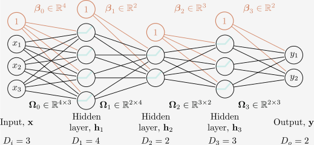
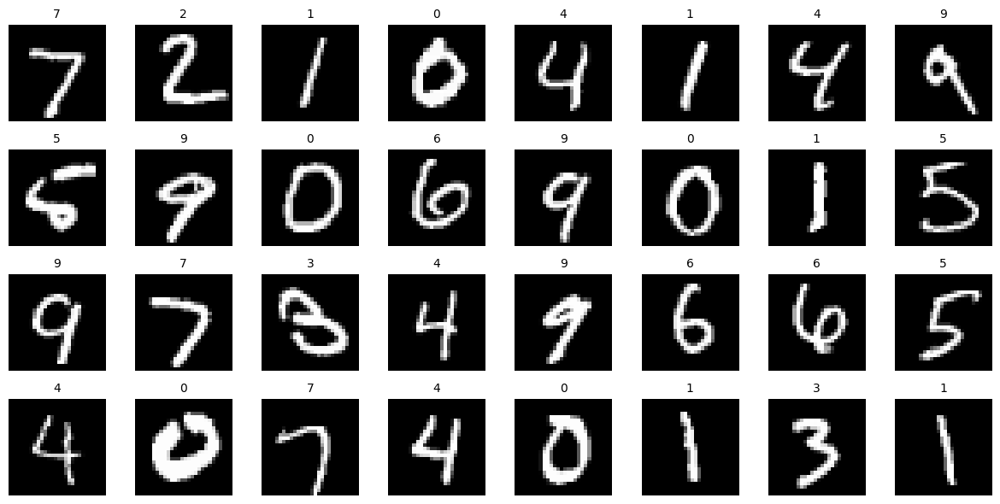
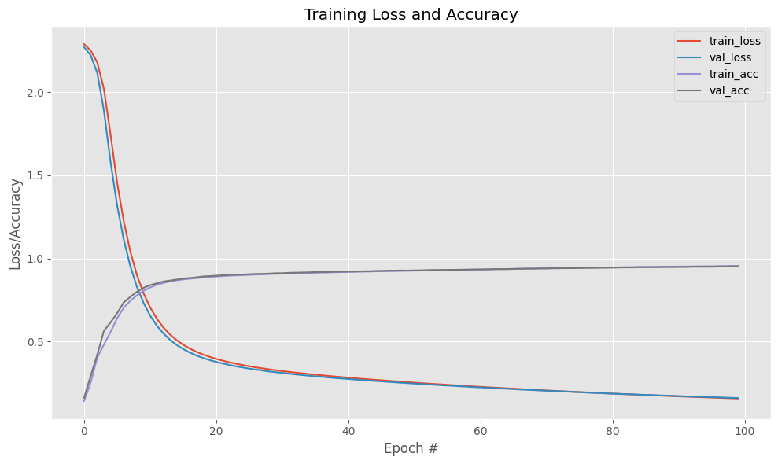
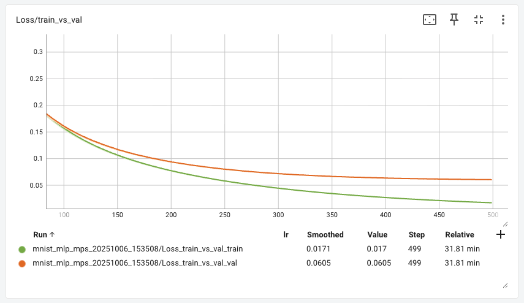
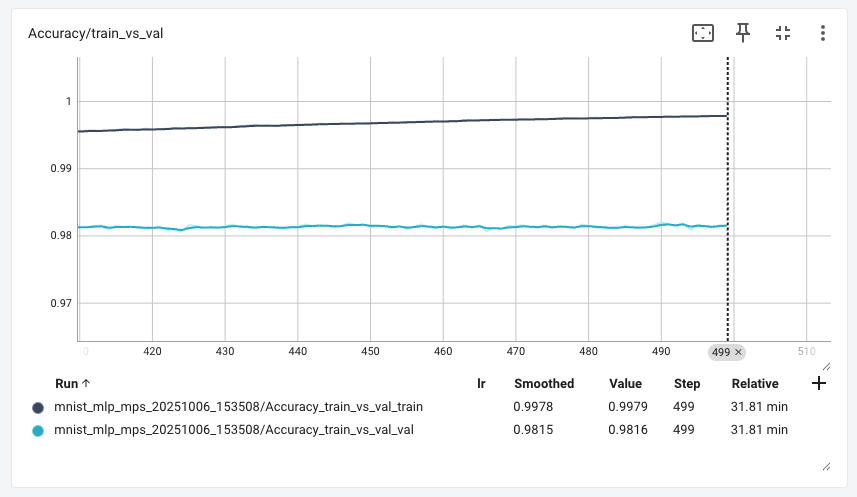

# Syvät neuroverkot

## Syväoppiminen

### Määritelmä

Määritelmän osalta Understanding Deep Learning kirjan luvun 3 alku on hyvä:

> "The last chapter described shallow neural networks, which have a single hidden layer. This chapter introduces deep neural networks, which have more than one hidden layer. With ReLU activation functions, both shallow and deep networks describe piecewise linear mappings from input to output." [^udlbook]

Prince toteaa, että matalan neuroverkkojen kyky kuvata monimutkaisia funktioita kasvaa piilokerroksen neuronien määrän lisääntyessä. Riittävän suurella neuronimäärällä matalat verkot pystyvät mallintamaan mielivaltaisen monimutkaisia funktioita. Käytännössä tämä on kuitenkin usein mahdotonta, sillä tarvittava neuronien määrä voi kasvaa kohtuuttoman suureksi. [^udlbook]

Syvät neuroverkot tarjoavat tähän ratkaisun: ne pystyvät tuottamaan huomattavasti enemmän lineaarisia alueita kuin matalat verkot samalla parametrimäärällä. Kerrosten määrän ja niiden neuronien määrä on siis jotakin, mitä pitää optimoida mallia suunniteltaessa. Palaamme tähän kohta tässä samassa luvussa.

### Yleiskatsaus

Täysin yhdistetyt kerrokset *(engl. fully connected layers)* ovat syväoppimisen peruskomponentteja. Niissä jokainen neuroni on yhteydessä kaikkiin edellisen kerroksen neuroneihin. Tämä mahdollistaa monimutkaisempien suhteiden oppimisen syötteiden ja ulostulojen välillä. Tosielämän mallit ovat 2020-luvulla siirtyneet yhä enemmän erilaisiin konvoluutio- ja toistoverkkoihin, mutta FC-kerrokset ovat edelleen keskeisiä monissa arkkitehtuureissa. Tässä luvussa keskitymme verkkoihin, joissa on pelkkiä FC-kerroksia.

Konsepti on helppo ja tulee toivon mukaan selväksi seuraavaa kuvaa katsomalla. Huomaat, että olet toteuttanut näitä verkkoja jo edellisen luvun TensorFlow Playground -tehtävässä.

Kuvassa kerroksen yksi neuronit ovat $h_1$, $h_2$ ja $h_3$. Kunkin niiden tuloste päätyy seuraavan kerroksen kunkin neuronin syötteeksi.


**Kuva 1:** *Kaksi kerroksinen syväverkko, jossa on kaksi piilotettua kerrosta, joissa kussakin on kolme neuronia. Jokainen piilotettu kerros on täysin yhdistetty (fully connected) edelliseen kerrokseen.*

### Laskutoimitukset

Selvyyden vuoksi käydään läpi, miten verkko toimii. Oletetaan, että syötevektori on $x = [x_1, x_2]$. Ensimmäisen piilotetun kerroksen neuronit laskevat seuraavasti: 

$$
\begin{align*}
h_1 &= a(w_{11} x_1 + w_{12} x_2 + b_1) \\
h_2 &= a(w_{21} x_1 + w_{22} x_2 + b_2) \\
h_3 &= a(w_{31} x_1 + w_{32} x_2 + b_3)
\end{align*}
$$

missä $w_{ij}$ ovat painot ja $b_i$ on bias-termi. Funktio $a$ on aktivointifunktio ReLU. Toinen kerros on monimutkaisempi, koska siinä on kolme syötettä ja kolme vastaanottavaan neuronia, joten painoja tulee olemaan $3 \times 3 = 9$. Toisen kerroksen neuronit laskevat seuraavasti:

$$
\begin{align*}
h_4 &= a(w_{41} h_1 + w_{42} h_2 + w_{43} h_3 + b_4) \\
h_5 &= a(w_{51} h_1 + w_{52} h_2 + w_{53} h_3 + b_5) \\
h_6 &= a(w_{61} h_1 + w_{62} h_2 + w_{63} h_3 + b_6)
\end{align*}
$$

Nämä merkinnät alkavat olla kohtalaisen sekavia, joten on parempi käyttää vektori- ja matriisimerkintöjä. Kummankin kerroksen ja ulostulon laskenta voidaan ilmaista seuraavasti:

$$
\begin{align*}
h^{(1)} &= a(W^{(1)} x + b^{(1)}) \\
h^{(2)} &= a(W^{(2)} h^{(1)} + b^{(2)}) \\
y &= W^{(3)} h^{(2)} + b^{(3)}
\end{align*}
$$

Yllä olevassa kaavassa $y$ on laskettu ilman aktivointifunktiota. Tämä tekee mallista regressiomallin, joka sopii hyvin jatkuvien arvojen ennustamiseen. Jos mallia halutaan käyttää binääriseen luokitteluun, siihen lisätään sigmoid-aktivointifunktio. Huomaa, että tämä on kertausta Johdatus koneoppimiseen -kurssin logistisesta regressiosta.

Kurssin aikana tulemme käyttämään PyTorch-kirjastoa, joka hoitaa paljon laskuja puolestamme. Tässä on jo esimakua siitä, kuinka yllä olevat laskut voidaan toteuttaa PyTorchilla:

```python
# Esimerkin vuoksi W1 voisi näyttää tältä
W1 = torch.tensor(
    [
    [0.11, 0.12],
    [0.21, 0.22],
    [0.31, 0.32]
], dtype=torch.float32)

# Lasketaan ensimmäinen kerros
h1 = torch.relu(torch.matmul(W1, x) + b1)

# Lasketaan toinen kerros
h2 = torch.relu(torch.matmul(W2, h1) + b2)

# Lasketaan ulostulo (ilman aktivointifunktiota)
y = torch.matmul(W3, h2) + b3
```

Huomaa, että tässä on kyseessä pelkkä *inferenssi* eli ennustaminen. Koko mallin kouluttaminen vaatii vielä paljon enemmän koodia, ja tämä esitellään kurssilla myöhemmin.

### Hyperparametrit

Syväverkkojen suunnittelussa on useita hyperparametreja. Hyperparametrit ovat malliin liittyvät asetukset, jotka valitetaan ennen sen kouluttamista – eli niitä ei siis opita koulutusvaiheessa. Tässä luvussa keskitymme vain niihin hyperparametreihin, jotka liittyvät FC-verkon kokoon:

* Kerrosten määrä $K$
* Neuronien määrä kussakin kerroksessa $D_k$
  
Tutustumme myös muihin hyperparametreihin kurssin edetessä. Hyperparametrien *oikeita arvoja* ei voi yksinkertaisesti tarkistaa jostakin Maolin taulukkokirjasta. Ne on löydettävä kokeilemalla.



**Kuva 2:** *Syväverkko, jossa on $K$ piilotettua kerrosta, joissa kussakin on $D_k$ neuronia. Jokainen piilotettu kerros on täysin yhdistetty (fully connected) edelliseen kerrokseen. Tähän kuvaan on piirretty mukaan myös vakiotermit (bias) $b_k$, jotka ovat $D_k$-ulotteisia vektoreita.*

Huomaa, että jos meidän *budjetti* GPU-muistille sallii vain $N = 1000$ painoa, voimme valita esimerkiksi luoda $K=2$ kerrosta, joissa kummassakin $D_k = 500$ neuronia. Tai voimme tehdä $K=5$ kerrosta, joissa kussakin on $D_k = 200$ neuronia. Tai voimme luoda suppilon, jossa ensimmäisessä kerroksessa on $D_1 = 400$ neuronia, toisessa $D_2 = 300$, kolmannessa $D_3 = 200$ ja neljännessä $D_4 = 100$. Kaikki nämä vaihtoehdot käyttävät saman verran muistia, mutta niillä on erilaiset kyvyt oppia erilaisia funktioita. Jos tutkit vanhoja malleja, huomaat, että suppilo oli ennen hyvinkin suosittu arkkitehtuuri. Nykyään on tavallisempaa käyttää saman kokoisia kerroksia. Géron antaa nyrkkisäännön, että paremman hyödyn saa tyypillisesti lisäämällä kerrosten määrää kuin neuronien määrää kerroksessa. [^handson-tf]

> "A typical neural network for MNIST might have 3 hidden layers, the first with 300 neurons, the second with 200, and the third with 100. However, this practice has been largely abandoned because it seems that using the same number of neurons in all hidden layers performs just as well in most cases, or even better; plus, there is only one hyperparameter to tune, instead of one per layer. That said, depending on the dataset, it can sometimes help to make the first hidden layer bigger than the others." [^handson-tf]

## Case: MLP ja MNIST

### Tehtävän yleiskuvaus

Aloitamme kurssin tutustumalla yksinkertaiseen syväverkkoon, joka tunnetaan nimellä monikerroksinen perceptroni (MLP, *multi-layer perceptron*). MLP on syväverkko, joka koostuu useista täysin yhdistetyistä kerroksista (FC-kerrokset), joissa on aktivointifunktio kunkin kerroksen jälkeen. Valitsemamme ongelma, tai dataset, on **MNIST**. Lyhenteen **NIST** tulee sanoista *National Institute of Standards and Technology*, joka on Yhdysvaltain hallituksen virasto. Kirjain **M** tulee sanasta *Modified*. Dataa on esiprosessoitu siten, että se on sopivassa muodossa koneoppimiseen, tehden siitä hyvän *Hello World* -esimerkin koneoppimiselle. Tyypillisessä koneoppimistehtävässä saat hyvin harvoin näin valmista dataa käsiisi: kuvat on valmiiksi rajattu, skaalattu, keskitetty ja muunnettu vektoreiksi. MNIST on kuitenkin erinomainen aloitus, koska se on pieni, helppo ymmärtää ja sillä on helppo kokeilla erilaisia malleja.

MNIST-datassa on käsinkirjoitettuja numeroita (0-9), jotka on skaalattu 28x28 pikselin harmaasävykuviksi. Kuvat on esitetty alla olevassa kuvassa. PyTorchin MNNIST tarjoaa 60 000 koulutuskuvaa ja 10 000 testikuvaa. Kuvat ovat tavallisia yksikanavaisia harmaasävykuvia *PIL-formaatissa* eli niiden pikseliarvot ovat välillä `0-255`. Jos kaikki nämä kuvat lataisi yhteen tensoriin, sen koko olisi `[70000, 1, 28, 28]`.



**Kuva 3:** *MNIST-datan esimerkkikuvia. Kuvat on poimittu PyTorch:n [torchvision.datasets.MNIST](https://docs.pytorch.org/vision/stable/generated/torchvision.datasets.MNIST.html)-luokasta.*

**Tavoite on siis:** kouluttaa moniluokkainen luokittelija, joka pystyy tunnistamaan käsinkirjoitetut numerot. Tämä on 10-luokkainen luokittelutehtävä, jossa jokainen luokka vastaa yhtä numeroa (0-9). Työ on jo tehty sinun puolestasi, koska tämä on kurssin aloitus, ja sinulle ei ole vielä edes opetettu PyTorchin käyttöä. Koodi löytyy Notebookista `notebooks/nb/100/110_first_model.ipynb` tämän kurssimateriaalin repositoriota eli [gh:sourander/syvaoppiminen](https://github.com/sourander/syvaoppiminen). Aloitusluennolla sinulle on esitelty, mistä mitäkin materiaalia löytyy, ja kuinka kurssi kannattaa suorittaa.

!!! tip

    MLP:t ovat perusarkkitehtuuri, josta monet muut neuroverkot on johdettu. Huomaa, että arkkitehtuureita on useita erilaisia. Aloitamme yksinkertaisimmasta mahdollisesta, jossa on vain FC-kerroksia, mutta etenemme kurssin aikana monimutkaisempiin arkkitehtuureihin, kuten konvoluutio- ja toistoverkkoihin (RNN). Tulet luomaan kurssin aikana konvoluutioverkon, joka istuu valittuun tehtävään paremmin kuin MLP.

### Tulokset

Aloitetaan käänteisesti tulosten esittelemisestä. Kuten on sanottu, MNIST on hyvinkin *Hello World*-tason tehtävä näin 2020-luvulla. Yksinkertainen MLP pystyy saavuttamaan yli 95 % tarkkuuden (accuracy) jo muutamassa minuutissa. Tulet huomaamaan, että vaikeampien tehtävien kanssa koulutusajat kasvavat merkittävästi, ja tarkkuudet jäävät usein vaatimattomaksi, varsinkin jos MLP-arkkitehtuuria käytetään vasarana, joka sopii tehtävään kuin tehtävään. Vasaralla viittaan sanontaan: *"it is tempting, if the only tool you have is a hammer, to treat everything as if it were a nail"* [^maslowshammer]. Tutustu alla olevaan kuvaajaan:



**Kuva 4:** *MNIST-datalla koulutetun mallin tarkkuus (accuracy) ja häviö (loss) koulutuksen aikana epookki epookilta.*

Kuvaajassa näkyy neljä käyrää: `train_loss`, `train_acc`, `val_loss` ja `val_acc`. Nämä kuvaavat mallin suoriutumista koulutusdatalla (train) ja validaatiodatalle (val). Koulutusdata on se data, jolla malli on koulutettu, ja validaatiodata on erillinen osajoukko datasta, jota ei ole käytetty mallin kouluttamiseen. Validaatiodataa käytetään mallin arviointiin koulutuksen aikana, jotta nähdään, kuinka hyvin malli yleistyy näkemättömään dataan. Ideaalitilanteessa lopullinen arviointi tehdään testidatalla, joka on täysin erillinen sekä koulutus- että validaatiodatasta. Tässä meidän yksinkertaisessa esimerkissä emme kuitenkaan tee erillistä testidataa. Eli siis kaikki 60 000 kuvaa ovat koulutusdataa ja 10 000 kuvaa ovat validaatiodataa. Hyväksymme validaatiotuloksen lopulliseksi tulokseksi.

Kuvaajan vaakasuuntainen akseli on epookkien määrä. Kuvan koulutuksessa on ajettu 100 epookkia. Yksi epookki tarkoittaa, että koko koulutusdata on käyty läpi kerran. Koska koulutusdata on jaettu pienempiin eriin (batch), yksi epookki koostuu useammasta batchista. Tässä tapauksessa batch-koko on 128, joten yhdessä epookissa on $60000 / 128 \approx 469$ askelta (batches). Malli päivittää painojaan jokaisen batchin jälkeen.

### Koulutuksen suoritusaika

Koulutuksen tulokset eri raudalla:

| Rauta             | Aika/epookki | Aika/koko koulutus | Lopputarkkuus (val) |
| ----------------- | ------------ | ------------------ | ------------------- |
| MacBook Pro (CPU) | 2.9 s        | 4 min 48 s         | 95.35 %             |
| MacBook Pro (MPS) | 3.7 s        | 6 min 12 s         | 95.18 %             |
| PC (CPU)          | 3.2 s        | 5 min 22 s         | 95.21 %             |
| PC (CUDA)         | 3.3 s        | 5 min 30 s         | 95.14 %             |

Macbook Pro on tarkemmalta malliltaan M2 Max (32 GB muistia). MPS (Metal Performance Shaders) on Apple Siliconin GPU-kiihdytys. PC on pöytäkone i7-12700F suorittimella, 32 GB keskusmuistilla ja NVIDIA RTX 3060 Ti -näytönohjaimella, jossa on 8 GB muistia.

### Epookkien määrä

Miksikö juuri 100 epookkia? Koska se on mukavan pyöreä summa. Esimerkin mallin rakenne on lainattu Adrian Rosebrockin kirjasta Deep Learning for Computer Vision with Python Volume 1. Kukaan ei luonnollisesti pakota meitä pysähtymään juuri 100 epookkiin, joten tutkitaan, mitä tapahtu, jos jatkamme koulutusta 500 epookkiin asti.

Alla näkyy kuvaajissa, mitä tapahtuu 100-500 epookin aikana. Kuvaajat on otettu työkalusta nimeltään TensorBoard, joka tulee sinulle tutuksi kurssin aikana. Lopputarkkuudet 500. epookin kohdalla ovat **99.79 % (train)** ja **98.15 % (val)**. Alemmasta kuvasta (Kuva 6) näkee, kuinka accuracy ei ole parantunut enää 400. epookin jälkeen laisinkaan validaatiodatalla, mutta koulutusdataa vasten se on edelleen parantunut. Tämä on malliesimerkki ylikoulutumisesta (overfitting).



**Kuva 5:** *TensorBoardissa on mahdollista zoomata kuvaajaan sisään. Tässä kuvaajassa näkyy suunnilleen alue 100-500. Mallin virhe vähenee epookista 100 eteenpäin, mutta `train` ja `val` käyrät alkavat erkaantua toisistaan, mikä viittaa ylikoulutukseen.*



**Kuva 6:** *Tässä kuvaajassa on zoomattu alueelle 400-500 accuracy-käyrässä. Kuten näkyy, validaatiotarkkuus ei ole parantunut 400. epookin jälkeen, mutta koulutustarkkuus jatkaa parantumistaan. Tämä on selkeä merkki ylikoulutumisesta (overfitting). Malli käytännössä oppii ulkoa koulutusdatan.*


### Nostoja koodista

Alempana on tehtävä, jossa sinua käsketään ajaa Notebook, joka kouluttaa mallin. Tämä toimii samalla kertaa sekä "Opi PyTorchia lukemalla" että "Testaa kehitysympäristösi toimivuus" -tehtävänä. Tehtävän lomassa sinun tulee käydä koodi läpi, mutta tässä on joitakin nostoja, jotka kannattaa huomioida.

#### Datan lataus

Mallin data ladataan näin:

```python
# Define transforms
transform = transforms.Compose([
    transforms.ToTensor(),
    transforms.Normalize((0.1307,), (0.3081,))
])

# Download and load the training data
print("[INFO] accessing MNIST...")
trainset = datasets.MNIST(*args, train=True, **kwargs)
testset = datasets.MNIST(*args, train=False, **kwargs)
```

Koodisnippetistä on pääteltävissä ainakin, kuinka MNIST-datan voi normalisoida käyttäen `Normalize()`-metodia. Normalisoinnissa annetaan kaksi argumenttia: syötteiden keskiarvo ja keskihajonta. MNIST-tapauksen kohdalla nämä ovat hyvin tunnettuna arvoja ja ne on laskettu nimenomaan training-datalla. Kyseinen [torchvision.transforms.Normalize](https://docs.pytorch.org/vision/main/generated/torchvision.transforms.Normalize.html) itsessään on Johdatus koneoppimiseen -kurssilta tuttu juttu. Se on tarkalleen ottaen sama asia kuin sklearnin `StandardScaler`: *"Normalize a tensor image with mean and standard deviation. This transform does not support PIL Image."*

#### Batchien lataus

Datan lataus tapahtuu `DataLoader`-luokan avulla. Kyseinen luokka on iteraattori-tyylinen olio, joka on *wrapper* datan ympärille. Se mahdollistaa datan käsittelyn erissä (batches) ja se osaa sekoittaa datan (shuffle) sekä ladata dataa rinnakkaisesti useammalla säikeellä (num_workers). Alla on esimerkki koulutusdatan lataamisesta:

```python
# Create data loaders
trainloader = DataLoader(trainset, batch_size=BATCH_SIZE, shuffle=True)
testloader = DataLoader(testset, batch_size=BATCH_SIZE, shuffle=False)
```

Myöhemmin koulutusloopissa dataa haetaan näin:

```python
for epoch in range(EPOCHS):
    model.train()
    for batch_idx, (inputs, labels) in enumerate(trainloader):
        # Training code here
```

#### Batchin koko

Miksi `BATCH_SIZE` on juuri 128? Alla taulukko, josta voit lukea tyypillisiä eri eräkoon vaikutuksia koulutukseen, tulokseen, muistinkäyttöön ja niin edelleen:

|                    | Pienet (1-16)        | Medium (32-128) | Large (256-512)          |
| ------------------ | -------------------- | --------------- | ------------------------ |
| **Koulutusnopeus** | Hidas                | Tasapainoinen   | Nopea jos muisti riittää |
| **Muistinkäyttö**  | Pieni                | Kohtalainen     | Suuri                    |
| **Lopputarkkuus**  | Hyvä                 | Erittäin hyvä   | Voi heikentyä            |
| **Konvergenssi**   | Todennäköisesti 100- | 100 oli ok      | Todennäköisesti 100+     |

Palaanne kurssin aikana tähän aiheeseen, mutta on hyvä muistaa, että eräkoon valinta on tärkeä hyperparametri, joka vaikuttaa merkittävästi mallin suorituskykyyn ja koulutusprosessiin. Pieni erä koko voi johtaa epävakaampiin päivityksiin, mutta se voi myös auttaa mallia yleistymään paremmin. Suuremmat erät voivat hyödyntää GPU:n rinnakkaisprosessointia tehokkaammin, mutta ne voivat myös johtaa huonompaan yleistymiseen.

Selvyyden vuoksi sanottakoon vielä, että:

* Batch on siis N joukko kuvia, jotka syötetään malliin kerralla. Niiden pitää mahtua muistiin.
* Epookissa on useita askelia (**steps**). Tarkka askelten määrä riippuu kuvien määrästä ja eräkoosta. Eli `60 000 / 128 = 469` askelta per epookki. Tai `60 000 / 1 = 60 000` askelta per epookki, jos batch-koko on 1.

#### Mallin määrittely

Malli määritellään `MLP`-luokassa, joka perii `nn.Module`-luokan ominaisuudet.

```python
class MLP(nn.Module):
    def __init__(self):
        super(MLP, self).__init__()
        self.fc1 = nn.Linear(784, 256)
        self.fc2 = nn.Linear(256, 128)
        self.fc3 = nn.Linear(128, 10)
    
    def forward(self, x):
        x = x.view(-1, 784)
        x = torch.sigmoid(self.fc1(x))
        x = torch.sigmoid(self.fc2(x))
        x = self.fc3(x)
        return x
```

Mieti, mitä forward-metodi tarkalleen palauttaa. Tuleeko sieltä raakatulokset (logits) vai softmaxin läpi käyneet todennäköisyydet? Jos olet sitä mieltä, että raakatulokset, niin missä kohtaa koodia softmax tehdään? Tulet huomaamaan, että PyTorchissa on useita tapoja tehdä samoja asioita – aivan kuten ohjelmoinnissa yleensäkin.

??? note "Vaihtoehtoinen mallin määrittely ilman luokkaa"

    Huomaa, että mallin voisi määritellä myös ilman `nn.Module`-perintää. Tällöin koodi näyttäisi tältä:

    ```python
    model = nn.Sequential(
        nn.Flatten(),
        nn.Linear(784, 256),
        nn.Sigmoid(),
        nn.Linear(256, 128),
        nn.Sigmoid(),
        nn.Linear(128, 10),
        nn.LogSoftmax(dim=1)
    )
    ```

    Tämä on kuitenkin PyTorchin kohdalla harvinaisempi tapa. Emme käytä sitä tällä kurssilla.

Huomaa, että MLP on luokka. Tämä mahdollistaa, että sinä voit itse lisätä luokkaan tarpeen mukaan metodeja. Ainoat pakolliset metodit ovat `__init__` ja `forward`. Kukaan ei estä sinua tekemästä esimerkiksi `def initialize_weights(self):` -metodia, joka alustaa painot haluamallasi tavalla. Mallin `super()`-kutsussa saadut metodit ja ominaisuudet selviävät PyTorchin dokumentaatiosta: [https://pytorch.org/docs/stable/generated/torch.nn.Module.html](https://pytorch.org/docs/stable/generated/torch.nn.Module.html).


### Termistöä

Alla on tähän asti kurssilla käytettyjä termejä, jotka tulee jo nyt laittaa korvan taakse. HUOM! Tässä lähinnä vain nimetään kurssilla käytäviä asioita. Syvällisempää käsittelyä tulee PyTorchin kautta myöhemmissä luvuissa.

| Termi             | Selitys                                                                                          |
| ----------------- | ------------------------------------------------------------------------------------------------ |
| Painot (weights)  | Mallin parametrit, jotka oppivat datasta. Jokaisella yhteydellä on oma painonsa.                 |
| Bias              | Mallin parametrit, jotka oppivat datasta. Jokaisella neuronilla on oma bias-termi.               |
| Aktivaatiofunktio | Funktio, joka lisätään neuronin ulostuloon. Aktivointifunktio tekee mallista ei-lineaarisen.     |
| Loss-funktio      | Funktio, joka mittaa mallin virheen. Koulutuksen aikana pyritään minimoimaan loss-funktio.       |
| Optimointi        | Prosessi, jossa mallin painot ja bias-termit päivitetään loss-funktion minimoimiseksi.           |
| Epoch             | Yksi läpikäynti koko koulutusdatasta.                                                            |
| Batch             | Pieni osa koulutusdatasta, joka syötetään malliin kerralla.                                      |
| Learning rate     | Hyperparametri, joka määrittää, kuinka suuria päivityksiä mallin painoihin ja biaseihin tehdään. |


## Tehtävät

!!! question "Tehtävä: UDLbook Deep"

    Lue Understanding Deep Learning kirjasta vähintään luvu 4.1 *"Composing neural networks"* sekä 4.2 *"From composing networks to deep networks"*. Kirjoita itsellesi lyhyt yhteenveto aiheesta omin sanoinesi, jotta ymmärrät asian.

    Tutustu myös UDL-kirjan kylkiäisenä tuleviin [Interactive Figures](https://udlbook.github.io/udlfigures/)-työkaluihin. Erityisesti *Concatenating networks* sekä *Deep network computation*-kuvaajiin.

!!! question "Tehtävä: Valitse kehitysympäristösi"

    Valitse itsellesi sopiva kehitysympäristö, jossa aiot tehdä kurssin harjoitukset. Vaihtoehtoja on useita:

    * Lokaali kone:
        * `uv`-ympäristö ja VS Code Notebooks (tätä opettaja käyttää macOS:llä ja Ubuntussa)
        * `docker`-ympäristö ja Jupyter Lab (Windows + CUDA GPU suositus)
    * Jupyter Hub (DC-labran ylläpitämä)
    * Coder (DC-labran ylläpitämä)
    * Google Colab
    * Joku muu pilvipalvelu, jossa on GPU

    HUOM! Opettaja ei voi realistisesti kokeilla kaikkia vaihtoehtoja, jotka syntyvät `("Win", "Mac", "Linux") x ("uv", "docker", "jupyterhub", "colab")` -ristikkona. Valitse siis sellainen, joka sinulle on tuttu tai jonka opit helposti. Opettaja tarjoaa tukea, mutta älä odota, että sinulle annetaan tasan yksi koodirimpsu, jolla kaikki toimii. Hallitse omat ympäristösi!

    P.S. **Tarkista aloitusluennon tallenne!** Siellä on mitä varmimmin neuvottu ainakin yksi tapa asentaa tarvittava ympäristö!

!!! question "Tehtävä: Aja MNIST MLP koodi"

    Koodi löytyy Notebookista `notebooks/nb/100/110_first_model.ipynb` tämän kurssimateriaalin repositoriota eli [gh:sourander/syvaoppiminen](https://github.com/sourander/syvaoppiminen).

    1. Lataa Notebook koneellesi.
    2. Aja Notebook kokonaisuudessaan. Varmista, että saat mallin koulutettua ja kaikki solut ajettua.
    3. Lue koodi kokonaisuudessaan läpi! Emme ole vielä opiskelleet PyTorchin käyttöä, mutta yritä konseptitasolla ymmärtää, mitä kukin koodirivi tekee.

    Samalla näet benchmarkkia siihen, kuinka sinun rautasi suhtautuu opettajan rautaan (ks. yllä oleva taulukko).

!!! question "Tehtävä: TensorBoard"

    Yllä oleva koodi käyttää TensorBoardia koulutuksen seurantaan. Aja TensorBoard omassa ympäristössäsi. Ohjeita tähän on Notebookin lopussa ja mahdollisisssa kurssivideoissa. Varautu ottamaan myös itsenäisesti selvää: tutki, mitä tiedostoja Notebook loi ja mihin (ks. `runs/`-hakemisto). Lyhyimmillään komento on kuitenkin:

    ```bash
    cd notebooks/
    uv run tensorboard --logdir nb/100/runs
    ```

    Tutustu TensorBoardin käyttöliittymään ja sen tarjoamiin visualisointeihin. Tutki, mikä rivi Notebookissa on vastuussa kunkin metriikan kirjaamisesta TensorBoardiin.

!!! question "Tehtävä: Mallin tarkkuus CPU vs MPS vs CUDA"

    Tutustu yllä olevaan "Koulutuksen suoritusaika"-osioon. Osiossa on taulukko, josta selviää, miten eri rauta vaikuttaa koulutuksen suoritusaikaan. Taulukkoon on asetettu esille myös lopputarkkuus validaatiodatalla. Pohdi, että:

    * Miksi Macbook (CPU ja MPS) sekä Linux PC (CPU sekä CUDA) eivät päässeet täysin samaan lopputarkkuuteen?
    * Vaihteleeko tämä joka kerta kun koulutat mallin uudestaan?
    * Miten ihmeessä CPU voi olla hitaampi kuin GPU? Huijataanko meitä ostamaan näytönohjaimia turhaan?

## Lähteet

[^udlbook]: Prince, S. *Understanding Deep Learning*. The MIT Press. 2023. https://udlbook.github.io/udlbook/
[^handson-tf]: Géron, A. *Hands-On Machine Learning with Scikit-Learn, Keras, and TensorFlow, 3rd Edition*. O'Reilly Media. 2022.
[^maslowshammer]: Wikipedia. Law of the instrument. https://en.wikipedia.org/wiki/Law_of_the_instrument