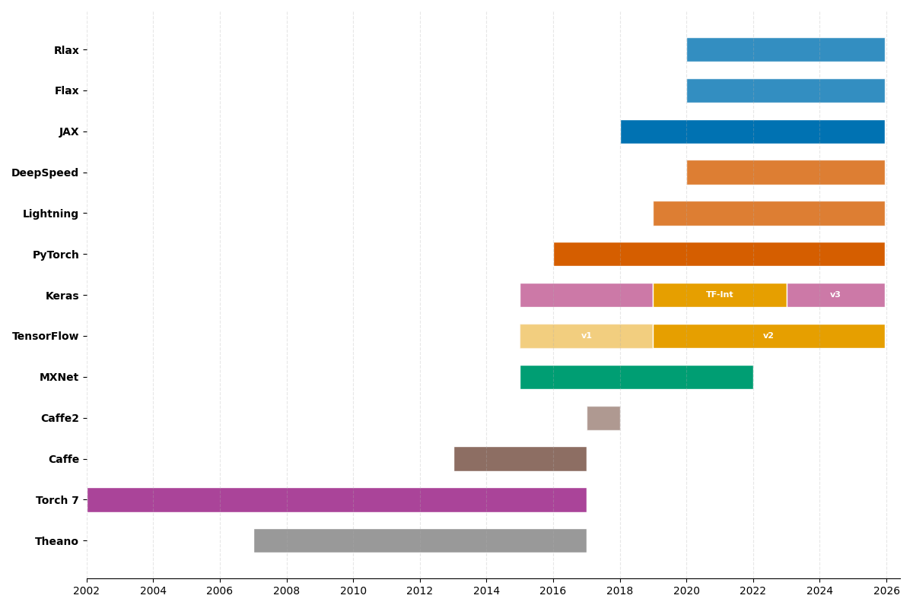
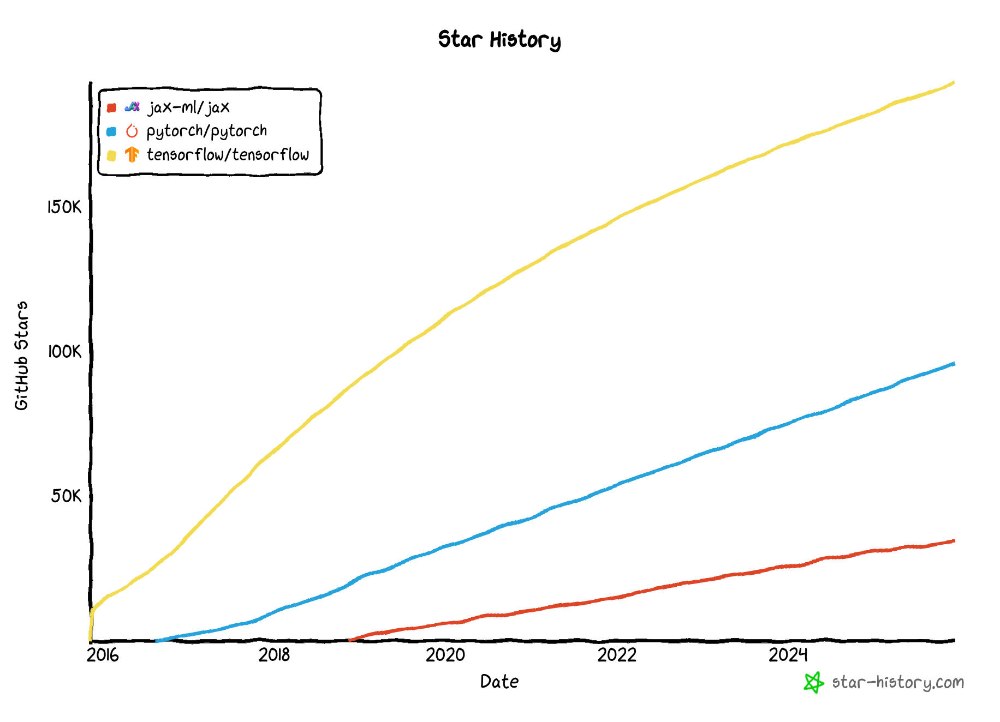

# PyTorch

## AI-sovelluskehysten lyhyt historia

Modernien syväoppimiskehysten historia koostuu nopeasta innovaatiosta ja suurten teknologiayritysten sekä avoimen lähdekoodin yhteisön kehittyvistä suhteista.

**Kuva 1:** _Syväoppimiskehysten aikajana. Kuvaaja on koostettu alla olevan tekstin lähteiden pohjalta ja Githubin release-historiasta. Toisiinsa liittyvät kirjastot on yhdistetty väreillä: esimerkiksi JAX on sininen, kuten myös sen kirjastot Flax ja Rlax. Torch7 kattaa kaikki versiot alkuperäisestä Torchista alkaen._

### Varhainen perusta (2009-2014)

Matka alkaa Theanosta, joka kehitettiin noin vuonna 2009 – tai ehkä olisi mainittava, että Nvidian CUDA syntyi 2006. Ennen tätä neuroverkot kirjoitettiin käsin esimerkiksi C++:lla. François Chollet kuvailee Theanoa: _"the conceptual ancestor of all modern deep learning tools"_. Theano oli ensimmäinen kehys, joka mahdollisti automaattisen differentioinnin ja GPU-laskennan syväoppimismallien kouluttamiseen. Se sai merkittävää jalansijaa vuosina 2013–2014, kun ImageNet 2012 -kilpailu herätti laajan kiinnostuksen syväoppimiseen. [^dlwithpython]

Näihin aikoihin myös Lua-pohjainen Torch 7 ja C++-pohjainen Caffe olivat kovaa huutoa. Kyseistä kirjastoa ei ole päivitetty sitten 2017, jolloin versio 1.0 julkaistiin [^dlwithpython]. Caffe:ta hyödynsi esimerkiksi [bat-country](https://github.com/jrosebr1/bat-country) kirjastossa, joka on Deep Dream -tyylinen kuvageneraattori. Kirjastolla voi generoida unenomaisia kuvia tavallisten valokuvien pohjalta. Miltä näyttää _Pelkoa ja Inhoa Las Vegasissa_–elokuva, jos katsoja näkee silmiä ja kasvoja sielläkin, missä niitä ei ole? Käy toki katsomassa repositoriosta esimerkkejä! Caffe2 julkaistiin Facebookin toimesta vuonna 2017, mutta se yhdistettiin myöhemmin PyTorchiin [^pytorchhistory].

### Keras: Korkean tason pioneeri (2015)

Keras lanseerattiin maaliskuussa 2015 uudenlaisena lähestymistapana syväoppimiseen. Se oli François Cholletin – eli lähteissä olevan kirjan _Deep Learning with Python (3rd ed.)_ toisen kirjoittajan – kehittämä. Kuten _Hands-On Machine Learning with Scikit-Learn, Keras, and TensorFlow, 3rd Edition_ -kirjassa kerrotaan, Chollet kehitti alkuperäisen Keras-kirjaston osana tutkimusprojektia, ja se _"quickly gained popularity, owing to its ease of use, flexibility, and beautiful design"_. [^geron3rd]

Alun perin Keras suunniteltiin korkean tason rajapinnaksi Theanon päälle, ja se oli suunnattu niille muutamalle tuhannelle ihmiselle, jotka tuolloin työskentelivät syväoppimisen parissa. Filosofia oli yksinkertainen: tehdä syväoppimisesta saavutettavaa intuitiivisen ja käyttäjäystävällisen API:n avulla. [^dlwithpython] Kerasin kilpailijaina toimi tuolloin Lasagne, joka oli myös Theano-pohjainen korkean tason kirjasto [^dlwithpytorch].

### TensorFlow:n läpimurto

Googlen julkaisema TensorFlow, 2015, oli käänteentekevä hetki, joka toi syväoppimisen valtavirran kehittäjien tietoisuuteen. Chollet ja Watson kuvailevat, että julkaisu oli: _"watershed moment that precipitated deep learning in the mainstream developer zeitgeist"_. TensorFlow otti keskeisiä ideoita Theanosta ja lisäsi kriittisen tuen laajamittaiselle hajautetulle laskennalle. Vuoden 2016 puoliväliin mennessä puolet TensorFlow-käyttäjistä käyttivät sitä nimenomaan Kerasin avulla. [^dlwithpython]

### PyTorch astuu näyttämölle (2016)

Meta (silloinen Facebook) julkaisi PyTorchin syyskuussa 2016 suorana vastauksena TensorFlow'n menestykselle [^geronpytorch]. PyTorch peri ohjelmointityylinsä Chainer-kehykseltä ja torch-autogradilta. Jos PyTorchin suunnittelun tausta kiinnostaa, suosittelen tutustumaan [PyTorch's design origins](https://soumith.ch/blog/2023-12-17-pytorch-design-origins.md.html)-kirjoitukseen. Sen on kirjoittanut Soumith Chintala, PyTorchin co-founder ja Torch 7:n pääkehittäjä.

> "In contrast, PyTorch was designed from the ground up to provide a more flexible, Pythonic approach to building neural networks". [^geronpytorch]

### Suuri integraatio: Keras osaksi TensorFlow'ta (2017-2019)

Suuri muutos tapahtui, kun Google integroi Kerasin TensorFlow'n korkean tason rajapinnaksi. Keras valittiin virallisesti suositelluksi korkean tason rajapinnaksi, kun TensorFlow 2 julkaistiin. [^geron3rd]

Ennen tätä Keras ja TF tulivat toki jo toimeen keskenään. Tensorflow 1.1.0 julkaisun myötä (elo 2018) Keras ladattiin `tf.keras`-moduulina, mutta se piti yhä asentaa erikseen. Jo vuonna 2019 Adrian Rosebrock totesi blogissaan: _"As you can tell, the history between Keras and TensorFlow is long, complicated, and intertwined"_. [^keras-vs-tf-keras]

TensorFlow 2.0:n julkaisuun mennessä vuonna 2019 integraatio oli valmis. Aurélien Géron toteaa:

> "Installing TensorFlow will automatically install Keras as well, and Keras will not work without TensorFlow installed. In short, Keras and TensorFlow fell in love and got married". [^geron3rd]

Alunperin Keras tuki useita taustajärjestelmiä (PlaidML, Theano, Microsoft Cognitive Toolkit), mutta versiosta 2.4 alkaen vain TensorFlow oli tuettu. [^geron3rd] Tällöin, 2020, minäkin olin yhä aktiivinen Kerasin ja Tensorflow:n käyttäjä. PyTorchin suosio oli kasvussa, mutta en löytänyt aikaa kokeilla sitä.

### Keras itsenäistyy jälleen

Viimeisin kehitys edustaa paluuta Kerasin monen taustajärjestelmän juurille. Kuten _Machine Learning – Modern Computer Vision & Generative AI_ -kirjassa kuvataan:

> "Keras will support multiple backends including TensorFlow, JAX, and PyTorch. This is much like the original iteration of Keras which supported the backends which were popular at the time".

Tämä kehitys tarkoittaa, että Keras on kulkenut täyden ympyrän – monen taustajärjestelmän kirjastosta osaksi TensorFlow'ta ja nyt takaisin tukemaan useita kehyksiä, mukaan lukien PyTorch, JAX ja TensorFlow.

### Nykytilanne (2024-)

Keras on itsenäinen ja vapaa, taas. Watson ja Chollet tiivistävät, että Python on voittanut kielikilvan seuraavaksi 15 vuodeksi. Vähintään nykyiset neljä kehystä (ks. lainaus alta) tulevat pysymään relevantteina – joskin uusia voi löytyä, kuten Applen MLX. [^dlwithpython]

> "Today, Keras, TensorFlow, PyTorch, and JAX are the top frameworks in the deep learning world." [^dlwithpython]

Tästä nelikosta Keras on ainut, joka ei ole täysin itsenäinen kehys. Se on korkean tason rajapinta, joka käyttää taustajärjestelmänä TensorFlow'ta, PyTorchia tai JAX:ia. Sillä voi siis kirjoittaa helppolukuista koodia, jossa on käytössä esim. Layerit näin: `dense = layers.Dense(64, activation="relu")`, mutta taustalla voi olla mikä tahansa tuettu kehys. Näitä taustakehyksiä yhdistää se, että ne kaikki toteuttavat samankaltaisia matalamman tason toiminnallisuuksia, kuten tensoreita, automaattista differentiointia, GPU-kiihdytystä ja vastavirtausta (backpropagation).

Voi hyvin olla, että jos kävisit tämän kurssin vuoden päästä, me käyttäisimme Kerasia ja vuorottellisimme backendien suhteen. Tällä hetkellä tämä kurssi on kuitenkin vahvasti PyTorch-painotteinen. Saat toki kurssin aikana kokeilla kirjoittaa jonkin tehtävän Keras edellä. Kenties haluat myös kokeilla, miten jokin alkupään low level -tehtävä onnistuisi TensorFlow:n tai JAX:n avulla. Jos kysyt kielimallilta, se kyllä kääntää (ainakin yksinkertaisen) koodin kehyksestä toiseen. Miksi vuorottelisimme? Kuten Watson ja Chollet kirjoittavat [^dlwithpython], PyTorch on kiva debugata ja sillä on erityisesti Hugging Facen ajamana loistava ekosysteemi, mutta se häviää suorituskyvyssä kilpailijoille. JAX on suorituskyvyltään erinomainen, mutta sen ekosysteemi on vielä pieni. TensorFlow on suorituskyvyltään hyvä ja sillä on hyvät tuotantoon soveltuvat työkalut. Keras tarjoaa helppokäyttöisen API:n, mutta se ei ole itsenäinen kehys. Jokaisella on siis omat vahvuutensa ja heikkoutensa. Erikoistunut rauta, kuten TPU:t, saattavat myös vaikuttaa valintaan.

**Kuva 2:** _TensorFlow, PyTorch ja JAX:n GitHub-tähtien kehitys. Kuva kaapattu joulukuussa 2025. Jos haluat nähdä ajantasaisen version, käy [Star History Chart](https://www.star-history.com/#jax-ml/jax&pytorch/pytorch&tensorflow/tensorflow&keras-team/keras&type=date&legend=top-left)-sivulla._

## Tehtävät

!!! tip "Muokkaa ja kokeile vapaasti!"

    Ennen tehtävien alustamista haluan välissä haluan huomauttaa, että **on täysin sallittua** muokata olemassaolevia Notebookeja ja/tai luoda omia Marimo-kirjoja, joissa kokeilet PyTorchin toiminnallisuuksia.

    **Ole rohkea!** Kokeile, tutki ja muokkaa. Riko ja korjaa.

    Dokumentoi löydöksesi oppimispäiväkirjaan.

!!! question "Tehtävä: From NumPy to PyTorch (PyTorchNN)"

    Avaa `210_numpy_to_pytorch.py`-tiedosto ja tutustu `PyTorchNN`-malliin. Malli on sama 2-2-1 kun aiempi `NumpyNNwithBCE`-malli, mutta toteutettu PyTorchilla.

    Aja koodi ja tutki mitä tapahtuu. Varmista, että ymmärrät, kuinka mikäkin rivi koodia liittyy tähän mennessä kurssilla opittuun.

    Keskity erityisesti PyTorch-kirjaston tensori- ja mallitoiminnallisuuksiin, joita Marimo-notebookissa käytetään.

!!! question "Tehtävä: PyTorch Learn the Basics: Tensors"

    Avaa `211_pytorch_tensors.py`. Huomaa, että kyseessä on PyTorchin virallinen [Learn The Basics: Tensors](https://docs.pytorch.org/tutorials/beginner/basics/tensorqs_tutorial.html) -opas, joka on käännetty Marimo-muotoon.

    Jos käytät Google Colabia, voit avata alkuperäisen ohjeen.

!!! question "Tehtävä: PyTorch Introduction to Pytorch Tensors"

    Avaa `212_tensors.py`. Huomaa, että kyseessä on PyTorchin virallinen [Introduction to PyTorch - YouTube Series: Introduction to PyTorch Tensors](https://docs.pytorch.org/tutorials/beginner/introyt/tensors_deeper_tutorial.html) -opas, joka on käännetty Marimo-muotoon.

    Myös tässä voit käyttää Google Colabia alkuperäisen ohjeen avaamiseen tai noudattaa kurssin Marimo-versiota.

!!! question "Tehtävä: Auto MPG"

    Avaa `213_auto_mpg.py`. Notebookissa on matalan kynnyksen käyttöönotto PyTorch-mallille. Data on loppumetreille asti aiemmin tutussa Pandas DataFramessa. Seuraavilla viikoilla tutustumme paremmin esimerkiksi Dataset ja DataLoader -toiminnallisuuksiin. Keskitytään toistaiseksi mallin kouluttamiseen ja tulosten validointiin yksinkertaisella MAE-metriikalla.

!!! question "Tehtävä: Kyberviha PyTorch-mallilla"

    Johdatus Koneoppimiseen -kurssin logistisen regression tehtävänä oli tunnistaa, onko henkilö kokenut kybervihaa viimeisen vuoden aikana.

    Alkuperäinen datasetti löytyy Data in Brief [Digital skills among youth: A dataset from a three-wave longitudinal survey in six European countries](https://www.sciencedirect.com/science/article/pii/S2352340924003652)-data-artikkelista. Käytämme kuitenkin vertailun vuoksi edelliseltä kurssilta tuttua, esikäsiteltyä datasettiä. Se on ladattavissa [hf:sourander/yskills](https://huggingface.co/datasets/sourander/yskills)-reposta.

    Muistanet, että tulos oli kohtalaisen heikko. Tämän harjoituksen motiviina on tutkia, ovatko neuroverkot hopealuoti, joka parantaa tuloksia merkittävästi – ==vai käykö kenties niin==, että joudut taistella hyperparametrien kanssa saadaksesi edes jossain määrin vertailukelpoisen tuloksen.

    Tehtävään löytyy `214_cyberhate.py` -notebook, jota voit käyttää pohjana. Vaihtoehtoisesti voit kirjoittaa koodin alusta asti itse. Tärkeintä on, että dokumentoit oppimispäiväkirjaasi, mitä teit ja mitä opit.

    !!! warning

        Älä sukella liian syvälle hyperparametrien virittämiseen. Tässä voisi käyttää uskomattoman määrän aikaa. Jos vibe-koodaat ratkaisua, joka alkaa sisältää termejä kuten Dropout, Early Stopping, Optuna, kannattaa huomioida, että nämä tulevat tutuksi kurssin Mallinnus-osiossa myöhemmin.

!!! question "Tehtävä: ONNX JAX:ia näkynyt?"

    Yllä olevasta historiasta puuttuu ONNX tyystin ja Jax on vain sivuhuomio. Tutustu Jaxiin ja ONNX:ään itsenäisesti ja kirjoita lyhyt yhteenveto oppimispäiväkirjaasi. ONNX:iin tutustutaan kenties tarkemmin myöhemmin kurssilla – ehkäpä vaikka Syväoppiminen II:ssa.

    On äärimmäisen suositeltavaa lisäksi käyttää Google Trendsiä ja vertailla, miten Worldwide-tasolla kehykset PyTorch, TensorFlow, Keras ja JAX ovat kehittyneet viimeisen viiden vuoden aikana. Huomaa, että tässä on kuitenkin kyse vain hakuhistoriasta. Se ei välttämättä suoraan heijasta todellista käyttöä tuotantoympäristöissä tai tutkimuksessa.

    💪 Jos oikein rohkea olet, ota JAX lyhyelle Hello World -tason koeajolle.

## Lähteet

[^dlwithpython]: Watson, M & Chollet, F. _Deep Learning with Python, Third Edition_. Manning. 2025.

[^pytorchhistory]: TensorGym. _The Complete History and Evolution of PyTorch | Deep Learning Framework Timeline_. n.d. https://tensorgym.com/blog/pytorch-history

[^geron3rd]: Géron, A. _Hands-On Machine Learning with Scikit-Learn, Keras, and TensorFlow, 3rd Edition_. O'Reilly. 2022.

[^dlwithpytorch]: Stevens, E, Antiga, L & Viehmann, T. _Deep Learning with PyTorch_. Manning. 2020.

[^geronpytorch]: Géron, A. _Hands-On Machine Learning with Scikit-Learn and PyTorch_. O'Reilly. 2025.

[^keras-vs-tf-keras]: Rosebrock, J. _Keras vs. tf.keras: What’s the difference in TensorFlow 2.0?_ PyImageSearch Blog. https://pyimagesearch.com/2019/10/21/keras-vs-tf-keras-whats-the-difference-in-tensorflow-2-0/
