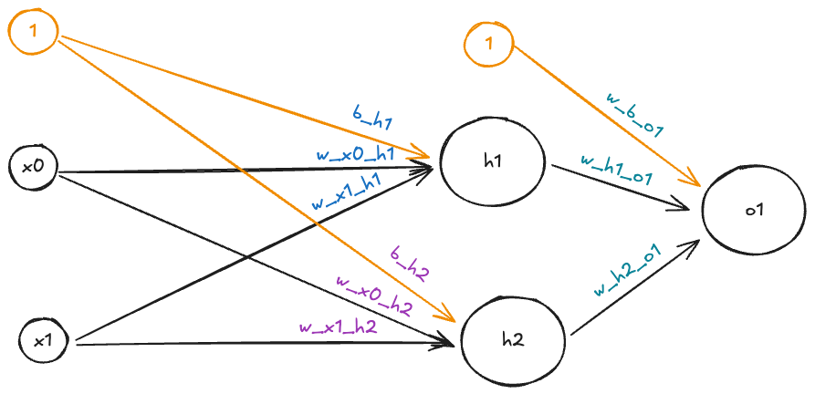
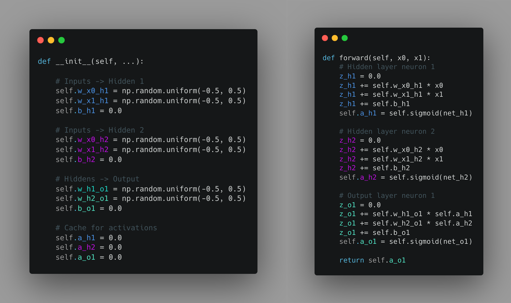

# Vektorointi

Ennen kuin hyppäämme PyTochin käyttöön, varmistetaan vielä, että ymmärrämme, **miksi** vektorointi on tärkeää syväoppimisessa. Neuroverkkojen opetus vaatii valtavia määriä laskentatehoa. Täten ei ole aivan sama, kuinka data esitetään ja kuinka laskenta toteutetaan. Ennen kuin nyrpistät nenääsi, että miksi syväoppimiskurssilla on käytössä Numpy, niin mainittaakoon heti alkuun: PyTorchin Tensor on hyvinkin samankaltainen kuin Numpyn ndarray. Molemmat ovat siis vektoreita ja matriiseja. Jotta osaamme myöhemmin arvostaa PyTorchin Tensoreita, kurkataan pintapuolisesti, kuinka neuroverkkoja voisi toteuttaa Numpyllä. Itse asiassa aivan ensimmäisenä unohdetaan jopa Numpy ja kurkataan Python-only -toteutusta.

## NN ilman vektorointia

### Verkon rakenne

Käytämme tämän luvun esimerkkinä verkkoa, joka tunnetaan nimellä `NumpyNNwithBCE`. Löydät sen tiedostosta `200_numpy_nn.ipynb`. Verkko on juuri sen verran pelkkää Perceptronia monimutkaisempi, että se kykenee yhden piilotetun kerroksen ansiosta ratkaisemaan XOR-ongelman. Selvyyden vuoksi verkon arkkitehtuuri on esitetty alla olevassa kuvassa



**Kuva 1:** *Kuvassa on 2-2-1 arkkitehtuuria edustava verkko, `NumpyNNwithBCE`, jota käytämme tämän luvun aikana esimerkkinä. Toteutuksesta löytyy Jupyter Notebook, jossa verkko on toteuttuna NumPy:lla.*

### Toteutus ilman vektorointia

Tutustumme ensin siihen, miltä malli näyttäisi, jos ==emme käyttäisi Numpy-kirjastoa==. Tätä mallia ei löydy mistään kokonaisuuteena, mutta saat toki koodata sen itse jos haluat. Olkoon sen nimi: `PythonNN`. Tutustu alla olevassa kuvassa esitettyyn koodiin. Koodi on värikoodattu siten, että värit täsmäävät Kuvan 1 painojen väreihin.



**Kuva 2:** *Kuvassa on `PythonNN`-verkon `__init__`- ja `forward`-metodit ilman vektorointia. Koodissa on paljon rautakoodattua toistoa.*

Esimerkki on tarkoituksella jätetty täysin rautakoodatuksi. Ongelmaa voisi koodin ylläpidettävyyden ja uudelleenkäytettävyyden kannalta parantaa käyttämällä silmukoita ja listoja. Koodista tulisi *rakenteeltaan* dynaamisempaa, mutta se suoritettaisiin yhä yksi kerta per syöte, yksi paino kerrallaan - eli siis sekventiaalisesti.

Tätä ongelmaa ratkaistaan vektoroinnilla. Numpy

### Silmukka toisen perään

Jos käytössä ei ole minkään sortin vektorointia, koodia loopataan näin:

```python
EPOCHS = 10_000
dataset = [(1, 0), (0, 1), (1, 1), (0, 0)]  # XOR dataset
model = PythonNN()

for epoch in range(EPOCHS):
    for x1, x2 in dataset:
        model.forward(x1, x2)
        model.backward(x1, x2)
        model.update_weights(lr=0.1)
```

### Numpy to the rescue

Huomaa, että Numpy-vektorointi tiivistää saman koodin hyvinkin lyhyeksi. Jos jätetään pari yksityiskohtaa pois, `forward()`-metodin koodi näyttää tältä:

```python
def forward(self, x):

    # Inputs -> Hiddens
    Z1 = self.A0.dot(self.W0) + self.b0
    self.A1 = self.sigmoid(Z1)

    # Hiddens -> Output
    Z2 = self.A1.dot(self.W1) + self.b1
    self.A2 = self.sigmoid(Z2)
    return self.A2
```

Numpy ei kuitenkaan pelkästään typistä syntaksia lyhyemmäksi. Se myös suorittaa laskennan paljon tehokkaammin. Tämä johtuu siitä, että Numpy on ohjelmoitu C-kielellä, mikä mahdollistaa *C array*-rakenteen käytön epätehokkaan Python listan sijasta [^whypythonslow]. Lisäksi Numpy hyödyntää SIMD (Single Instruction, Multiple Data) -laskentaa, joka mahdollistaa useiden arvojen käsittelyn yhdellä käskyllä [^whynumpyfast]. Eli siis yksittäinen käsky (single instruction) voidaan suorittaa yhtäaikaisesti rinnakkaisesti usealle datalle (multiple data).

Myöhemmin kurssilla käytettävät TensorFlow ja PyTorch vievät tämän vielä askeleen pidemmälle hyödyntämällä GPU:ita, jotka on suunniteltu erityisesti rinnakkaislaskentaan. Esimerkiksi CUDA on SIMT (Single Instruction, Multiple Threads) -arkkitehtuuri, joka mahdollistaa tuhansien säikeiden samanaikaisen suorittamisen. Jos käsitteet SISD, MDSI, SIMD ja MIMD eivät ole entuudestaan tuttuja, kannattaa pikaisesti tutustus [Flynnin luokittelu](https://fi.wikipedia.org/wiki/Flynnin_luokittelu)-Wiki-artikkeliin. SIMT on lisäys tähän luokitteluun.

Neuroverkkojen kanssa säästö on suuri, koska verkon koulutuksessa tehdään useita kertoja $ W \cdot X + b $ -tyyppisiä laskuja. Nämä ovat juuri niitä laskuja, jotka hyötyvät vektoroinnista ja rinnakkaislaskennasta. Pelkässä `forward()`-metodissa on yksi tällainen operaatio per kerros. Ilman SIMD-laskentaa tämä pistetulo suoritettaisiin yksi parametri kerrallaan. Kuinka monta kertaa siis? Tässä meidän 2-2-1 verkossamme koulutettavia parametreja on yhteensä 9 (6 painoa ja 3 biasia). Muistellaan vertaiun vuoksi meidän aiempaa MNIST-malliamme, jossa oli 784 syötettä, 128 piilotettua solmua ja 10 ulostuloa. Yhteensä parametreja on:

| Layer item | Shape      |       Count |
| ---------- | ---------- | ----------: |
| fc1.weight | (256, 784) |     200,704 |
| fc1.bias   | (256,)     |         256 |
| fc2.weight | (128, 256) |      32,768 |
| fc2.bias   | (128,)     |         128 |
| fc3.weight | (10, 128)  |       1,280 |
| fc3.bias   | (10,)      |          10 |
| **Total**  |            | **235,146** |

## Lyhyet opit

Älä koskaan sekoita `for`-silmukoita ja Python-natiiveja ei-vektoroituja funktioita hajautetun tai vektoroidun koodin kanssa sekaisin. Pythonin `for`-silmukkaa voi käyttää ajurina (engl. driver), kuten vaikkapa epookkien tai erien (engl. batch) läpikäymiseen, mutta älä koskaan käytä sitä datan läpikäymiseen. Käytä sen sijaan vektoroituja funktioita ja operaatioita.

Seuraavassa osassa tätä kurssia opit PyTorchin ja siihen liittyvien aputyökalujen kuten Datasetin ja Dataloaderin käytön. Nämä ovat tehokkaita työkaluja: käytä niitä hyväksesi.

## Tehtävät

!!! question "Tehtävä: Tutustu vektorointiin"

    Katso [Vectorization in PYTHON by Prof. Andrew NG](https://youtu.be/ylkC33LWRjo) -video. Videolla AI-kontekstissa hyvinkin tunnettu tekijä selittää vektoroinnin perusteet ja havainnollistaa, miten vektorointi nopeuttaa laskentaa. Kaikki 8 minuutissa.

    Jos aihe jäi yhtään epäselväksi, katso myös toinen 8-minuuttinen video samalta tekijältä: [Explanation For Vectorized Implementation (C1W3L05)](https://youtu.be/kkWRbIb42Ms).

!!! question "Tehtävä: NumPy Neural Network (NumpyNNwithBCE)"

    Avaa `200_numpy_nn.py`-tiedosto ja tutustu `NumpyNNwithBCE`-malliin. Kyseessä on neuroverkko, joka on toteutettu NumPy-kirjastolla (eli ilman PyTorchia). Aja koodi ja tutki mitä tapahtuu. Varmista, että ymmärrät, kuinka mikäkin rivi koodia liittyy tähän mennessä kurssilla opittuun.

    P.S. Voit jättää `backward()`-metodin pienemmälle huomiolle. Tutustumme myöhemmällä luennolla vastavirta-algoritmiin (engl. backpropagation), joka on `backward()`-metodin ydin.

## Lähteet

[^whypythonslow]: VanderPlas, J. *Why is Python slow?* https://jakevdp.github.io/blog/2014/05/09/why-python-is-slow/
[^whynumpyfast]: Numpy. *Why is NumPy fast?* https://numpy.org/doc/stable/user/whatisnumpy.html#why-is-numpy-fast

