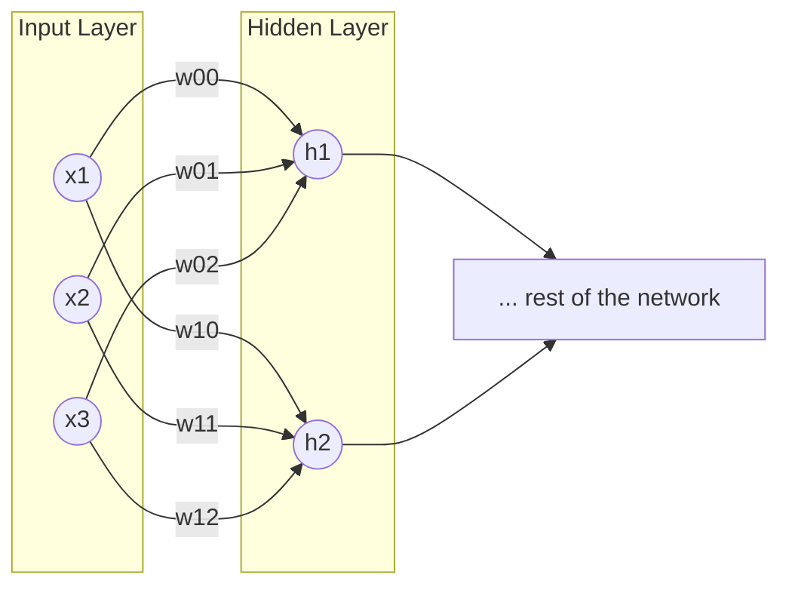

# Vastavirta (Backprop)

## Motivaatio

Tämä on kenties kurssin teoreettisin osuus, mutta sisältää yleistietoa, joka on käytännössä pakko olla hallussa. Vertaa mielessäsi näitä kahta keskustelua:

> "Mitä osaat kertoa binäärijärjestelmästä?" <br>
> — "Öööh, taisin käyttää sitä yhdessä projektissa, vissiin."
>
> "Mitä osaat kertoa algoritmista nimeltään *backpropagation*?" <br>
> — "Öööh, taisin käyttää sitä yhdessä projektissa, vissiin."

Vastavirta-algoritmi (engl. backpropagation) on keskeinen menetelmä neuroverkkojen kouluttamisessa. Se mahdollistaa virheen tehokkaan laskemisen ja painojen päivittämisen verkon eri kerroksissa. Heti alkuun täytyy sanoa, että backpropagation ei ole sama asia kuin gradient descent, vaikka nämä kaksi usein mainitaankin yhdessä. Backpropagation on menetelmä, jolla lasketaan virheiden gradientit verkon painoille, kun taas gradient descent on optimointialgoritmi, joka käyttää näitä gradientteja painojen päivittämiseen. Optimointialgoritmeja on muitakin, kuten esimerkiksi Adam ja RMSprop.

!!! tip

    Jos et osaa yhdistää termiä `optimizer` tai `Adam` mihinkään aiemmin näkemääsi, avaa jokin aiempien viikkojen marimo Notebook. Yksi monista esimerkeistä on Notebook, jossa koulutettiin Auto MPG -ennustin. Etsi rivejä, jotka näyttävät tältä:

    ```python
    optimizer = xxxxx.xxxxx.Adam(xxxxxxxxxx, xx=xxx)
    ```

    Huomaa kuitenkin, että optimointialgoritmit eivät ole tämän viikon aihe. Niihin tutustutaan hieman ensi viikolla. Tällä viikolla oletetaan, että meillä on jokin optimointialgoritmi, joka tarvitsee gradientit painojen päivittämiseen.

## Kertaus: Mikä on gradientti?

Tätä aihetta on käsitelty Johdatus koneoppimiseen -kurssissa Hill Climbing ja Gradient Descent -osioissa. Jos et muista aiheesta mitään, on äärimmäisen suositeltavaa kurkata omaa oppimispäiväkirjaasi ja kerrata lyhyesti. Tarkasti ottaen meidän tulee selvittää kaksi termiä: 

* osittaisderivaatta (engl. *partial derivative*)
* gradientti (engl. *gradient*)

### Osittaisderivaatta

Osittaisderivaatta on yksittäisen muuttujan vaikutus funktion lopputulokseen. Kun lasket osittaisderivaatan, pidät muut muuttujat vakioina ja tarkastelet vain yhden muuttujan vaikutusta [^essentialmath]. Esimerkiksi, jos meillä on funktio $f(x, y) = x^2 + 3y^2$, osittaisderivaatat $x$ ja $y$ suhteen ovat:

$$
\frac{\partial f}{\partial x} = 2x
$$

$$
\frac{\partial f}{\partial y} = 6y
$$

Eli, jos $x$:ää kasvatetaan yhdellä yksiköllä, $f$:n arvo kasvaa kahden yksikön verran, kun taas $y$:n kasvattaminen yhdellä yksiköllä kasvattaa $f$:n arvoa kuudella yksiköllä.

### Gradientti

Gradientti on hyvin yksinkertainen käsite: se on kokoelma kaikista osittaisderivaattoista. Toisin sanoen, gradientti kertoo, kuinka paljon funktion arvo muuttuu, kun kukin muuttuja muuttuu hieman [^essentialmath]. Edellisen esimerkin funktiolle $f(x, y) = x^2 + 3y^2$, gradientti on:

$$
\nabla f = \left( \frac{\partial f}{\partial x}, \frac
{\partial f}{\partial y} \right) = (2x, 6y)
$$

Käytännössä gradientti voi olla siis muotoa:

```python
# Gradient of Loss w.r.t. W
grad_W = torch.tensor(
#   [[   w00,    w01,   w02 ],
#    [   w10,    w11,   w12 ]]
    [[0.0980, 0.1960, 0.2940],
     [0.1078, 0.2156, 0.3234]]
)
```

Tässä esimerkissä gradientti on 2x3-matriisi, jossa jokainen alkio edustaa osittaisderivaattaa vastaavalle painolle neuroverkossa. Selvyyden vuoksi näytetään tämä `3-2-?-...-?` arkkitehtuuri Mermaid-kaaviona:




## Backpropagation

### Paperilla

Johdatus koneoppimiseen -kurssilla gradientin laskeminen oli kovin helppoa, koska logistinen regerssio on yksinkertainen lineaarinen malli (jolla on logistinen funktio perässä). Neuroverkoissa meillä on monta funktiota. Jos pelkästään yllä olevan Mermaid-kaavion verkon osalta meillä on seuraavanlainen laskukaava:

$$
\begin{aligned}
z_1 &= w_{00} \cdot x_1 + w_{01} \cdot x_2 + w_{02} \cdot x_3 + b_0 \\
z_2 &= w_{10} \cdot x_1 + w_{11} \cdot x_2 + w_{12} \cdot x_3 + b_1 \\
h_1 &= \sigma(z_1) \\
h_2 &= \sigma(z_2)
\end{aligned}
$$

Yllä olevassa kaavassa $\sigma$ on aktivointifunktio, esimerkiksi sigmoid tai ReLU. Tällöin, kun haluamme laskea gradientin $w_{00}$ suhteen, meidän täytyy käyttää ketjusääntöä, koska $w_{00}$ vaikuttaa lopulliseen häviöön (loss) monen välikerroksen kautta. Watson ja Chollet kirjoittavatkin, että: 

> "Backpropagation is simply the application of the chain rule to a computation graph. There’s nothing more to it." [^dlwithpython]

Tämä ei ole matematiikan kurssi, joten en aio kerrata ketjusääntöä tässä tarkasti. Sen sijaan tiivistän sen siten, että ketjusäännön avulla voimme purkaa monimutkaisen funktion osittaisderivaatat yksinkertaisemmiksi osittaisderivaattojen kertolaskuiksi. Jos meillä on funktio $f(g(x))$, ketjusäännön mukaan sen derivaatta on: $\frac{df}{dx} = \frac{df}{dg} \cdot \frac{dg}{dx}$. Mikäli et muista matematiikan tunneista mitään, kannattaa kerrata ketjusääntö kun kirjoitat oppimispäiväkirjaasi. Tehtävissä on annettu hyödyllisiä lähteitä, joista löydät lisätietoa.

Tämän viikon jälkeen sinulle pitäisi olla vahva ymmärrys siitä, mitä tapahtuu seuraavissa riveissä:

```python
for epoch in range(epochs):
    # ...
    loss = some_loss_function(y_true, y_pred)
    loss.backward()  # <-- Tässä tapahtuu backpropagation
    # ...
```

Jos/kun lasket backpropagationin oppimissyistä käsin, ainakin kerran elämässäsi, ymmärrät paremmin, mitä `loss.backward()` tekee. Käytännössä tähän löytyy ainakin kaksi erilaista keinoa. Esittelen ne lyhyesti alla, ja myöhemmin tutustut näihin tehtävien kautta.

#### Keino 1: Ensin lokaalit ja sitten kertolasku

Tämä on se keino, johon törmäät esimerkiksi Tamer Elsayedin videolla: [Lecture 12 | Backpropagation I | CMPS 497 Deep Learning | Fall 2024 (alkaen ajasta 24:56)](https://youtu.be/NHWP339RnAs?si=Wy8Uh25-MuWNyWOT&t=1496). Toimintatapa on seuraava:

1. Tee ensin forward pass ja tallenna kaikki väliarvot.
2. Laske kunkin muuttujan lokaali derivaatta sen syötteiden suhteen (esim. tulosääntöä hyödyntäen).
3. Kun tämä on valmis, ja haluat tietää vaikkapa painon $w_{00}$ vaikutuksen lopulliseen häviöön (loss), etsi kaikki polut, jotka yhdistävät $w_{00}$ lopulliseen häviöön. Kerro ne yhteen.

Huomaa, että kohdan 2 voi tehdä käytännössä ==missä tahansa järjestyksessä==, kunhan kaikki tarvittavat lokaalit derivaatit on laskettu.

#### Keino 2: Lopusta vaiheittain alkuun

Tämä on se keino, kuinka backpropagation esitellään usein ohjelmoinnin yhteydessä kirjallisuudessa. Esimerkiksi Matt Mazurin blogissa: [A Step by Step Backpropagation Example](https://mattmazur.com/2015/03/17/a-step-by-step-backpropagation-example/). Tämä on loogista, koska virhe *propagoituu* verkossa taaksepäin. Välivaiheissa tallennetut layerin gradientteja voidaan nimittää *deltoiksi*. Toteutuksemme laskee kunkin kerroksen virheen eli "deltan" ($dZ$). Tätä virhettä käytetään laskemaan painojen gradientit ($dW$ ja $db$).

1. Tee ensin forward pass ja tallenna kaikki väliarvot (aktivoinnit $A$)
2. Käsittele lähtötason virhe ($dZ_{out}$) virhe.
3. Laske tämän kerroksen **painojen gradientit** ($dW$) *(hyödyntäen virhettä ja edellisen tason syötettä)*
4. Laske **edellisen kerroksen virhe** siirtämällä nykyinen virhe painojen läpi taaksepäin ($dZ_{prev}$)
5. Toista vaiheet 3 ja 4, kunnes kaikki kerrokset on käsitelty.

Huomaa, että tämä on pakko tehdä ==järjestyksessä lopusta alkuun==, koska jokainen kerros tarvitsee edellisen kerroksen gradientin.

Itse operaatio näyttää meidän viime viikona `NumpyNNwithBCE`-mallissamme tältä:

```python
def backward(self, target):
    # === Lähtökerros (Layer 2) ===
    # 1. Laske virhe (dZ2)
    self.dZ2 = self.A2 - target  # (1)!
    
    # 2. Laske gradientit painoille (dW2, db2)
    # Nämä tallennetaan, jotta optimize() voi käyttää niitä
    self.dW2 = self.A1.T.dot(self.dZ2)  # (2)!
    self.db2 = self.dZ2  # (3)!

    # === Piilotettu kerros (Layer 1) ===
    # 3. Propagoi virhe taaksepäin (dZ1)
    dA1 = self.dZ2.dot(self.W2.T)  # (4)!
    self.dZ1 = dA1 * self.sigmoid_derivative(self.A1)  # (5)!

    # 4. Laske gradientit painoille (dW1, db1)
    self.dW1 = self.A0.T.dot(self.dZ1)  # (6)!
    self.db1 = self.dZ1  # (7)!
```

1. **dZ2** eli **delta** (δ²) on lähtökerroksen virhe. Binary cross-entropy + sigmoid -yhdistelmällä tämä yksinkertaistuu muotoon `ennuste - todellinen`. Tämä on gradientti häviön suhteen pre-aktivaatioon Z².

2. **dW2** on gradientti lähtökerroksen painoille W². Lasketaan kertomalla edellisen kerroksen aktivaatiot (A¹) nykyisen kerroksen virheellä (dZ²). Huomaa transpoosi (`.T`)!

3. **db2** on gradientti lähtökerroksen biaseille b². Bias-gradientti on yksinkertaisesti sama kuin virhe (dZ²), koska biasin derivaatta on 1.

4. **dA1** on gradientti piilotetun kerroksen aktivaatioiden suhteen. Propagoidaan virhe taaksepäin kertomalla nykyisen kerroksen virhe (dZ²) nykyisen kerroksen painojen transpoosin (W².T) kanssa.

5. **dZ1** eli **delta** (δ¹) on piilotetun kerroksen virhe. Lasketaan kertomalla propagoitu aktivaatiovirhe (dA1) sigmoidin derivaatalla pisteessä A¹. Tämä on ketjusäännön sovellus!

6. **dW1** on gradientti piilotetun kerroksen painoille W¹. Lasketaan samalla tavalla kuin dW2: kerrotaan syötteet (A⁰) nykyisen kerroksen virheellä (dZ¹).

7. **db1** on gradientti piilotetun kerroksen biaseille b¹. Sama logiikka kuin db2: bias-gradientti on yksinkertaisesti virhe (dZ¹).

!!! note 

    Yllä olevassa koodiesimerkissä, kuten muutenkin NumpyNN:n suhteen, on oletus, että meillä on stokastinen gradientti, jossa batzh size on tasan 1. Muuten dB2 ja dB1 pitäisi laskea ottamalla keskiarvo rivien yli (esim. `np.sum(self.dZ2, axis=0) / m`, missä m on batch size).

Tutustu yllä olevan koodiblokin annotointeihin; tunnistat ne pienestä plussamerkistä, josta aukeaa lisätietoa. Huomaa, että jos piilotettuja kerroksia olisi useita, prosessi alkaisi näyttää tältä:

```python
def backward(self, target):
        # === Lähtökerros ===
        self.dZ5 = self.A5 - target
        self.dW5 = self.A4.T.dot(self.dZ5) # Gradientti W5:lle

        # === Piilotetut kerrokset ===
        # Layer 4
        dA4 = self.dZ5.dot(self.W5.T)
        self.dZ4 = dA4 * self.sigmoid_derivative(self.A4)
        self.dW4 = self.A3.T.dot(self.dZ4) # Gradientti W4:lle

        # Layer 3
        dA3 = self.dZ4.dot(self.W4.T)
        self.dZ3 = dA3 * self.sigmoid_derivative(self.A3)
        self.dW3 = self.A2.T.dot(self.dZ3) # Gradientti W3:lle

        # Layer 2
        dA2 = self.dZ3.dot(self.W3.T)
        self.dZ2 = dA2 * self.sigmoid_derivative(self.A2)
        self.dW2 = self.A1.T.dot(self.dZ2) # Gradientti W2:lle

        # Layer 1
        dA1 = self.dZ2.dot(self.W2.T)
        self.dZ1 = dA1 * self.sigmoid_derivative(self.A1)
        self.dW1 = self.A0.T.dot(self.dZ1) # Gradientti W1:lle
```

Jos tämän haluaa kirjoittaa dynaamisesti useammalle piilotetulle kerrokselle, täytyy käyttää silmukkaa. Tällöin eri kerroksen, kuten myös aktivoinnit, kannattaisi tallentaa listoiksi. Seuraava koodiblokki mukailee Adrian Rosebrockin kirjan luvun 10 esimerkkiä [^dl4cv]. Esimerkissä käytetään yleistä ketjusääntöä, joka lasketaan myös lähtökerrokselle (output layer). Siksi output_delta sisältää myös aktivaatiofunktion derivaatan. Tämä tarvitaan, koska käytössä on MSE-virhefunktio – aiemmassa BCE-esimerkissä tätä vaihetta ei tarvittu Sigmoid+BCE-yhdistelmän vuoksi.

```python
    def backprop(self, X, y):
        # Tee forward pass ja tallenna kaikki aktivoinnit
        activations = self.forward(X)
        
        # 1. Laske lähtötason virhe (output layer)
        output_error = activations[-1] - y
        output_delta = output_error * self.sigmoid_deriv(activations[-1])

        # Deltat tulevat pinoutumaan tähän listaan
        deltas = [output_delta]
        
        # 2. Propagoi gradientti taaksepäin kerros kerrokselta
        for layer_idx in np.arange(len(activations) - 2, 0, -1):
            
            # hyödynnetään edellisen kerroksen deltaa (pinon päältä)
            this_delta = deltas[-1].dot(self.W[layer_idx].T)
            
            # sigmoid ketjusäännöllä mukaan
            this_delta = this_delta * self.sigmoid_deriv(activations[layer_idx])
            
            # lisää tämä delta pinon päälle
            deltas.append(this_delta)
        
        # 3. Käännä deltalista oikeaan järjestykseen. 
        # Nyt niitä voi käyttää painojen päivittämiseen optimointialgoritmissa
        self.deltas = deltas[::-1]
```

Huomaa, että Rosebrockin koodi poikkeaa meidän esimerkistä siten, että se laskee tässä vaiheessa ainoastaan kerrosten virhetermit eli deltat ($dZ$), mutta ei vielä varsinaisia painojen gradientteja ($dW$).

Meidän NumpyNNwithBCE-toteutuksessamme laskimme backward-metodissa valmiiksi myös gradientit (esim. self.dW2 = ...), jotta rakenne vastaisi täysin PyTorchin tapaa tallentaa gradientit .grad-muuttujaan. Rosebrockin esimerkissä gradienttien laskeminen (eli aktivaatioiden ja deltojen välinen matriisitulo) on jätetty tehtäväksi vasta myöhemmin, varsinaisen painojen päivityksen yhteyteen.

!!! note "Bias?"

    Entäpä bias-termit? Kun meillä on selkeä Dense-verkko (fully connected), bias-termit voidaan käsitellä muiden painojen joukossa. Tämä onnistuu yksinkertaisesti lisäämällä syötevektoriin ylimääräinen arvo, joka on aina 1. Olet tehnyt tämän jo aiemmin Johdatus koneoppimiseen -kurssilla. Rosebrock kutsuu tätä *bias trick*-menetelmäksi, ja hoitaa sen näin `fit()`-metodissaan [^dl4cv]:

    ```python
    X = np.c_[X, np.ones((X.shape[0]))]
    ```

    Minun koodiesimerkeissäni bias-termit on käsitelty erikseen, jotta koodi olisi selkeämpää oppimisen kannalta, ja kenties täsmäisi paremmin PyTorchin tapaan.

### PyTorchissa

Tätä kannattaa harjoitella itsenäisesti PyTorchin avulla. Alla on kuitenkin yksinkertainen esimerkki siitä, kuinka simppeli funktio ja sen derivointi onnistuu. Tavoitteenamme on funktio:

$$
f = \frac{1}{n} \sum_{i,j} x_{ij}^2
$$

Tämän voi derivoida muotoon `1/n * 2x`. Kun `n = 4`, niin saamme:

$$
\nabla f = \frac{X}{2}
$$

Tehdään sama PyTorchissa.

```python
x = torch.tensor([
    [0.1, 0.2],
    [0.3, 0.4]
], requires_grad=True) # <- hox!

# Pow
y = x ** 2

# 1/n * y
f = y.mean()
```

Tässä vaiheessa `f` on skaalari arvolstaan `0.0750`. Jos tässä vaiheessa tulostat eri arvoja, tulet huomaamaan, että `x.grad==None`, koska emme ole vielä tehneet takaisinvirtausta. Sen sijaan `y.grad_fn` ja `f.grad_fn` kertovat, miten nämä arvot on laskettu: ne sisältävät arvot `<PowBackward0>` ja `<MeanBackward0>`, jotka viittaavat `y`- ja `f`-muuttujien laskentaan. Nyt voimme kutsua takaisinvirtausta, mikä antaa `x.grad`-muuttujaan halutun gradientin:

```python
f.backward()
```

Jatkossa `x.grad` sisältää gradientin `f` suhteen `x`:ään. Tulostamalla `x.grad` saamme:

```
tensor([[0.0500, 0.1000],
        [0.1500, 0.2000]])
```


### Autograd

Käytännössä backpropagation on toteutettu syväoppimiskirjastoissa siten, että sinun ei tarvitse kirjoittaa backpropagation-koodia itse muuta kuin opiskelusyistä. Kukin Tensor huolehtii itseensä kohdistuneista operaatioista. PyTorch:n oma dokumentaatio esittelee sitä kattavasti, joten kannattaa tutustua, jos aihe kiinnostaa: [Automatic differentiation package - torch.autograd](https://docs.pytorch.org/docs/stable/autograd.html). Etsi sivulta sanaa `grad_fn`. Kun esimerkiksi teet tensorioperaation `y = a * b`, PyTorch kiinnittää tensoriin `grad_fn=<MulBackward0>`:n. Kun myöhemmin kutsut `y.backward()`, PyTorch käyttää tätä tietoa laskeakseen gradientit `a` ja `b` suhteen. Tässä tapauksessa kyseessä olisi kertolaskuun pätevä sääntö eli $\frac{d}{da}(a \cdot b) = b$ ja $\frac{d}{db}(a \cdot b) = a$.

Kun tämä tehdään koko `loss.backward()`-kutsun yhteydessä, PyTorch kävelee taaksepäin koko laskentaverkon läpi, käyttäen ketjusääntöä laskeakseen gradientit kaikille verkon parametreille. Tämä on siis juuri se, mitä backpropagation tekee.

Jotta takaisinvirtaus (backpropagation) on mahdollista, verkon täytyy täyttää joitakin kriteereitä:

1. **Derivoitavuus**. Verkon kaikkien osien tulee olla derivoituvia. ReLU ei ole derivoitava pisteessä 0, mutta siitä käytännössä tehdään sellainen subgradientin avulla (lue: fancy tapa sanoa, että `if (x == 0): return 0`). Alkuperäisen Perceptronin askelfunktio ei ole derivoituva, joten se ei sovellu vastavirta-algoritmin käyttöön. [^geronpytorch] Diskeetit ehtolauseet ja satunnaisuus eivät ole myöskään derivoitavia.

2. **Asyklinen laskentagraafi (DAG)**. Laskennan täytyy muodostaa suunnattu asyklinen verkko. Jos verkossa on silmukoita (esim. RNN), ne "avataan auki" (unrolling), jotta backpropagation voidaan toteuttaa [^geronpytorch].


!!! info "Monimutkaisemmat arkkitehtuurit"

    Yllä esitelty delta-sääntö ja backward-metodin toteutus toimii suoraviivaisesti tavallisissa, eteenpäin suunnatuissa neuroverkoissa (engl. feedforward, fully connected, dense), joissa jokainen neuroni on yhteydessä jokaiseen edellisen kerroksen neuroniin. Monimutkaisemmissa arkkitehtuureissa, kuten **konvoluutioverkoissa (CNN)**, gradienttien laskeminen on huomattavasti monimutkaisempaa.

    Onneksi autograd hoitaa kaiken tämän puolestamme!


## Tehtävät

!!! warning "Älä panikoi!" 

    Tehtävät ovat tämän kurssin teoreettisin ja mahdollisesti eniten päänvaivaa aiheuttava osio. Suhteuta aiheeseen sukeltaminen omiin voimavaroihisi: jos opettajan kirjoittamat Marimo Notebookit osoittautuvat voittamattomiksi, keskity esimerkiksi StatQuestin videoihin ja intuitiotasoon.
    
    Lopulta tärkeintä on, että ymmärrät perusidean backpropagationista ja osaat käyttää sitä syväoppimiskirjastoissa, kuten PyTorchissa. Muista, että haluat vältellä olemasta tämä henkilö:

    > "Mitä osaat kertoa algoritmista nimeltään *backpropagation*?" <br>
    > — "Öööh, taisin käyttää sitä yhdessä projektissa, vissiin."

!!! question "Tehtävä: Takaisinvirtaus intuition tasolla"

    Aloita tutustumalla sekä minun materiaaliin että internetistä löytyvään, intuitiotasoa korostavaan sisältöön. Hyviä lähteitä ovat ainakin:

    * [3Blue1Brown video: Backpropagation, intuitively | Deep Learning Chapter 3](https://www.youtube.com/watch?v=Ilg3gGewQ5U)
    * [StatQuest: Neural Networks Pt. 2: Backpropagation Main Ideas](https://youtu.be/IN2XmBhILt4)
    * Jos sinulla on pääsy Manningin kirjaan *Deep Learning with Python, Third Edition* (2025), tutustu lukuun 2.4 *"The engine of neural networks: Gradient-based optimization"* [^dlwithpython].

!!! question "Tehtävä: Lopusta vaiheittain alkuun"

    Olet aiemmin nähnyt backpropagation-algoritmin tehdyn käsin `NumpyNNwithBCE`-mallissamme, ja tähän viitattiin myös tässä luentomateriaalissa. Tutustu nyt `300_numpy_to_pytorch_pt2.py`-Notebookiin, jossa tehdään syväluotausta aiemmin nähdyn koodin `backward`-metodin toiminnasta. Tässä Notebookissa käytetään **"Lopusta vaiheittain alkuun" -menetelmää**.

    Notebookin rinnalla on hyvä tutustua myös Matt Mazurin versioon: [A Step by Step Backpropagation Example](https://mattmazur.com/2015/03/17/a-step-by-step-backpropagation-example/). Jos haluat todellisen syväluotauksen aiheeseen, katso University of Michiganin Justin Johnsonin luento: [Lecture 6: Backpropagation](https://youtu.be/dB-u77Y5a6A?si=O2s-NbdM2HnKA2UT). Aihetta käsitellään myös kurssilla aiemmin mainitussa [Understanding Deep Learning e-kirjassa](https://udlbook.github.io/udlbook/).

    Voit hyödyntää sitä muistiinpanojen tekemiseen oppimispäiväkirjaasi.

!!! question "Tehtävä: PyTorch Learn the Basics: Automatic Differentiation with torch.autograd"

    Tutustu `301_autogradqs_tutorial.py`-tiedostossa olevaan, Marimo-formaattiin käännettyyn PyTorchin tutoriaaliin. Alkuperäinen löytyy tästä osoitteesta: [Automatic Differentiation with torch.autograd](https://docs.pytorch.org/tutorials/beginner/basics/autogradqs_tutorial.html)

!!! question "Tehtävä: Ensin lokaalit ja sitten kertolasku"

    Tutustu `302_backpropagation.py`-Notebookiin, jossa tehdään syväluotausta backpropagationin toiminnasta **"Ensin lokaalit ja sitten kertolasku" -menetelmällä**. Notebookin rinnalla on hyvä tutustua myös Tamer Elsayedin luentoon: [Lecture 12 | Backpropagation I | CMPS 497 Deep Learning | Fall 2024 (alkaen ajasta 24:56)](https://youtu.be/NHWP339RnAs?t=1496), jossa hän käy läpi Understanding Deep Learning -kirjan luvun 7 asioita nimenomaan tällä menetelmällä. Myös seuraava video, [Lecture 13 | Backpropagation II | CMPS 497 Deep Learning | Fall 2024](https://youtu.be/3pVRMPmqwhc?si=6wwVVLqQonQLjT-c), jatkaa vastavirran parissa.

!!! question "Tehtävä: Laskentaketju PyTorchissa"

    Tee yllä olevan `f = (1/n) * sum(x)` -esimerkin kaltainen laskentaketju PyTorchissa, jossa selvität muuttujien $x$, $y$ ja $z$ gradientit. Funktion $f$ tulee noudattaa seuraavaa matemaattista funktioiden ketjua:

    $$
    \begin{aligned}
    a &= x^3 \\
    b &= y^2 \\
    c &= a \odot b \quad \text{(elementwise-tulo)} \\
    d &= |\sin(\frac{c}{b})| \quad \text{(itseisarvo)} \\
    e &= \sqrt{\frac{d}{z}} \\
    f &= \frac{1}{n}\sum_i e_i \quad \text{(keskiarvo)}
    \end{aligned}
    $$

    Käytä näitä alkuarvoja:

    * $x = [1.0, 2.0, 3.0]$
    * $y = [0.5, 1.0, 1.5]$
    * $z = 0.5$

    Tunnistat oikeat tulokset seuraavista arvoista:

    ```
    f = 1.362325
    x.grad = tensor([ 0.4165, -0.4137, -1.9011])
    y.grad = tensor([0.0000e+00, 0.0000e+00, 1.7881e-07])
    z.grad = -1.362325
    ```

    !!! note

        Muista pohtia, mitä gradientti oikeastaan tarkoittaa. Jos käärit toteutuksesi funktioon, joka ottaa `x`:n parametrina, niin voit laskea kaksi arvoa seuraavasti:

        ```python
        f1 = compute([1.0, 2.0, 3.0])
        f2 = compute([1.0, 2.0, 3.00001])
        ```

        Tulet huomaamaan, että `f2 - f1` on hyvin lähellä `x.grad[2] * 0.00001`. Eli jos kasvatat `x[2]`:ta pikkiriikkisen verran, niin `f`:n arvo muuttuu suunnilleen `x.grad[2]` kertaa tuo pieni muutos. Huomaa kuitenkin, että lukema ei tule olemaan niin sama, että voisit verrata sitä `==`-operaattorilla.
## Lähteet

[^essentialmath]: Nield, T. *Essential Math for Data Science*. O'Reilly. 2021.
[^dlwithpython]: Watson, M & Chollet, F. *Deep Learning with Python, Third Edition*. Manning. 2025.
[^dl4cv]: Rosebrock, A. *Deep Learning for Computer Vision with Python. Starter Bundle. 3rd Edition*. PyImageSearch. 2019.
[^geronpytorch]: Géron, A. *Hands-On Machine Learning with Scikit-Learn and PyTorch*. O'Reilly. 2025.